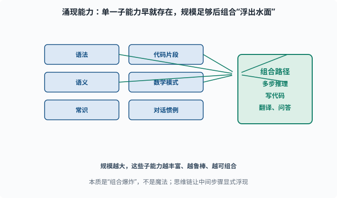
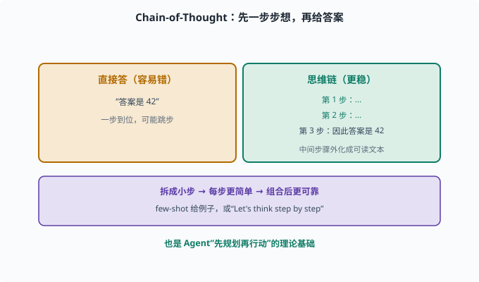

# 能力从何而来：涌现与"无中生有"的推理

> 目标：理解"规模带来的能力涌现"到底是什么、又不是什么。读完这一页，你能分辨哪些能力来自架构与数据、哪些是规模阈值后的涌现，也知道"会推理"从何而来。

## 一个反直觉的现象：能力是"蹦"出来的

预测下一个词听起来简单，但当模型足够大、数据足够多，一些看似**不相关**的能力开始出现：

```text
会数学推理（虽然会错）
会写代码
会翻译
会理解复杂指令
会出现"思维链"式的多步推理
```

这些不是"训练时专门教"的，而是**当模型规模跨过某个门槛后突然出现的**——这就是所谓**涌现能力（emergent capabilities）**。

## 涌现的本质：不是魔法，是"组合爆炸"

也许你好奇：预测下一个词怎么会"凭空"会写代码？

一个更扎实的解释是：

```text
预训练见过海量的"问题-解决"文本（问答、代码、论文、对话）
模型学会了大量高维概念提取与组合路径
规模越大，这些路径和概念的表征越丰富、越鲁棒
当它们足够多且可组合时，"多步推理/写代码"这类需要组合的能力就"浮出水面"
```

所以涌现不是魔法，而是**大量简单子能力的组合爆炸**：单一子能力早就有，只是规模不足以让它们协同工作并稳定输出。



上图左边是六种"早就存在"的子能力（语法、语义、常识、代码片段、数学模式、对话惯例），它们各自向右边汇聚，最终组合出多步推理、写代码、翻译问答等复杂能力。规模越大，这些子能力越丰富、越鲁棒、越可组合，于是"涌现"看似是突然出现的，其实是组合爆炸的结果。右下角还点出思维链（CoT）：让中间步骤显式浮现，往往能让推理更可靠。

## 三种"非训练目标但自然出现"的能力

可以把 LLM 的能力大致分三类：

```text
1. 语言学能力：语法、词序、共指（架构+数据直接给）
2. 世界知识：百科、常识（海量文本里记住）
3. 推理/组合能力：数学、代码、多步逻辑（规模足够后组合涌现）
```

前两类接近"记忆/表征"，第三类才是"思考"。你需要区分：**记忆≠推理**，前者靠数据覆盖，后者靠表示组合。

## 思维链：让"中间步骤"浮现

"涌现"的重要体现是：模型能自己做**多步推理**，但让它"直接写答案"可能错，让它**先一步步想**（few-shot 给例子——在 prompt 里先放几个"问题+解答"的示例；或用"Let's think step by step"）就准很多。这就是**思维链（Chain-of-Thought, CoT）**的由来。

为什么有效：

```text
把复杂问题拆成中间步骤 → 每一步更简单 → 组合后更可靠
模型在"写中间步骤"时，相当于把隐藏计算外化成了可读文本
```

这里有个值得停下来想一拍的机制细节：模型**每生成一个 token，那个 token 就进入了下一步的输入**。所以"先写步骤再写答案"不是仪式感——第一步的推理结果真的成了第二步的上文，等于把一次"深层单步计算"摊平成了"多步浅层计算"，每步只需在更短的依赖链上做对一小段。这与 [04-02 反向传播](../04-deep-learning/04-02-backpropagation.md) 里"深网络难训、跨层直连帮助梯度流通"有微妙的精神呼应：**路径越短、越显式，信号越不容易丢**。

这是提示工程的重要一脉（[07](../07-llm-engineering/README.md)），也是 Agent 让模型"先规划再行动"的理论基础（[08](../08-agent-foundations/README.md)）。



上图左右对照"直接答"和"思维链"：左侧琥珀色是让模型一步到位直接给答案，容易"跳步"而错；右侧绿色是让它先写下第 1 步、第 2 步、第 3 步，再把中间步骤外化成可读文本，最后落到答案。底部紫色条解释为什么有效：把复杂问题拆成小步，每一步更简单、更容易用已有的子能力完成，组合后整体更可靠。这正是 CoT 能让"涌现"出来的推理更稳的原因。

## 能力的边界：不是万能

要破除"涌现=全能"的神话，记住三件事：

```text
1. 涌现能力不稳定：同一任务换个措辞可能骤降（甚至和大小无关，部分属度量选择）
2. 仍然爱幻觉：会自信地编造
3. 不是"理性推理机"：没有可靠的逻辑一致性，有时自相矛盾
```

学术上对"涌现是否真实存在"还有争论——有人认为是评估指标的问题（用某种阈值衡量"突然达标"）。但对工程而言，**"规模变大往往带来能力提升"是经验事实，值得利用**。

## 与 Agent 的关系：推理能力被"外接"利用

对 agent（[08](../08-agent-foundations/README.md)）最重要的启示：

```text
LLM 的推理能力可以外化成"行动"：
把"思考"写成工具调用、把"规划"写成步骤
```

deepseek-harness 正是让 LLM 在一次推理里输出"接下来该调用哪个工具、参数是什么"，让"会推理"变成"会行动"。末尾自动化把这个能力包成可执行的 Agent 循环。

## 思考题

1. 什么是涌现能力？它为什么被这么命名？
2. 为什么说涌现"不是魔法"？合理化的解释是什么？
3. 记忆能力和推理组合能力的区别是什么？
4. 为什么思维链（CoT）往往能让模型答得更准？
5. 涌现能力的三个边界/注意点是什么？

## 参考答案

1. 指模型规模跨过某门槛后，原本不相关的复杂能力突然出现（数学、代码、多步推理等），没有在训练中被显式指定，故称"涌现"。它像"蹦"出来的，但其实是组合性结果。
2. 因为预训练见过海量"问题-解决"文本，模型学到大量高维概念和组合路径；规模越大组合越丰富越鲁棒，当这些子能力足够时可组合出需要的复杂能力，本质是组合爆炸而非玄学。
3. 记忆能力靠训练数据的覆盖（记住事实、语法、常识）；推理/组合能力靠表示在不同概念间组合、路由，规模足够后在更复杂任务上显现。记忆是"查询"，推理是"组合"。
4. 思维链把复杂问题拆成逐步的小步，每步都更简单、更容易用已有子能力完成，组合后整体更可靠，同时外化的中间文本让推理可读、可控、可纠偏。
5. ①涌现不稳定，措辞一变可能骤降；②仍会幻觉、自信地编造；③不是可靠的逻辑推理机，可能自相矛盾。学术上对"涌现是否真实"也有评估指标相关的争议。

## 下一步

- 想知道这些能力的短板与幻觉 → [06-09 局限与幻觉](06-09-limits-hallucination.md)。
- 想把这些能力通过提示/Action 工程化 → [07 LLM 工程](../07-llm-engineering/README.md)。
- 想理解"让 LLM 会行动"的 Agent 循环 → [08 Agent 基础](../08-agent-foundations/README.md)。

[返回本章目录](README.md)
