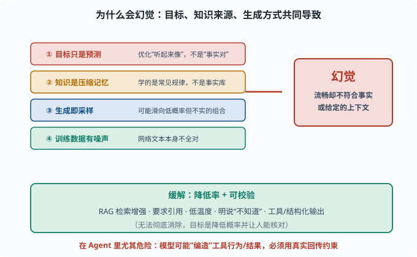
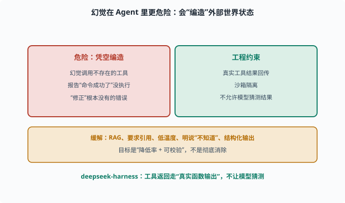

# 局限与幻觉：为什么它"一本正经地胡说"

> 目标：搞懂 LLM 的已知短板，重点是幻觉（hallucination）。读完这一页，你能解释幻觉的产生机制、常见类型、应对思路，并明白为什么"可信度管理"是使用和建设 Agent 的必修课。

## 先说结论：LLM 不是"理性可靠"的

LLM 是一个"以预测下一个 token 为目标的概率模型"，不是数据库、不是搜索引擎、不是确定性计算器。它的输出是**可信度有限的语言生成**。

几个核心已知短板：

```text
幻觉：编造不存在的事实/来源
推理不稳：同一问题换个问法可能答错
长上下文漏读：窗口内深处的信息被忽略
过时知识：预训练的知识有截止日期
偏见与重复：盲目对齐数据中的偏见、或车轱辘话
```

这一页重点讲幻觉，因为它最常见也最危险。

## 幻觉是什么：定义与分类

**幻觉（hallucination）**指模型生成"看似流畅、却不符合事实/输入"的内容。通常分两类：

```text
事实幻觉（factual hallucination）：编造不存在的实体、数字、来源
忠实性幻觉（faithfulness hallucination）：与给定的上下文/指令不符
```

例：

```text
"据 2023 年某报告……" → 可能根本没这份报告
"我给你总结原文：……" → 可能与原文不符
```

## 为什么会幻觉：根本原因

幻觉不是"bug"，而是模型的**内在本质**所致：

```text
1. 目标只是"预测下一个词"：它优化的是"听起来像"的概率，不是"事实正确"
2. 知识来自压缩记忆：预训练学的是"常见规律"，不是完整事实库
3. 生成即采样：为了多样自然，采样会滑向低概率但不真实的组合
4. 训练数据有噪声/矛盾：网络文本本身就不全对
```

所以模型"自信满满地编"是它的**默认行为**，不是故意骗你。要把幻觉压下去，必须靠提示、工具、检索、评估等外部手段。



上图左边列出四个导致幻觉的根源：目标只是"预测下一个词"、知识来自压缩记忆、生成即采样、训练数据本身有噪声。它们共同指向右边红色的"幻觉"结果——输出流畅却不符合事实或上下文。下方绿色框是缓解方向：用 RAG、要求引用、低温度、明说"不知道"、工具/结构化输出来降低率并让它可校验。底部红字提醒你：幻觉在 Agent 里尤其危险，必须靠真实工具回传约束。

## 为什么"越像真的"越危险

最棘手的是：幻觉往往**看起来完全合理**——措辞流畅、带数字、带"论文/报告"、煞有介事。这让用户难以识别。

原因：模型学会了"真实文本长什么样"，于是在给它幻觉时也照着真实的样子包装。**流畅度与可信度是两回事。**

## 缓解幻觉的思路

不追求"彻底消除"（做不到），而是**降低率 + 可校验**：

```text
检索增强（RAG）：把答案建立在外部文档上，减少纯记忆编造
要求引用：让模型给出处/来源，便于人工核对
低温度采样：降低随机性，减少滑向离奇组合
明确"不知道"：提示模型在不确定时可说"我不知道"
工具/结构化输出：用代码、表格、API 替代自由文本，减少幻觉空间
人类/自动评估：用评测抽查，识别高幻觉区间
```

这些大多是 [07](../07-llm-engineering/README.md) 和 [10](../10-practical-lab/README.md) 的核心内容。

## 幻觉在 Agent 里更危险

对 agent（[08](../08-agent-foundations/README.md)）尤其致命，因为模型会**"编造"工具行为/结果**：

```text
幻觉调用了一个不存在的工具
幻觉报告"命令成功了"其实没执行
幻觉"修正"了根本没有的错误
```

所以 agent 框架必须有强约束（[08](../08-agent-foundations/README.md) 的循环、[10](../10-practical-lab/README.md) 的沙箱）：让**真实工具结果回传、不允许模型凭空编造**。deepseek-harness 里工具返回走"真实的函数输出"，不让模型"猜测"结果，正是防幻觉的工程手段之一。



上图把"Agent 中的幻觉"与对应的工程约束并排：左侧红色列出危险行为——幻觉调用不存在的工具、报告"命令成功了"其实没执行、"修正"根本不存在的错误；右侧绿色是框架该做的约束——真实工具结果回传、沙箱隔离、不允许模型猜测结果。底部琥珀色再给出通用缓解思路（RAG、要求引用、低温度、明说"不知道"、结构化输出），目标始终是"降低率 + 可校验"。对 Agent 而言，让**真实工具返回**约束模型，是防幻觉最关键的工程手段。

## 其他局限：怎么共存

- **过时知识**：用 RAG（检索增强生成，[06-07](06-07-context-window.md) 提到、[07](../07-llm-engineering/README.md) 展开）补充新信息。
- **推理不稳**：用思维链、few-shot、让模型自查。
- **长上下文漏读**：精炼上下文、检索关键片段、放关键信息在显眼位置。
- **安全边界**：对齐能降低但无法根除有害输出，见 [11](../11-safety-governance/README.md)。

理解这些局限不是让你"不用 LLM"，而是让你**把它当"强大的概率工具"，而不是"全知全能的可靠助手"**——在使用与建设时都做相应防护。

## 思考题

1. 用你自己的话给幻觉下定义，并区分事实幻觉与忠实性幻觉。
2. 为什么"预测下一个词"的目标天然会引起幻觉？
3. 为什么幻觉常常"看起来非常可信"？
4. 列举至少 4 种缓解幻觉的工程手段。
5. 为什么幻觉在 Agent 场景尤其危险？

## 参考答案

1. 幻觉是模型生成"流畅但不符合事实或上下文的输出"。事实幻觉是编造不存在的实体/数字/来源；忠实性幻觉是输出与给定上下文或指令不符。
2. 因为模型优化的是"下一个词听起来合理/在训练分布里常见"，而非"与客观事实一致"。知识从压缩记忆来、生成靠采样，天然会有偏离事实的倾向。
3. 因为模型学会了真实文本的"样子"（措辞、结构、引用格式），给它幻觉时也会照着真实的包装呈现，使"流畅、带数字、带出处"却毫不真实。
4. RAG 检索增强（答案建立在外部文档上）、要求模型给引用/出处、降低采样温度、明确提示"不知道"可直说、用工具/结构化输出替代自由文本、加人类或自动评估抽查。
5. 因为 agent 会"行动"：模型若幻觉"调用了工具""命令成功""已修复错误"，是凭空编造外部世界状态，可能导致误操作、错误结论或安全事故。必须有真实工具结果回传和沙箱约束来防止。

## 下一步

- 想把幻觉与可信度做进工程 → [07 LLM 工程](../07-llm-engineering/README.md)。
- 想理解 agent 如何用循环+真实工具回传防幻觉 → [08 Agent 基础](../08-agent-foundations/README.md)。
- 想研究安全与治理 → [11 安全与治理](../11-safety-governance/README.md)。

[返回本章目录](README.md)
