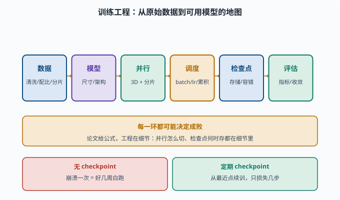
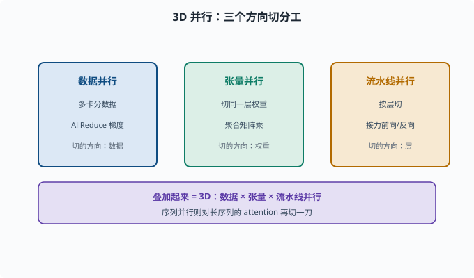
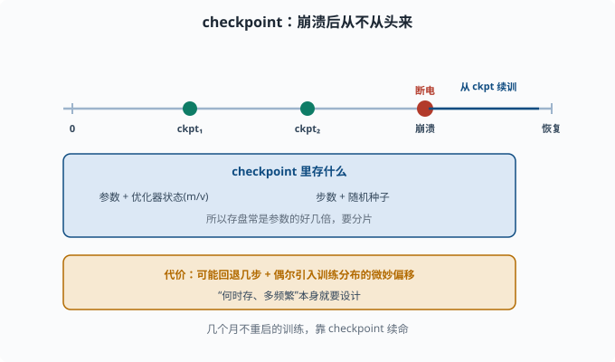

# 训练工程：把一个大模型练出来的组织方式

> 目标：理解大规模训练"不是把数据塞进去按个按钮"，而是数据、并行、调度、检查点的系统工程。读完这一页，你能说清数据管线、3D 并行、检查点/容错在训练里的角色。

## 训练工程的难点在哪

训练一个 LLM 不是"拿代码跑一跑"。真正的工程问题包括：

```text
数据怎么清洗、怎么组织、怎么保证质量
模型大到单卡装不下，怎么用多卡并行
训练要跑几天到几个月，怎么防崩溃、怎么续训
loss 指标怎么跟踪、怎么判断收敛
成本怎么算、怎么在预算内"配平"参数和数据
```

这些组成了**训练工程**——"把一个大模型练出来的组织方式"。它和 [06-05 训练三阶段](../06-llm-fundamentals/06-05-training-stages.md) 的"三阶段"是两码事：三阶段告诉你要练什么目标，训练工程告诉你怎么把训练跑起来。



上图把训练工程拆成首尾相连的一串环节：原始数据先经清洗/配比/分片，再定模型尺寸与架构，接着用 3D 并行 + 分片铺到多卡上，通过 batch / 学习率 / 梯度累积做调度，以 checkpoint 保证容错，最终靠指标判断是否收敛。下方的红绿对比强调一个关键差异：没有 checkpoint 时一次崩溃就白跑数周，而定期存盘能把损失压到几步。

## 数据工程：训练质量的第一决定因素

"垃圾进，垃圾出"。数据准备通常包括：

```text
去重（dedup）：去掉重复/相似文本，防止模型死记硬背（训练集重复=变相过拟合，03 章讲过；在万亿语料上更致命）
清洗：去 HTML、去毒、去乱码
过滤：去低质量、去敏感/有害、去机器噪声
混合配比：不同语种/领域按比例混（如代码、百科、对话）
切分：训练/验证/测试集（概念见 [03-01](../03-machine-learning/03-01-supervised-overview.md)）
分片（shard）：切成可并行读取的文件块
```

一个常用工具直觉：**数据量巨大（万亿 token）时，单机清洗不可行，要用流式/分布式管线**（[04-09](../04-deep-learning/04-09-distributed.md)）。数据配比本身也是超参数，直接影响能力分布。

## 并行与调度：3D 并行 + 分片

模型大到放不下时必须并行（[04-09](../04-deep-learning/04-09-distributed.md)）。LLM 训练常用组合：

```text
数据并行：多卡各拿一小批数据各算各的梯度，再 AllReduce（多卡之间把各自的梯度加总、同步成同一份的集合通信操作）
张量并行：同一层权重切开，各卡算一部分矩阵乘再聚合
流水线并行：按层切，前后段接力前向/反向
序列并行：对长序列的 attention 也做切分（长上下文训练用）
```

把它们叠起来就是"3D 并行"。但要注意**通信开销**：并行度不是越高越好，要与网络带宽、batch 大小权衡。



上图画出了三维各自的分工：数据并行沿"数据"方向切、张量并行沿"权重"方向切、流水线并行沿"层"方向切，叠加起来才是 3D。右侧紫色条提示序列并行是在长序列上再对 attention 切一刀，专门服务于长上下文训练。

### 调度的目标

调度要权衡：

```text
batch 大小：太大显存爆、太小效率低、影响收敛
学习率：warmup + cosine（[04-05](../04-deep-learning/04-05-optimizers.md)）
梯度累积：显存不够时，连续算 N 个小 batch 的梯度攒在一起再更新一次，等效模拟大 batch
吞吐 vs 稳定性
```

工程上常用"吞吐量（tokens/秒/卡）"作为效率指标。

## 检查点与容错：训练几个月，不能从头来

训练跑数周/数月，中途崩溃不罕见。**检查点（checkpoint）**就是定期把你的模型状态存盘，崩溃后从最近点续训：

```text
每隔 N 步保存一次（参数 + 优化器状态 + 步数 + 随机种子状态）
崩溃/断电后从最近的 checkpoint 恢复，而非重头
```

这带来两个工程问题：

- **存盘大**：模型+优化器状态常是参数的好几倍（[04-09](../04-deep-learning/04-09-distributed.md)），要分片存储。
- **续训有损失**：可能回退几步，且偶尔导致训练分布的微妙偏移。因此"何时存、多频繁"本身要设计。



上图是 checkpoint 的时间直觉：训练沿时间轴前进，在多个节点存盘；哪怕中途断电，也能在崩溃点后的最近检查点续训，而不必重头再来。蓝色框提醒你检查点**不只是参数**，还要包含优化器状态（如 Adam 的 m/v）、当前步数与随机种子，这解释了为什么存盘往往比模型本身还大、必须分片存储。

## 指标跟踪与收敛判断

训练时要持续观察：

```text
loss（趋势、是否震荡、train/val 差距）
gradient norm（是否爆炸/消失）
learning rate 曲线
吞吐与步时
```

这些可以接到 [07-07](07-07-evaluation.md) 的评估：训练 loss 只是过程指标，真正好不好用要下游评测。

## 成本与配平

成本不是只看算力，而是：

```text
算力（GPU/TPU 机时）
数据（采集、清洗耗时）
人工（质量标注、对齐数据收集）
迭代调试（一次失败要重跑）
```

与此相连的是 [06-04 缩放定律](../06-llm-fundamentals/06-04-scaling-laws.md) 的配平：参数和 token 要成比例才不浪费预算。工程决策常是"在固定预算下，参数多大、token 多少、并行怎么切"。

## 一张训练工程地图

```text
数据（清洗/配比/分片）
  → 模型（尺寸/架构）
    → 并行（3D + 分片）
      → 调度（batch/lr/梯度累积）
        → 检查点与容错
          → 指标与评估
```

每一个环节都可能决定成败。这也是为什么"reproduce 一个开源模型"没那么简单——论文只给公式，工程在细节里。

## 思考题

1. 训练工程要解决哪几类核心问题？
2. 数据工程里"去重"和"混合配比"各解决什么问题？
3. 3D 并行包含哪三种？为什么不是并行度越高越好？
4. checkpoint 为什么必要？它通常要保存哪几样东西？
5. 为什么说"训练 loss 低"和"模型好用"是两回事？

## 参考答案

1. 数据组织与清洗、大规模并行、调度（batch/学习率/梯度累积）、检查点与容错、指标跟踪、成本配平。
2. 去重防模型背死重复文本、提高数据信息量；混合配比决定能力分布（代码/百科/对话等按比例），是隐性的平衡参数。
3. 数据并行、张量并行（切单层权重）、流水线并行（按层切），常再加序列并行。因为并行要伴随梯度/激活的 AllReduce 通信，并行度过高通信开销会吃掉收益，要与带宽和 batch 权衡。
4. 训练可能跑数周数月，崩溃/断电后要从头重跑不可接受。checkpoint 保存参数、优化器状态（如 Adam 的 m/v）、步数、随机种子，以便从最近点低损续训。
5. 因为训练 loss 反映的是"预测下一个词"在训练分布上的拟合度，不等于在下游真实任务上的可用性、鲁棒性与可靠性；一个模型可背熟训练分布但泛化差、爱幻觉。

## 下一步

- 想让训练好的模型"跑得快、省显存" → [07-02 推理优化](07-02-inference-optimization.md)。
- 想理解并列的底层 → [04-09 分布式训练](../04-deep-learning/04-09-distributed.md)。
- 想回到配平与规模的经济学 → [06-04 缩放定律](../06-llm-fundamentals/06-04-scaling-laws.md)。

[返回本章目录](README.md)
