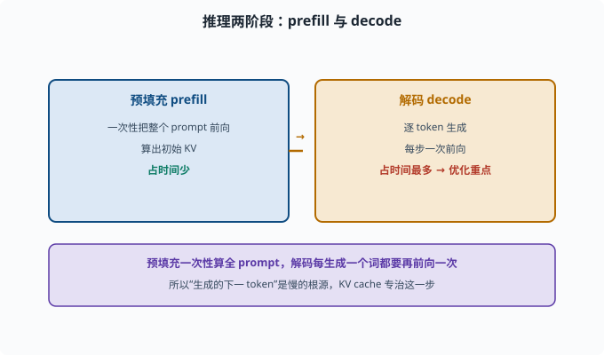
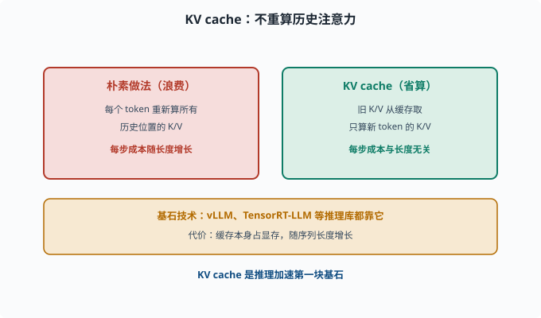
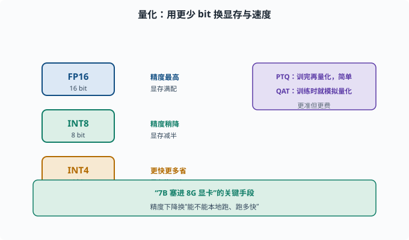
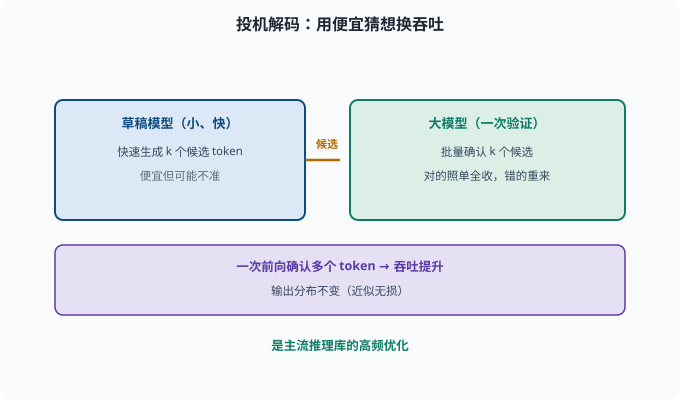

# 推理优化：让模型跑得快、省显存

> 目标：理解 KV cache、量化、蒸馏、投机解码等让推理变快变省的手段。读完这一页，你能说出"为什么生成的下一 token 慢"、以及工程上怎么提速省内存。

## 推理为什么"慢且贵"

回想 [06-02](../06-llm-fundamentals/06-02-token-through-model.md)：生成每个 token 都要让模型重新前向一遍，上下文越长、每步越贵。推理优化就是针对"慢、占显存、贵"这三件事。

```text
预填充（prefill）：一次性把 prompt 全部前向，算出初始 KV
解码（decode）：逐 token 生成，每步前向一次
```

优化重点是解码阶段：它占时间最多。



上图把推理分成左右两半：预填充一次性把整个 prompt 送进模型并算出初始 KV，耗时较短；解码则每个 token 都要再前向一次，是整条链路里最慢也最贵的一段。正因为"生成下一 token"才是瓶颈，后续的 KV cache、量化、投机解码等优化几乎都对准解码阶段。

## KV cache：别重复算已经算过的注意力

注意力需要 K、V（[05-05](../05-nlp-transformers/05-05-attention.md)）。朴素做法每个 token 都重新算所有历史位置的 K/V，浪费大量算力。

**KV cache** 思路：把每个已生成 token 的 K、V 结果**缓存**起来，下一步只算新 token 的 K/V，与缓存的旧 K/V 拼接即可，不必重算历史。

```text
第 t 步：只新增第 t 个 token 的 K/V，旧 K/V 从缓存取
→ 不必重算历史的 K/V 投影（新 token 的注意力仍要读全部缓存 K/V，这部分仍随长度线性增长）
```

KV cache 是推理加速的基石，几乎所有推理库（vLLM、TensorRT-LLM 等——部署 LLM 推理的开源引擎）都用。代价是**缓存本身占显存**（显存随序列长度增长）。



上图对比两种做法：左侧的朴素实现每生成一个新 token 都要重算所有历史位置的 K/V；右侧把已算好的旧 K/V 缓存起来，每步只算新 token 的 K/V 并与缓存拼接，省掉了重算历史这部分开销（注意：新 token 的注意力仍要读全部缓存 K/V，所以单步成本仍随长度缓慢增长，省的是"重算"而不是"读取"）。下方的琥珀条强调的是代价：缓存是省了算力，却要额外吃显存。

## 量化：用更少的 bit 存同样多的权重

模型参数默认 FP16/BF16（16 bit）。**量化**把权重用更少 bit 存（INT8、INT4），以省显存、加速。

```text
FP16 → INT8：显存减半，稍降精度
FP16 → INT4：显存约剩 1/4，更快但精度损失更大
```

常用方案的直觉：

```text
训练后量化（PTQ）：训完再量化，简单但可能降精度
量化感知训练（QAT）：训练时就模拟量化，更准但更费
```

量化是"让 7B 模型塞进 8G 显卡"的关键手段。精度下降换来的是"能不能本地跑、跑多快"。



上图用阶梯演示精度的取舍：FP16 用 16 bit、INT8 用 8 bit、INT4 用 4 bit，位数越少显存越省、速度越快、精度损失越大。右侧紫色条并在 PTQ（训完再量化，简单但可能降精度）与 QAT（训练时就模拟量化，更准却更费）这两种落地路线。

## 蒸馏（Distillation）：让小模型拷贝大模型

**知识蒸馏（knowledge distillation）**：训练一个小的学生模型，让它模仿大的教师模型的输出。教师的输出分布（每个词的概率，而非只给最终答案）叫 **soft 目标**——它比"对/错"的硬标签携带更多信息（哪些错误选项"接近正确"），学生学这些分布能学得更细。

```text
大模型（教师）生成 soft 目标 / 输出分布
小模型（学生）向教师的输出学习
→ 用更小的模型逼近大模型能力
```

适合"能力要用、但太大跑不动"的场景。代价是学生能力通常不及教师，在难任务上打折。

## 投机解码（Speculative Decoding）：用"便宜猜想"加速

生成是自回归的，每步都要走完整大模型。**投机解码**的思路：

```text
先用一个便宜的小草稿模型快速生成 k 个候选 token
大模型一次性验证这些候选是否合理
正确的照单全收，错的重来
```

这样大模型一次前向能"确认"多个 token，吞吐提升、且输出分布不变（严格来说无损）。是推理库里的高频优化。



上图把投机解码画成两段接力：左侧便宜的小草稿模型快速产出 k 个候选 token，右侧大模型一次性批量验证这 k 个候选。被确认的词照单全收、被否定的重来，于是大模型一次前向就能确认多个 token，吞吐明显提升，且因为验证过程不改变接受分布，输出分布与大模型直接生成严格相同（无损）。

## 其他常见优化

```text
批处理：把多个请求打成 batch 一次前向，摊薄开销
连续批处理（continuous batching）：请求动态进出，减少空闲
FlashAttention：更高效/省显存的注意力实现（重排计算顺序、减少读写显存次数）
低精度激活：中间激活也用低位宽存，减少内存占用
```

这些偏底层实现，但你该知道：推理引擎（vLLM 等）已经把很多做进去了，选对引擎比手写更快。

## 一张优化手段速查

| 手段 | 主要解决 | 代价 |
|---|---|---|
| KV cache | 解码慢 | 占显存 |
| 量化 | 省显存、加速 | 精度略降 |
| 蒸馏 | 用小模型代替大模型 | 能力打折 |
| 投机解码 | 生成快 | 需一个草稿模型 |
| 批处理/连续批 | 吞吐低 | 需调度 |
| FlashAttention | 慢/占显存 | 实现复杂度 |

## 思考题

1. 为什么生成阶段比预填充"每步都贵"？KV cache 如何解决？
2. 量化到底在存什么？FP16 到 INT4 大概省多少显存？
3. 知识蒸馏的大致流程是什么？
4. 投机解码为什么能"又稳又快"？它验证什么？
5. 连续批处理和普通批处理有何不同？

## 参考答案

1. 因为生成每个 token 都要让模型前向一次，朴素做法每步重算所有历史 K/V。KV cache 缓存旧 K/V，每步只算新 token 的投影，把"重算历史"这部分开销整个省掉（新 token 的注意力仍要读全部缓存，那部分随长度线性增长，但不再平方级重算）。
2. 量化在用更少 bit 存权重：FP16 用 16 bit、INT8 用 8 bit、INT4 用 4 bit。FP16→INT4 理论显存降到约 1/4，换来精度损失与更快速度。
3. 用大教师模型为数据生成输出（soft 目标/分布），训练小学生模型在这些目标上学，让小模型逼近教师的行为，从而用更小的模型复刻大模型能力。
4. 投机解码先请一个便宜草稿模型快速产出 k 个候选 token，大模型一次前向批量验证；正确的全收、错的重来。因为多数草稿词能被确认，吞吐提升且分布不变（严格无损）。
5. 普通批处理把请求打包一起前向，但一个请求结束会空占时隙；连续批处理允许请求动态进出，让 GPU 在请求生命周期内持续被利用，减少空闲、提高吞吐。

## 下一步

- 想让模型"更会用上下文" → [07-03 上下文工程](07-03-context-engineering.md)。
- 想理解注意力计算的底层 → [05-05 注意力机制](../05-nlp-transformers/05-05-attention.md)。
- 想评估这些优化带来的真实提升 → [07-07 评估基准](07-07-evaluation.md)。

[返回本章目录](README.md)
