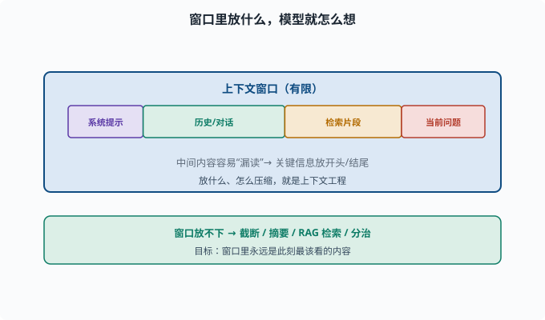
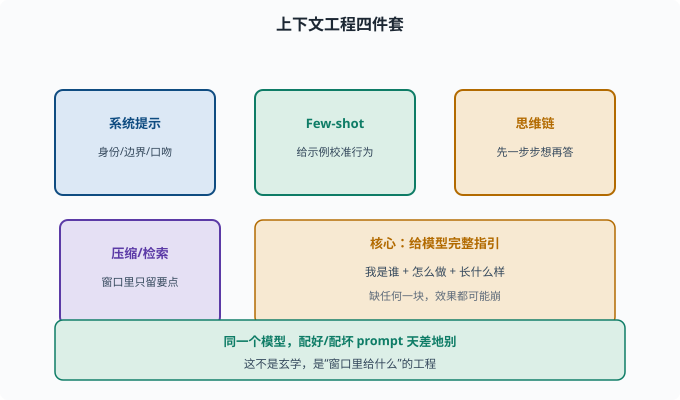

# 上下文工程：用好输入是 Agent 的生存技能

> 目标：把"怎么写 prompt、怎么管上下文、怎么压缩"当成一门硬本事。读完这一页，你能讲清系统提示词、少样本、思维链、上下文压缩与检索的作用，这是 Agent 落地的核心能力。

## 为什么"输入"本身就是工程

模型的能力是固定的，但**给它的上下文**可以是千差万别的。同样一个模型，配上好 prompt 与坏 prompt，效果天差地别。这不是玄学——模型只基于"窗口里的内容"工作（[06-07](../06-llm-fundamentals/06-07-context-window.md)），所以**你把什么放进窗口，就决定了它怎么想**。

**上下文工程（context engineering）**就是：系统性地设计、组织、维护窗口内信息，让模型产出最好、最稳的结果。



上图把模型真正"看到"的窗口拆成几段：系统提示、历史对话、检索片段和当前问题。窗口有上限，因此每一段都要精打细算；而长上下文中间的内容容易被注意力稀释而"漏读"，所以工程上会把关键信息放到开头或结尾。放什么、怎么压缩，正是上下文工程的核心动作。

## 基础技能一：系统提示词（system prompt）

很多 LLM 支持在用户消息前加一段**系统提示**，定义模型的身份、行为、边界：

```text
你是一个严谨的工程师助手。
只根据提供的文档回答，不乱编。
保持回答简洁。
```

作用：

```text
设定角色与语气
注入约束（别胡说、别过度自信）
定义输出格式
给出使用规则
```

系统提示是 Agent prompt 的"宪法"，deepseek-harness 的 session/system-prompt 就负责这一层（[08](../08-agent-foundations/README.md)）。

## 基础技能二：少样本示例（Few-shot）

在 prompt 里给几个**输入-输出示例**，模型就能模仿格式与思路：

```text
输入：...
输出：...
输入：...
输出：...
（新输入）
```

少样本不是教新知识，而是**校准行为**：让模型知道"你要的这种格式、这种判断方式长什么样"。常用在输出格式稳定、需要结构化结果的场景。

## 基础技能三：思维链（CoT）

[06-08](../06-llm-fundamentals/06-08-emergent-capabilities.md) 提过：让模型"先一步步想"，往往更准。

```text
直接问：这个逻辑题答案？         （可能直接错）
引导：请一步步推理再给出答案。   （准确率更高）
```

进阶玩法还有两种：**自洽性（self-consistency）**——让模型独立生成多条推理路径，对最终答案投票取多数；**思维树（Tree-of-Thoughts）**——把推理组织成一棵可回溯的树，允许探索多个分支再挑最好的。Agent 的"规划"也常靠 CoT：让模型先列出要调用什么工具、再执行。

## 长上下文管理：窗口放不下时

窗口有限（[06-07](../06-llm-fundamentals/06-07-context-window.md)），长对话/长文档塞不下时要有策略：

```text
截断：只留最近 N 轮/最近一段
摘要：把旧内容压缩成要点放回
检索（RAG）：只把与当前问题相关的片段放进窗口
分治：把长文档切片、分多次处理再汇总
优先级：关键信息放开头/结尾（中间易被"漏读"）
```

这些都直接影响成本与效果。**让"窗口里永远是此刻最该看的内容"，就是上下文工程的核心。**

## 压缩与结构化

善用**结构化**减少 token 又保留信息：

```text
表格 / 列表 比大段散文省 token 且更清晰
用紧凑符号代替冗长重复
把代码/日志缩成关键行
```

对 Agent，工具返回常是大段输出，先让工具"只返回关键摘要再塞回窗口"，能省下可观 token（[08](../08-agent-foundations/README.md)、[10](../10-practical-lab/README.md)）。

## 一个最小实践：对比好坏 prompt

```python
# 坏：什么都往里塞、没约束
def bad_prompt(text):
    return f"请帮我处理一下这个：{text}"

# 好：明确身份、约束、格式、few-shot
def good_prompt(text):
    system = "你是会议纪要助手，只用原文信息，不编造，输出要点列表。"
    few = "示例：\n原文:『讨论A和B』\n输出:\n- A\n- B\n"
    return system + "\n" + few + "\n原文: " + text + "\n输出:"
```

肉眼可见后者给模型"我是谁、怎么做、长什么样"的完整指引。



上图把上下文工程的方法收敛成四件套：系统提示定义身份与边界、少样本示例用范例校准行为、思维链引导先推理再作答、压缩与检索保证窗口里只留要点。右上角的琥珀条点出内在逻辑——好的 prompt 本质是给模型一条完整的指引链路，缺少任何一块都可能让输出失去稳定性。

## 思考题

1. 上下文工程的核心思想是什么？为什么它如此重要？
2. 系统提示词通常承载哪几类信息？
3. 少样本示例是在"教新知识"还是"校准行为"？为什么？
4. 窗口放不下长文本时，有哪些可用的上下文管理手段？
5. 为什么"关键信息放开头/结尾"比放中间更稳？

## 参考答案

1. 核心是"系统性地设计窗口内的内容"从而控制模型行为与效果。因为模型只基于窗口工作，放什么进去就决定了它怎么想，且成本也由 token 决定。
2. 角色与语气、约束（不乱编/不自信过度）、输出格式、使用规则。系统提示是对话的"宪法"。
3. 校准行为而非教新知识。示例让模型看清"你要的格式/判断方式"，是利用模型已有能力去对齐你的期望，不新增事实。
4. 截断只留最近、摘要压缩旧内容、用 RAG 检索相关片段、长文档切片分治、并按优先级把关键信息放显眼位置。
5. 因为过长上下文中，靠近窗口中间的内容会因注意力权重被大量 token 稀释而容易被"漏读"；开头和结尾通常被模型更充分注意，因此关键信息放首尾更可靠。

## 下一步

- 想看到"检索增强"如何注入外部知识 → [07-08 RAG](07-08-rag.md)。
- 想把这些技术组成 agent 循环 → [08 Agent 基础](../08-agent-foundations/README.md)。
- 想评估 prompt/上下文方案是否真的更好 → [07-07 评估基准](07-07-evaluation.md)。

[返回本章目录](README.md)
