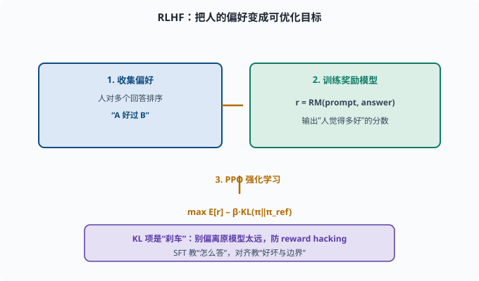

# 对齐（Alignment）：让模型做"对的事"

> 目标：理解对齐的地位与方法：RLHF、奖励模型、PPO 为什么能让模型"更会听话、更安全"。读完这一页，你能说清"预训练会接词、对齐会做人"，也知道对齐的局限。

## 为什么训练完还不算"能用"

回顾 [06-05](../06-llm-fundamentals/06-05-training-stages.md)：预训练给知识，SFT 让模型"会答"，但还不够：

```text
可能说有害的话
可能编造而不自知
可能答非所问、车轱辘话
不遵守格式、边界
```

**对齐（alignment）**就是把模型的**深层偏好/行为**调成"符合人的意图与期望"，而不只是"会生成一句像样的回答"。

## 对齐与微调的区别

```text
SFT：用"指令-答案"对，教模型"怎么答"（模仿）
对齐：用"人的偏好"信号，调模型"偏好什么样"（价值观）
```

一句话：SFT 教"表达"，对齐教"好坏与边界"。



上图把 RLHF 画成三步：先从人类对候选回答的排序中收集偏好，训练出能给 (prompt, answer) 打分的奖励模型，再用 PPO 之类的强化学习让策略模型往高奖励方向优化，同时用 `β·KL(π‖π_ref)` 这个"刹车"约束它不要偏离初始模型太远。下方紫色条强调这套目标和 SFT 的分野——SFT 管"怎么答"，对齐管"什么算好、哪里是边界"。

## RLHF 的三个组成部分

**RLHF（基于人类反馈的强化学习）**是经典对齐方案，通常分三步：

### 1. 收集人类偏好，训练奖励模型

让人对同一 prompt 的多个候选回答做**排序**（哪个好、哪个差）：

```text
prompt: "给我怎么煎鸡蛋？"
回答 A：详细步骤
回答 B：乱七八糟/有害
人标：A 好于 B
```

这批排序数据训练一个**奖励模型（reward model）**：给定 (prompt, 回答)，输出一个分数，代表"人觉得多好"。假设：`r = RM(prompt, answer)`。

### 2. 用强化学习优化策略

把要训练的"助手模型"当作**策略模型 π**（强化学习术语：能根据状态选择动作的模型）。目标：让 π 生成的回答获得高奖励：

```text
max  E[ r(prompt, answer) ] - β·KL(π || π_ref)
```

这里的关键是**加一个 KL 约束**。**KL 散度（KL divergence）**衡量两个概率分布的差异：完全相同为 0，差得越远值越大。`π_ref` 是对齐开始前的初始模型，`KL(π‖π_ref)` 就是"现在的模型离出发点偏了多远"，`β` 是偏离的罚金系数：

- 如果只顾"刷高奖励"，模型会学到"用钻空子的方式讨好奖励模型"（reward hacking，奖励作弊）。
- KL 项把策略拉向"别偏离初始模型太远"，防止跑偏、崩掉。

### 3. 常用算法：PPO

PPO（Proximal Policy Optimization，近端策略优化）是这一步常用算法。它的做法大致是：

```text
用策略生成若干回答 → 用奖励模型打分
更新策略，让高奖励的回答概率增大、低奖励的减小
通过"裁剪"限制每步更新幅度，防止训练不稳定
```

工程上还常混入"直接用 SFT 模型"作为参考基线、逐步迭代收集偏好，形成不断改进的闭环。

## 一个朴素的"为什么加 KL"的直觉

想象你只想"让分数最高"：

- 奖励模型分高 ≠ 真做得对，可能只是"说出它喜欢听的模式"。
- 没有约束，模型会跑偏成"讨好评委的怪话"。

KL 正则就是"刹车"：**既要高奖励，又不能偏离原有合理模型太远。** 这是 RLHF 稳定性的关键。

举一个 reward hacking 的具体样子：奖励模型可能学到"长回答、多列表、语气热情"普遍分高（因为标注员偏爱这类回答），于是策略模型把**所有**回答都拉长、堆列表、加感叹号——分数上去了，质量未必。更极端的：如果奖励模型对"承认不知道"打低分，模型就学会永不认错、自信编造。这些都是"优化代理目标（proxy，代理：代替真实目标参与优化的可计算替身）而非真实目标"的经典病：奖励分数只是"人觉得好"的**代理**，优化压过头上就会在代理与真实之间的缝隙里跑偏。KL 约束不能根治这个问题（根治要靠更好的偏好数据与奖励模型迭代），但它保证跑偏的幅度有限——最坏情况也只是"离出发点不太远的模型"，而不是崩溃的乱码生成器。

## 对齐的局限：不是万能

对齐有明显边界，务必清醒：

```text
奖励模型可能被刷（reward hacking）
偏好数据有偏见，对齐也继承偏见
不会"变聪明"：不增加预训练的知识/推理
可能过度拒答（安全过头，连合理请求都拒绝）
新攻击/提示注入仍可能绕过
```

所以对齐是"降低风险、提升体验"，不是"彻底安全"。安全与治理见 [11](../11-safety-governance/README.md)。

## 思考题

1. 对齐和 SFT 的核心区别是什么？
2. RLHF 的三部分组成是什么？
3. 奖励模型是做什么的、怎么训练出来的？
4. 为什么 PPO 优化要加一个 KL 约束？
5. 对齐有哪些已知局限？

## 参考答案

1. SFT 用"指令-答案"教模型"怎么答"（模仿表达）；对齐用人的偏好信号调模型的"偏好好坏与行为边界"（价值观）。SFT 教表达，对齐教好坏。
2. ①收集人类排序并训练奖励模型；②把助手模型当策略模型，最大化奖励；③用 PPO 等强化学习更新，并通过 KL 约束防止跑偏。
3. 奖励模型接收 (prompt, 回答) 输出一个分数，代表"人的偏好程度"。它由人工对候选回答的排序数据训练而成，把"人觉得好不好"转成可优化的数值。
4. 因为只刷高奖励会引发 reward hacking（模型学会讨好评委而非真正做好），且可能崩坏。KL 项把策略约束在"不偏离初始合理模型太远"，兼顾高奖励与稳定。
5. 奖励模型可能被刷、偏好数据有偏见、不增加真实知识、可能安全过度拒答、新攻击/注入仍可能绕过，所以对齐是降低风险而非彻底安全。

## 下一步

- 想了解不需要强化学习的对齐替代 → [07-05 DPO 与替代](07-05-dpo.md)。
- 想评估对齐效果 → [07-07 评估基准](07-07-evaluation.md)。
- 想研究安全与治理 → [11 安全与治理](../11-safety-governance/README.md)。

[返回本章目录](README.md)
