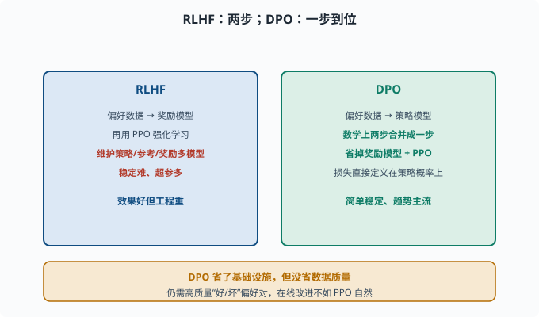

# DPO 与替代方案：不靠强化学习也能对齐

> 目标：理解 DPO 为什么能"跳过奖励模型和强化学习"直接对齐。读完这一页，你能对比 RLHF 与 DPO 的差异与取舍，也知道对齐替代路线的几个选项。

## RLHF 的工程负担

RLHF（[07-04](07-04-alignment.md)）效果好，但工程很重：

```text
要额外训练一个奖励模型
强化学习（PPO）训练不稳定、超参多
需要维护策略/参考/奖励多个模型
调参失败率高
```

于是出现了"更简单、更稳定的对齐"路线，**DPO** 是最重要的代表。



上图并排对比两条路线：左侧的 RLHF 需要先在偏好数据上训练奖励模型、再用 PPO 强化学习优化，还要同时维护策略、参考、奖励多个模型；右侧的 DPO 把这两步数学上合并成一步，直接基于同一份"好/坏偏好对"训练策略模型，省掉了奖励模型和 PPO 两件大件。底部琥珀条提醒一个关键事实：省的是基础设施，不是数据质量。

## DPO 的核心洞察

**DPO（Direct Preference Optimization，直接偏好优化）**有一个极其优雅的想法：

```text
RLHF"先训奖励模型、再用强化学习优化"的两步，
可以数学上合并成一步：直接用偏好数据训练策略模型。
```

也就是：**不需要单独的奖励模型，也不需要 PPO**。只用原来的"一对回答的好坏排序"数据，就能让模型学会"偏好好的回答"。

训练目标直觉：

```text
对每个 (preferred, dispreferred) 对：
  提高 preferred 的概率
  降低 dispreferred 的概率
  同时用 KL 约束别偏离参考模型太远（防止跑偏）
```

DPO 直接把"偏好排序"变成简单可微的损失，一步到位。

## 为什么 DPO 能"等价"

数学上，RLHF 的最优策略有一个**闭式解**（closed-form solution：能一步写出的显式公式，不需要迭代求解）。DPO 反推这个解，把隐含的"最优奖励"表达成策略模型的函数，于是：

```text
不再显式建模奖励模型
损失直接定义在策略概率上
```

这解释了 DPO 的吸引力：**效果接近 RLHF，却省掉奖励模型与 PPO 两个大件。**

## 一个 DPO 损失的"直觉版"

简化来看，DPO 的优化方向是：

```text
↑ log P_θ(chosen | x)   （让好的更高）
↓ log P_θ(rejected | x) （让差的更低）
两项的差距要拉开，且用 β 控制"拉多开"（别漂太远）
```

`β` 控制"多信任偏好数据 vs 多保持原模型"。小 `β` 更激进拟合偏好，大 `β` 更保守。真实 DPO 损失把这些打包进一个 sigmoid：比较的是"策略相对参考模型，在好答案上的提升量"减"在坏答案上的提升量"——对参考模型的约束不是单独的 KL 惩罚项，而是藏在 β 缩放的这层比较里（这正是上面"闭式解反推"的结果）。

## 备选对齐路线一览

```text
RLHF（PPO）：经典，效果好但重
DPO：直接偏好优化，简单稳定，趋势主流
其他：RLAIF（用 AI 代替人工标注偏好）、Constitutional AI（按宪法原则自我批评）、KTO（不需要成对、只要"好/坏"单条标签的变体）、IPO（把"拉大差距"换成更温和回归目标的变体）等
```

没有"万能最优"：重工程追求上限选 RLHF 系，轻量实用选 DPO 系，低成本迭代常用 DPO。

## DPO 的代价与局限

DPO 并非免费：

```text
仍需要高质量偏好对（好/坏成对的数据）
对数概率估计要基于参考模型，训练内存/计算仍有开销
对"在线获取新偏好并持续改进"不如 PPO 自然（PPO 可在线采样）
偏好数据质量差则对齐差
```

所以 DPO 是"省了基础设施"，不是"省了数据质量"。

### DPO 与 RLHF 怎么选

一个实用的决策参考：

```text
团队没有 RL 训练基建、偏好数据一次性收集 → DPO（简单稳定，一次训练跑完）
需要在线滚动收集偏好、随部署持续调 → RLHF/PPO（采样-标注-更新可循环）
追求极致性能上限、有成熟 RL 工程团队 → RLHF 系（上限经验上略高）
快速做实验比较几种对齐方案 → DPO（迭代成本低）
```

实践中还有"两段走"的常见组合：先 DPO 快速打底（拿到 90% 的效果），需要时再上 PPO 精修。选择的关键变量不是"哪个更好"，而是**你的偏好数据从哪来、多久更新一次、你有多少 RL 工程能力**。

## 思考题

1. RLHF 的工程负担有哪些？
2. DPO 的核心洞察是什么？
3. DPO 相比 RLHF 省掉了哪两样东西？为什么能省？
4. DPO 损失大致朝哪两个方向优化、还要约束什么？
5. DPO 有哪些局限？

## 参考答案

1. 要额外训练奖励模型、用 PPO 等强化学习且不稳定、需同时维护策略/参考/奖励多模型、超参多调参复杂。
2. 把 RLHF 的"先训奖励模型、再用强化学习优化"两步，数学上合并成一步：直接用偏好对数据训练策略，不需要单独奖励模型与 PPO。
3. 省掉独立的奖励模型和 PPO 强化学习。因为 RLHF 的最优策略有闭式解，DPO 反推后把隐含奖励表达成策略概率的函数，直接定义可微损失。
4. 提高"被偏好"回答的概率、降低"被排斥"回答的概率并拉开差距，同时用 `β` 约束这个差距的尺度，防止策略偏离参考模型太远（漂移与 reward hacking）；对参考模型的约束隐含在损失的比较结构里，不是独立的 KL 惩罚项。
5. 仍需要高质量偏好对；对数概率与参考模型计算仍有开销；对"在线采样新偏好并持续改进"不如 PPO 自然；偏好数据质量差则对齐效果差。

## 下一步

- 想去看 RLHF 与奖励模型的细节 → [07-04 对齐](07-04-alignment.md)。
- 想衡量对齐好坏 → [07-07 评估基准](07-07-evaluation.md)。
- 想低成本自定义模型 → [07-09 微调实践](07-09-finetuning.md)。

[返回本章目录](README.md)
