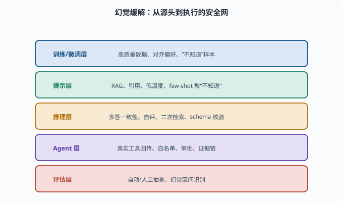
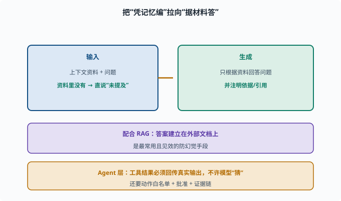

# 幻觉与缓解：让模型少"编"

> 目标：把 [06-09 局限与幻觉](../06-llm-fundamentals/06-09-limits-hallucination.md) 的幻觉概念落地成具体的工程缓解手段。读完这一页，你能列出从"数据/训练"到"推理/评估"的整套防幻觉工具箱，并理解"缓解"而非"根除"。

## 先记住：幻觉是"减轻"不是"消除"

LLM 的幻觉源于"预测下一个词"的本质（[06-09](../06-llm-fundamentals/06-09-limits-hallucination.md)），无法彻底根除。工程上的目标很现实：

```text
降低幻觉率
让幻觉可被检测/可被校验
把高风险幻觉挡在关键流程外
```

## 缓解层次一：训练/微调

从源头下手：

```text
高质量训练/对齐数据：减少"学坏"的土壤
RLHF/DPO 偏好：把"说错/编造"标成低分
加"我不知道"样本：教模型在不确定时直说
可校准性：让模型学会正确表达不确定性
```

这些成本高、周期长，但最治本。



上图把整套防幻觉手段按"从源头到执行"的次序排成五层：训练/微调层治本但贵，提示层最省事，推理层在生成后自检，Agent 层用真实工具回传与审批兜底，评估层负责持续抽查。这正好回答了"缓解而非根除"的工程定位——每一层都只能降低概率，靠多层叠加才让高风险幻觉尽量被挡在关键流程外。（本章行文按前四层展开，评估层见 [07-07](07-07-evaluation.md)。）

## 缓解层次二：上下文与提示

不重训、最省事：

```text
检索增强（RAG）：把答案建立在外部文档上
提示模型"只用给定材料，不要推理虚构"
要求给引用/出处
降低温度：减少采样滑向离奇组合
few-shot 给"老实说不知道"的例子
```

其中 **RAG** 是最强杠杆，单列在 [07-08](07-08-rag.md)。

## 缓解层次三：推理期校验

生成后再自检：

```text
生成多份答案，投票/一致性检测
让模型自评"这条是否确定"
对关键数值/来源二次检索核对
结构化输出+规则校验：用 schema（模式约定——对输出"必须有哪些字段、什么类型"的形式化描述，[08-02](../08-agent-foundations/08-02-tools-and-function-calling.md) 展开）约束，减少自由文本
```

这一层叫做"推理期安全网"——即使发生了幻觉，也尽量拦截或标记。

## 缓解层次四：Agent 层约束

对 agent（[08](../08-agent-foundations/README.md)）最特殊也最关键：

```text
工具结果必须回传真实输出，不许模型"猜"
工具/动作清单白名单，杜绝编造工具
重要操作要人工确认（审批）
记录证据链，便于回溯与校验
```

deepseek-harness 里工具返回走真实函数输出、重大操作走审批，正是这套思路（[08](../08-agent-foundations/README.md)、[10](../10-practical-lab/README.md)）。

## 一个简单实践：强制"用材料回答"

```python
def grounded_prompt(context, question):
    return f"""以下是一段资料。请只根据资料回答，不要加入资料外的信息。
如果资料里没有答案，请直接说"资料中未提及"。
资料：{context}
问题：{question}
请注明依据："""
```

这类 prompt 配合 RAG，把模型从"凭记忆编"拉向"据材料答"，是最常用且见效的防幻觉手段。



上图展示了"接地回答"的完整链路：左侧输入侧把上下文资料与问题一起交给模型，并明确"资料里没有就直说未提及"；右侧生成侧只依据资料作答并注明引用；下方两条条带进一步叠加 RAG 和 Agent 层约束——尤其工具结果必须回传真实输出、动作要有白名单与审批，杜绝模型凭空捏造外部状态。

## 一张缓解工具箱

```text
训练层：高质量数据、对齐偏好、"不知道"样本
提示层：RAG、引用、低温度、few-shot "不知道"
推理层：多答一致性、自评、二次检索、schema 校验
Agent 层：真实工具回传、白名单、审批、证据链
评估层：自动/人工抽查、幻觉区间识别
```

## 思考题

1. 为什么说缓解目标不是"根除"幻觉？
2. 训练/对齐层如何降低幻觉？
3. 提示层最常用的三招是什么？
4. 推理期的"一致性检测"是什么思路？
5. Agent 层防幻觉最关键的原则是什么？

## 参考答案

1. 因为幻觉源于"预测下一个词"的本质，是模型内在倾向，无法彻底消除。工程目标改为降低率、可检测、可校验，并把高风险场景挡在关键流程外。
2. 用更高质训练/对齐数据减少学坏土壤；把"编造/说错"在 RLHF/DPO 里标成低分；加入"我不知道"样本；让模型学会正确表达不确定性。
3. RAG 检索增强（答案建立在外部文档上）、提示"只用材料不虚构"、要求引用/出处，或降低温度、few-shot 教"不知道"。
4. 让模型生成多份回答，看它们是否一致；重复采样的答案高度一致的可信度更高，分歧大的更可能是幻觉，从而拦截高不确定输出。
5. 工具结果必须回传真实输出，不允许模型"猜测/编造"工具行为或外部状态；配合动作白名单、重大操作审批与证据链，杜绝模型凭空捏造已发生的事。

## 下一步

- 想深入"检索增强"这个最强杠杆 → [07-08 RAG](07-08-rag.md)。
- 想衡量防幻觉做得好不好 → [07-07 评估基准](07-07-evaluation.md)。
- 想把幻觉控制做进 agent 循环 → [08 Agent 基础](../08-agent-foundations/README.md)。

[返回本章目录](README.md)
