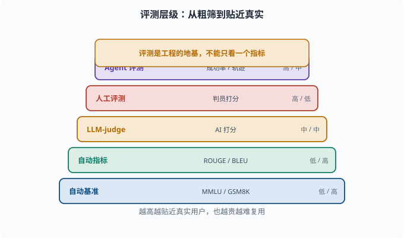
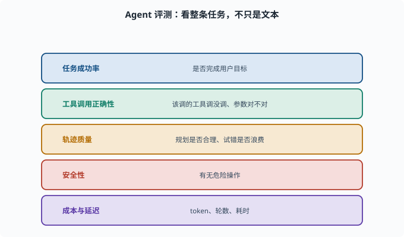

# 评估基准：怎么知道模型/系统到底行不行

> 目标：建立"评测是工程的地基"的认知。读完这一页，你能区分自动基准、人工评测、agent 级评测，知道为什么不能只看一个指标，也知道评测本身的陷阱。

## 为什么"好坏"必须度量

模型"看起来聪明"不可靠。要做出工程决策（改 prompt、换模型、调参、上线），就得有**可重复、可比较**的度量。

```text
没有评测 → 只能靠"感觉"，无法迭代
评测差 → 错误决策，浪费成本
评测对 → 知道改哪儿有用、哪儿没用
```

所以在 LLM 工程里，**评估（evaluation）是地基**。



上图把评测按"成本与贴近真实"排成一条阶梯：从可重复、便宜的自动基准与自动指标，到中等成本的 LLM-as-a-Judge，再到昂贵但最可靠的人工评测与整条任务级的 Agent 评测。越往上越贴近真实用户，但也越贵、越难复用；顶部的琥珀条点明原则——评测是工程的地基，不能只看一个指标。

## 自动基准（Benchmark）

用现成数据集+打分规则自动算分：

```text
常识/知识：MMLU（多学科选择题）、TriviaQA（百科问答）
推理：GSM8K（数学应用题）、Big-Bench（跨领域综合）
代码：HumanEval（函数补全）、MBPP（基础编程题）
中文：C-Eval（中学到大学多学科中文选择题）、CMB（中文医学）
```

优点：可重复、省人力、能横向对比模型。
缺点：

```text
可能过拟合/数据泄漏（测试题进训练集）
选择题正答率有运气成分
不能覆盖"真实对话"的复杂与多解
分数高不等于真的好用
```

## 自动指标：ROUGE / BLEU 与它们的局限

生成任务常用：

```text
BLEU、ROUGE：看生成文本与参考答案的 n-gram 重合度（n-gram=连续 n 个词，[05-01](../05-nlp-transformers/05-01-lm-basics.md) 讲过这个概念；重合度越高分越高）
精确率/召回率/F1（分类/抽取）：沿用 [03-05](../03-machine-learning/03-05-evaluation-metrics.md)
```

局限：**生成是开放多解的**，"说得对但措辞不同"会给低分。所以机器 n-gram 指标只能当粗筛，不能当唯一裁判。

## LLM-as-a-Judge：让大模型当评委

用**大模型评判大模型的回答**（LLM-as-a-Judge）：

目标：给定任务与参考答案（或直接凭事实），让评判模型打分/排序。优点是可复现、覆盖多解、便宜。

陷阱：

```text
评委有偏（偏爱排在前面的答案、偏爱长回答）
评委自己也可能幻觉
自我偏好（喜欢跟自己像的回答）
需要设计评分 rubric（评分细则），否则不稳
```

所以"AI 评委"要配好评分细则、多次采样、人工抽验。

## 人工评测：最可靠也最贵

人类根据评分准则直接判断回答：

```text
有用性、正确性、忠实性、安全性、流畅度
排名（A 好于 B）或 5 分制打星
```

优势：贴近真实用户、能抓自动指标漏掉的点。
代价：慢、贵、有主观差异，需要"判员一致性"（多个判员对同一批样本的打分是否互相吻合）控制。

## Agent 评测：不只是文本

对 agent（[08](../08-agent-foundations/README.md)），评测不能只看"一句回答"，而要看**整个任务的结果**：

```text
任务成功率：是否完成了用户目标
工具调用正确性：调了该调的工具、参数对不对
多步轨迹质量：规划是否合理、试错是否浪费
安全性：有没有危险操作
成本与延迟：token 量、轮数、耗时
```

这在 deepseek-harness 里对应"真实任务的完成度"和"会话记录的文字/轨迹回放"（[08](../08-agent-foundations/README.md)、[10](../10-practical-lab/README.md)）。文本接龙指标在 agent 场景远远不够。



上图把 Agent 评测拆成五个可度量的维度：任务成功率、工具调用正确性、轨迹质量、安全性与成本延迟。它提醒你评测对象从"一句文本"变成了"一整条行动轨迹"——不仅要看最终结果对不对，还要关心该调的工具是否调对、规划是否浪费试错、有没有危险操作，并用 token 与轮数衡量效率。

## 评测的常见陷阱

```text
只在"容易的"测试集上测 → 高估
测试集泄漏进训练 → 假高分
只看一个指标 → 以偏概全
用模型的"自报"当结论 → 主观
不断改 prompt 去适配测试集 → 过拟合测试
```

好的评测要：多个维度、冻结的测试集、分层抽样、结合自动+人工+回合级。

## 一张评测层级表

| 层级 | 对象 | 例子 | 成本/可重复性 |
|---|---|---|---|
| 自动基准 | 单模型 | MMLU、GSM8K | 低/高 |
| 自动指标 | 生成结果 | ROUGE、BLEU | 低/高 |
| LLM-judge | 生成结果 | AI 打分 | 中/中 |
| 人工评测 | 生成结果 | 判员打分 | 高/低 |
| Agent 评测 | 整条任务 | 成功率、轨迹、安全 | 高/中 |

## 思考题

1. 自动基准的优点与局限各是什么？
2. 为什么 BLEU/ROUGE 不适合当唯一裁判？
3. LLM-as-a-Judge 的陷阱有哪些？
4. Agent 评测和纯文本评测有何不同？
5. 列举至少 4 个评测的常见陷阱。

## 参考答案

1. 优点是可重复、省人力、能横向对比模型；局限是可能数据泄漏/过拟合、选择题有运气成分、不能覆盖真实对话的复杂与多解、分数高不等于好用。
2. 因为生成是开放的、多解且措辞多样的，"说得对但换说法"会被 n-gram 重合度给低分，无法反映语义正确性，只适合当粗筛。
3. 评委有位置/长度偏好、评委也会幻觉、可能偏好与自己风格相似的答案；若没有清晰评分 rubric 且不多次采样、不人工抽验，结果不稳定。
4. Agent 评测要看整条任务（成功率、工具调用正确性、多步轨迹质量、安全性、成本与延迟），而不只是单句回答的文本质量，因此文本接龙指标远远不够。
5. 只测易集而高估、测试集泄漏进训练、只盯一个指标、把模型自报当结论、反复改 prompt 去适配测试集导致过拟合测试。

## 下一步

- 想把外部知识注入提高事实性 → [07-08 RAG](07-08-rag.md)。
- 想低成本定制模型 → [07-09 微调实践](07-09-finetuning.md)。
- 想在 agent 里落地评估 → [08 Agent 基础](../08-agent-foundations/README.md) 与 [10 实战 Lab](../10-practical-lab/README.md)。

[返回本章目录](README.md)
