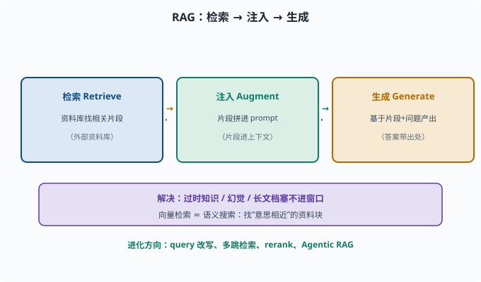
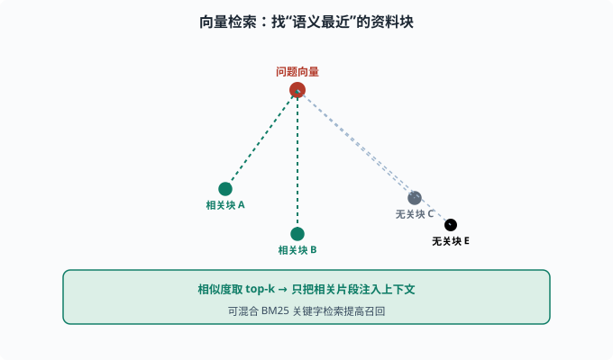

# RAG：检索增强生成，把外部知识注入模型

> 目标：理解 RAG 的"检索-注入-生成"框架，以及它为何是解决"过时知识、幻觉、长文档"的关键。读完这一页，你能说清 RAG 的模块、向量检索的大致原理，以及它的局限。

## 为什么需要 RAG

LLM 有几个"治不好"的毛病（[06-09](../06-llm-fundamentals/06-09-limits-hallucination.md)）：

```text
知识有截止日期（预训练时点）
爱编造（凭记忆容易幻觉）
长文档塞不进上下文（窗口有限，[06-07](../06-llm-fundamentals/06-07-context-window.md)）
```

**RAG（Retrieval-Augmented Generation，检索增强生成）**的思路：让模型**先检索外部资料，再把检索结果放进上下文一起回答**，而不是全靠记忆。



上图画出了 RAG 的完整链路：先从外部资料库检索出与问题相关的片段，再把这些片段注入 prompt，最后让模型基于"片段 + 问题"生成答案。下方紫色条点出这套机制一次性解决了 LLM 的三个短板——知识有截止日期、爱凭记忆编造、长文档塞不进有限窗口；同时无论走朴素、进阶还是 Agentic RAG，本质都围绕"检索什么、什么时候检索"这个动作。

## RAG 的三段式流程

```text
检索（Retrieve）：从外部资料库（文档、数据库、网页）找出相关问题片段
注入（Augment）：把检索到的片段拼成 prompt 的一部分
生成（Generate）：模型基于"检索片段 + 问题"生成答案
```

例：

```text
问题：公司 2024 年营收是多少？
检索：从公司知识库取出一段"2024 年营收 X 亿"
注入：资料 = X 亿；问题 = ...
生成：模型据资料回答 → 引用出处
```

这不仅提升正确率，更重要的是**让答案有据可查**、能更新知识而不必重训模型。

## 核心模块与"检索"怎么工作

RAG 的几个部件：

```text
资料库：把文档切块（chunk，chunk=把长文切成的小段）+ 转成向量存起来
Embedding：用模型把文本块变成向量（[05-02](../05-nlp-transformers/05-02-word-representation.md)）
检索：把问题也转成向量，找"语义最接近"的资料块（向量相似度）
生成：把命中块塞进 prompt
```

向量检索近似"语义搜索"：`问题向量` 与每个 `资料块向量` 算相似度，取最接近的几段。常用工具如向量数据库（专为存向量、快速算相似度设计的数据库）。也可结合关键字（BM25，经典的关键词打分检索算法，靠词频等统计量匹配）做混合检索提高召回——向量管"意思相近"，关键词管"字面精确"。



上图把向量检索画成一个"语义地图"：顶部的红色问题向量向四周的绿色资料块打虚线，越近的线代表语义越接近；先算相似度、再取 top-k 相关片段注入上下文。绿色条带与右侧灰色无关块呼应一个关键点——检索找的是"意思相近"而非"字面相同"，必要时还要混合关键字（BM25）来提高召回。

## RAG 的常见变体

```text
朴素 RAG：一次性检索几段直接塞入
进阶：query 改写（把口语问题改写成更适合检索的问法）、多跳检索（multi-hop，回答需要"A 的作者写过什么"这类问题时要先查 A 再查作者，检索多跳着走）、重排序（rerank，用更精细的模型给初步检回的候选重新打分排序）
Agentic RAG：让 agent 自主决定检索哪些、查几次（[08](../08-agent-foundations/README.md)）
```

演进方向是"更智能地决定检索什么、什么时候检索、要不要再查"，这正好和 agent 的"行动循环"结合。

## RAG 不是银弹：局限

```text
检索可能漏掉关键片段（召回不足）
检索质量差 → 注入的也是错的
分块粒度：切太碎丢上下文，切太粗噪音大（chunk 大小通常几百 token 量级，要按文档结构试）
向量检索对"事实精确匹配"有时不如关键词（如型号、编号）
仍可能被模型忽略/误用注入内容
```

所以工程上常常**评估 RAG 的检索质量**（[07-07](07-07-evaluation.md)）：不仅要看"答案对不对"，还要看"命中的资料对不对"。

## 一个 RAG 的最小示意思路

```python
# 概念演示，不是生产代码
def rag_answer(question, doc_chunks, embed_fn, llm):
    q_vec = embed_fn(question)
    # 找 top-k 最相近的资料块
    scored = sorted(
        ((embed_fn(c), c) for c in doc_chunks),
        key=lambda pair: cosine(pair[0], q_vec), reverse=True)
    context = "\n".join(c for _, c in scored[:3])
    prompt = f"根据以下资料回答，不要编造。\n资料：{context}\n问题：{question}"
    return llm(prompt)
```

看到的骨架：**嵌入→检索→注入→生成**，就是 RAG。

## RAG 与 Agent 的未来

对 agent（[08](../08-agent-foundations/README.md)），RAG 是"给模型当外部记忆与工具"的一种。deepseek-harness 的 web 搜索、文件读取等能力，本质上都在做"把外部信息取回、放进上下文再决策"这件事（[08](../08-agent-foundations/README.md)）。

## 思考题

1. RAG 的三个阶段是什么？
2. 向量检索大致如何工作？在检索语义时它找的是什么？
3. RAG 解决了 LLM 的哪几个问题？
4. RAG 的常见局限有哪些？
5. 为什么评估 RAG 时还要看"检索质量"而非只看答案？

## 参考答案

1. 检索（从外部资料库找出相关片段）、注入（把片段拼进 prompt）、生成（基于"片段+问题"产出答案并带依据）。
2. 把文本块和问题都转成向量，再算向量之间的相似度，找出与问题语义最接近的资料块。它找的是"语义相近的内容"，而非仅字面匹配。
3. 缓解过时知识（可更新外部资料无需重训）、降低幻觉（答案建立在检索依据上）、处理长文档（只注入相关片段，规避窗口塞满）。
4. 检索可能召回不足、检索质量差会注入错误、分块粒度影响效果、向量检索对精确事实匹配有时不如关键词、模型仍可能忽略或误用注入内容。
5. 因为"答案对"建立在"检索对了"之上：若命中资料是错的/漏了关键块，模型就算忠实于材料也会答错。分开评估检索召回率与答案正确性，才能定位问题在检索还是生成。

## 下一步

- 想防幻觉的更多手段 → [07-06 幻觉与缓解](07-06-hallucination.md)。
- 想评估这种系统 → [07-07 评估基准](07-07-evaluation.md)。
- 想看到 RAG 如何融进"会行动的 agent" → [08 Agent 基础](../08-agent-foundations/README.md)。

[返回本章目录](README.md)
