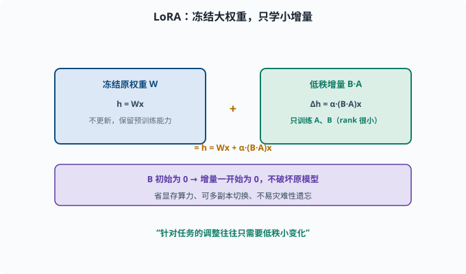
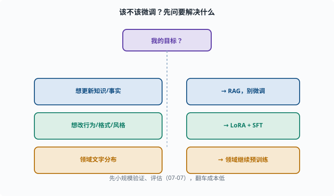

# 微调实践：低成本定制模型（LoRA 与指令微调）

> 目标：理解"为什么不用全参数重训也能定制模型"。读完这一页，你能说清全量微调 vs LoRA、指令微调 vs 领域继续预训练的差异，也知道什么时候该微调、什么时候不该。

## 什么时候才需要微调

微调不是默认选项。先问一个问题：**你想解决的是什么？**

```text
想要更新知识/事实 → 用 RAG，别微调
想要改变"行为/格式/风格" → 才考虑微调
想要特定领域技能（结构化输出、工具调用格式）→ 微调有价值
```

一个朴素原则：

> 微调擅长"改变行为模式"，不擅长"塞新知识"。新事实更适合检索增强（[07-08](07-08-rag.md)）。

## 全量微调 vs 参数高效微调

**全量微调（full fine-tuning）**：更新全部参数。效果上限高，但：

```text
显存/算力大、成本高
可能过拟合、灾难性遗忘（忘了预训练学的）
每个任务一份全量副本，难以同时维护多个
```

**参数高效微调（PEFT）**：只训练一小部分"附加参数"。**LoRA** 是代表作。

## LoRA：只学"增量"，不动原权重

**LoRA（Low-Rank Adaptation，低秩适配）**的核心洞察如下。先补一个背景——"秩（rank）"是矩阵的一个属性：一个 d×k 的矩阵最多有 min(d,k) 个独立方向；如果一个矩阵能用两个小矩阵相乘（如 d×rank 乘 rank×k，rank 很小）来近似，就说它是"低秩"的。LoRA 的假设是：

> 模型原有权重很大，但"针对某个任务要做的调整"往往只需要**很小维度的增量**（低秩）。

做法：冻结原始权重 W（形状 d×k，d 行 k 列，同 nn.Linear 的权重），在旁边加两个小矩阵：A（rank×k）和 B（d×rank），rank 远小于 d、k。实际更新时：

```text
新权重 = 原 W + α·(B·A)
```

`h = Wx + α·(B·A)x`。`B·A` 的形状是 (d×rank)·(rank×k) = d×k，与 W 完全同形，但它至多 rank 个独立方向——这就是"低秩"的来源。训练时**只更新 A、B**（参数量 (d+k)×rank，远小于 d×k），原 W 冻结。`α` 是缩放系数，控制增量整体的强度。

好处：

```text
显存/算力大幅下降（可消费级显卡微调）
参数少、可同时存多个任务副本切换
不易灾难性遗忘（几乎不改原权重）
效果好、收敛快
```

这也是"适配器/adapter"家族的思想：在冻结的大模型旁加一个可训练的"小配件"。



上图把 LoRA 的结构画成两条并行的路径：左路是冻结的原权重 `W`（输出 `h = Wx`，不参与更新、保住预训练能力），右路是外加的低秩矩阵对 `B·A`（输出增量 `α·(B·A)x`），两者相加得到最终 `h = Wx + α·(B·A)x`。紫色条点出 `B` 初始为 0 的妙处——起步时增量为 0、完全不破坏原模型，训练中才逐步长出所需的方向，这也是 LoRA 省显存、可多副本、不易灾难性遗忘的根源。

## 指令微调（SFT）的实操要点

微调的常见形态是**指令微调（SFT）**（[06-05](../06-llm-fundamentals/06-05-training-stages.md)）：

```text
数据：(指令, 期望输出)
损失：next-token 交叉熵
通常配合 LoRA 做 PEFT
```

实操经验：

```text
数据质量 > 数量：一小批高质量"格式/行为"样本比一大堆低质更有效
控制学习率：LoRA 常用较低 lr
防过拟合：验证集、早停（[04-06](../04-deep-learning/04-06-training-tricks.md)）
保留通用能力：混一些通用指令数据，防遗忘
```

## 领域继续预训练：另一种姿势

如果想注入"领域文本风格"（如法律/医学语料），可以**继续预训练（domain-adaptive pretraining）**：

```text
用领域纯文本 + next-token 目标继续训练
→ 让模型更"懂"该领域的文字分布
```

注意：这提升的是"该领域文本的流畅/熟悉度"，不等于"领域知识更准"，还需要下游验证。

## 一个 LoRA 的代码直觉

```python
import torch
import torch.nn as nn

class LoRALinear(nn.Module):
    def __init__(self, weight, rank=8, alpha=16):
        super().__init__()
        self.register_buffer("W", weight)   # 冻结原权重，形状 (d, k)
        d, k = weight.shape
        self.A = nn.Parameter(torch.randn(rank, k) * 0.01)
        self.B = nn.Parameter(torch.zeros(d, rank))
        self.alpha = alpha

    def forward(self, x):
        base = x @ self.W.T
        delta = self.alpha * (x @ (self.B @ self.A).T)
        return base + delta
```

`A` 小随机初始化、`B` 初始为 0，保证刚开始增量是 0（不破坏原模型）。训练只更新 A/B。这就是 LoRA 的本质示意（PyTorch 库如 `peft` 已实现，不必手写）。

## 微调该不该做：决策流

```text
只是想要新事实？ → RAG（别微调）
想改输出格式/风格/领域行为？ → LoRA + SFT
领域文字分布？ → 领域继续预训练
能接受大成本且要上限？ → 全量微调（谨慎）
```

先小规模验证、评估（[07-07](07-07-evaluation.md)），翻车成本低。



上图是一张"要不要微调"的决策图：想更新知识或事实就走 RAG、别微调；想改行为/格式/风格就 LoRA + SFT；想让模型更熟悉某领域的文字分布就做领域继续预训练。每个支路对应的"该不该做、用哪种技术"被画成分支，提醒你微调不是默认选项，先明确要解决什么再选手段。

## 思考题

1. "微调擅长什么、不擅长什么"？知识应该用什么手段注入？
2. 全量微调 vs 参数高效微调，各自的取舍是什么？
3. LoRA 的核心思想是什么？它训练时只更新哪部分？
4. LoRA 的 B 为什么初始化为 0？
5. 何时该用 RAG、何时该用微调？

## 参考答案

1. 微调擅长改变"行为模式/格式/风格"，不擅长"塞新知识/事实"。新事实更适合用 RAG（检索增强）注入，而非靠重训。
2. 全量微调更新所有参数、上限高但贵且易遗忘/过拟合；参数高效（如 LoRA）只训练小增量，省显存算力、可多副本、不易遗忘，但表达上限略低。
3. LoRA 认为"针对任务的调整往往只需低秩小变化"，于是冻结原权重 W，外加两个小矩阵 A、B 学习增量（新权重 = W + α·B·A）。训练只更新 A、B。
4. 因为 B 初始为 0 时增量 B·A=0，刚开始输出就是原模型的输出，不破坏预训练已学的能力；训练过程中才逐步长出所需增量。
5. 想注入新事实/更新知识用 RAG；想改变输出格式、风格、特定领域行为，或需要稳定结构化的行为（如工具调用格式）时才用微调（常配合 LoRA + SFT）。

## 下一步

- 想评估微调效果 → [07-07 评估基准](07-07-evaluation.md)。
- 想让微调后的模型"会用工具做任务" → [08 Agent 基础](../08-agent-foundations/README.md)。
- 想复习训练技巧 → [04-06 训练技巧](../04-deep-learning/04-06-training-tricks.md)。

[返回本章目录](README.md)
