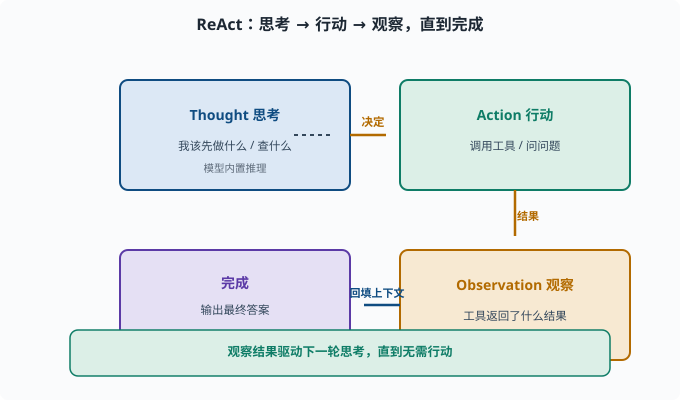
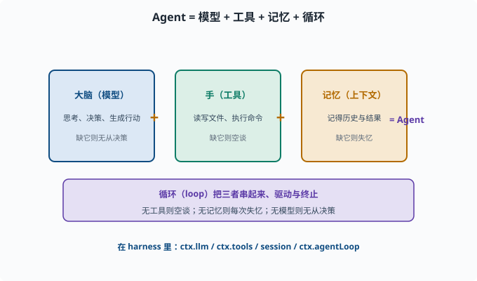

# 什么是 Agent

> 目标：读完这一页，你能用自己的话区分"聊天机器人"和"Agent"，说出 Agent 的三个核心部件，并知道 `deepseek-harness` 把这些部件放在了哪里。

## 从对话到行动

一个普通的聊天机器人，做的事情是：**输入一句话 → 输出一句话**。它确实在"说话"，但它不负责"动手"——它不会替你把文件写好、把命令跑完、把网页查完。

Agent（智能体）的关键区别只有一句话：

> **Agent 不只是生成文本，它能调用工具、观察结果、继续行动，直到完成任务。**

换句话说，聊天机器人的输出终止于文本；Agent 的输出可以是一个个**动作**（读写文件、执行命令、查数据库、调用外部服务），而这些动作的结果又会作为新的输入，推动它继续思考。这套"输出的动作反过来变成新的输入"的接法，工程上就叫**闭环（closed loop）**：输出会回流影响下一步输入，和 [03-01](../03-machine-learning/03-01-supervised-overview.md) 里"预测→算损失→更新→再预测"的训练闭环是同一个思想。

## 一个代表性的循环：ReAct

Agent 最朴素也最经典的工作方式叫 **ReAct（Reason + Act，思考与行动交替）**。它把一次任务拆成一个循环：

```text
Thought（思考）  →  我该先做什么？
Action（行动）   →  调用某个工具 / 问个问题
Observation（观察）→  工具返回了什么结果？
                    ↓ （回到思考，直到任务完成）
完成 → 输出最终答案
```



上图把 ReAct 画成一个循环：模型先在 `Thought` 里决定"我该先做什么"，据此发起一个 `Action`（调用工具或提问），拿到工具的 `Observation` 结果后又把结果回填进思考，如此周而复始，直到没有行动产生、直接输出最终答案。注意循环的关键是"中间结果会反过来驱动下一步"，这正是"有目标、有记忆、能自我调整"得以成立的地方。

「思考–行动–观察」不断交替，直到 Agent 自己判断任务已经完成。

> 很多人把 Agent 简单理解为"能调用函数"。其实更进一步：真正的 Agent 是**有记忆、有目标、能根据中间结果自我调整**的循环，而"会调用工具"只是它的一个关键零件。

## Agent 的三个核心部件

要被称为 Agent，几乎总是需要下面三样东西（它们也正是后续章节的主题）：

| 部件 | 干什么 | 对应章节 |
|---|---|---|
| **大脑（模型）** | 负责思考、决策、生成行动 | [06 LLM 原理](../06-llm-fundamentals/README.md)、[07 LLM 工程](../07-llm-engineering/README.md) |
| **手（工具）** | 让 Agent 能读写文件、执行命令、访问外部世界 | [08-02 工具调用](08-02-tools-and-function-calling.md) |
| **记忆（上下文）** | 记得之前的对话与观察，形成连贯行为 | [08-04 记忆系统](08-04-memory-systems.md) |

三者之外还需要一个**循环（loop）**把它们串起来——决定何时继续、何时终止。循环是工程骨架而不是模型的"器官"，放到 [08-03 Agent 循环](08-03-agent-loop.md) 单独展开；本章的心智模型公式里先把它算上。

缺一个都不完整：没有工具，它只能空谈；没有记忆，它每次都是"失忆的"；没有模型，它根本无法决策。

### 与"自动化脚本"的分界

有个容易混淆的近邻：一段带 if/else 的自动化脚本也会"读取输入、执行动作、循环处理"，它算 Agent 吗？判别的钥匙在**决策者是谁**：

```text
自动化脚本：决策逻辑由人事先写死（if 条件、循环边界都是代码）
Agent：下一步做什么由模型在运行中根据上下文决定
```

所以"接了模型的 API"不等于 Agent——如果模型只负责生成一句文案、流程走向仍由 if/else 决定，那只是"用 LLM 的脚本"。反过来，Agent 也并非永远更优：流程确定时，脚本的确定性、可测试性、低成本都胜过 Agent（[09-07](../09-agent-architecture/09-07-workflow-vs-agent.md) 会正面讨论这个取舍）。理解分界不是为了"什么都是 Agent"，而是为了在两者之间做对选择。



上图用一个简单等式概括：`Agent = 模型 + 工具 + 记忆 + 循环`。脑袋负责思考与决策，手负责读写文件、执行命令、访问外部世界，记忆负责把历史与中间结果留到当下，而循环把三者串起来、决定何时继续、何时终止。在 harness 里，它们分别落在 `ctx.llm`、`ctx.tools`、`session` 和 `ctx.agentLoop`。

## 在 deepseek-harness 里，这些部件在哪里

这是这套文档独有的优势：我们坐在真实源码仓库里。`deepseek-harness` 的架构就是 `everything is a plugin`，上述"大脑/手/记忆"在它的核心包里有清晰对应。

先记住三个入口，后面几章会逐一深入。**能力缝（capability seam）**是 harness 的术语，指"一个能力（如 LLM、工具、shell）对外提供服务的接缝"——各插件在这条缝上注册自己，其余代码只认缝、不认具体实现（[09](../09-agent-architecture/README.md) 展开）：

| Agent 概念 | 源码位置 | 一句话说明 |
|---|---|---|
| 大脑（模型） | [packages/llm/llm](../../packages/llm/llm/README.md) | 模型适配器的能力缝，`ctx.llm` |
| 手（工具注册） | [packages/core/tools](../../packages/core/tools/README.md) | 作用域化的工具注册表，`ctx.tools` |
| 记忆（会话日志） | [packages/core/session](../../packages/core/session/README.md) | append-only（只追加、不修改旧记录）的 `SessionEvent` 日志 |
| 循环（思考–行动） | [packages/core/agent-loop](../../packages/core/agent-loop/README.md) | 默认的 turn / step 驱动，`ctx.agentLoop` |

> 一个概念在这里格外重要：**turn（一轮）与 step（一步）**。在 harness 里，一次完整的处理叫 turn，turn 里每做一次模型请求并执行其工具叫 step。这正是 ReAct 循环的工程化表达。

更系统地讲，这个产品里"循环的控制流"由 [docs/architecture.md](../../docs/architecture.md) 描述。我们会在 [09 Agent 架构](../09-agent-architecture/README.md) 详细拆解。

## 一个最小心智模型

把下面这句话记住，后面所有内容都能挂上去：

```text
Agent = 模型（思考） + 工具（行动） + 记忆（上下文） + 循环（把三者串起来）
```

接入一个真实系统时，你要回答的四个问题是：用哪个模型？有哪些工具？记忆存哪里、怎么看？循环怎么被驱动和终止？

## 思考题

1. 一个只调用一次工具、拿到结果就结束的流程，算 Agent 吗？为什么？
2. ReAct 里"思考"和"行动"交替的必要性是什么？如果只思考不行动、或只行动不思考，各会怎样？
3. 为什么"记忆"不只是把聊天记录存下来？它还可能影响哪些行为？

## 参考答案

1. 通常不算（或只是"很弱的 Agent"）。因为一次调用后就不再循环、不再根据结果调整，它缺少"有目标、有记忆、能自我调整的循环"这个关键特征；"会调用工具"只是 Agent 的一个零件，而不是全部。
2. 因为真实任务常常需要"先看一步的结果，再决定下一步"：只有思考和行动交替、把中间观察反馈回决策，才能应对不可预知的中间状态。如果永远只思考不行动，就只是"空想"，解决不了实际问题；反过来，只行动不思考则是盲目乱试，浪费甚至闯祸。
3. 因为记忆不只是存档，它塑造行为：是否记得用户偏好、是否了解任务的进度、是否会从之前的错误里自省、能否跨轮保持一致，这些都会改变 Agent 后续的决策与产出。没有好的记忆结构，Agent 每轮都是"失忆的"。

## 动手练习

- 找出你日常用过的三个 AI 产品，判断它们是聊天机器人还是 Agent，并说明依据。
- 在 `deepseek-harness` 里 `rg -n "turn|step" packages/core/agent-loop/src`（`rg` 即 ripgrep，一个命令行代码搜索工具，相当于快得多的 grep），感受 turn/step 的代码入口。

## 下一步

- 想深入"Agent 怎么调用工具" → [08-02 工具调用与 Function Calling](08-02-tools-and-function-calling.md)。
- 想理解整个 Agent 的框架设计范式 → [09 Agent 架构](../09-agent-architecture/README.md)。
- 想看 harness 作者怎么定义这一套概念 → 官方 [glossary](../../docs/glossary.md)。

[返回本章目录](README.md)
