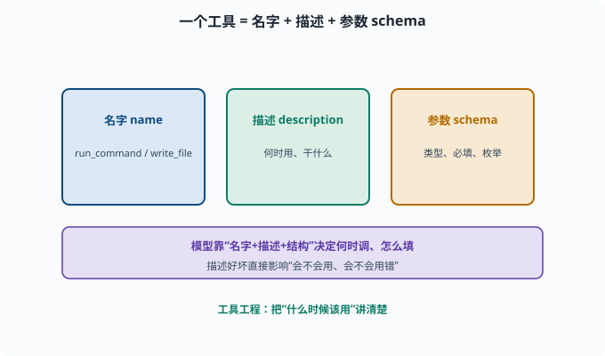
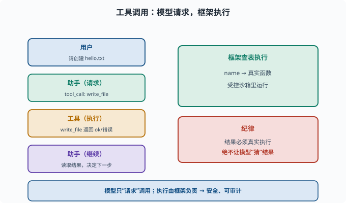
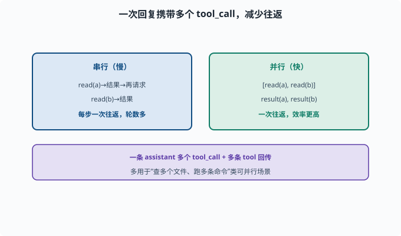

# 工具调用与 Function Calling：让模型能"动手"

> 目标：理解"工具"如何从模型的"文本功能"变成可执行的"真实能力"。读完这一页，你能说清 Function Calling 的 message 交换、工具描述如何进入模型、以及工具结果如何回传。

## 从"会说话"到"会做事"

LLM 本身只会生成文本（[06-02](../06-llm-fundamentals/06-02-token-through-model.md)）。要让它"读写文件、执行命令、查网页"，必须给它**工具（tools）**，并把"什么时候用哪个工具、用什么参数"变成模型可以**输出并执行**的动作。

**Function Calling（工具调用）**就是这套机制：模型不只输出"接下来要说什么"，还能输出"接下来要调用哪个函数、参数是什么"。

## 工具的三要素

一个工具本质上是三样东西：

```text
1. 名字（name）：唯一标识，如 "run_command"
2. 描述（description）：告诉模型"这个工具是干嘛的、什么时候用"（一段文字）
3. 参数 schema（parameters）：模型要填哪些参数、各自类型/约束（结构化 JSON）
```

模型根据"名字+描述+参数结构"，决定是否调用、怎么调用。

> **schema（模式/结构约定）**：对数据"长什么样"的形式化描述——有哪些字段、各自什么类型、哪些必填。**JSON**（一种"键: 值"文本格式，Web 与 API 世界的数据交换通用语）则是承载它的常用写法；这里的参数 schema 就是**JSON Schema**——一段描述"参数对象长什么样"的 JSON。02 章读 TypeScript 接口时你已经接触过"用类型描述数据形状"的思想（[02-06](../02-programming-basics/02-06-reading-typescript.md)），JSON Schema 做的是同一件事，只是独立于编程语言。



上图拆开一个工具：名字是唯一标识，描述告诉模型"这个工具干什么、什么时候用"，参数 schema 规定模型要填哪些字段及其类型与约束。三者一起进入模型，模型据此判断"该不该调、怎么填参数"。描述写得越清楚，模型就越少用错。

## 一次 Function Calling 的完整回合

以"帮我在 /tmp 里建一个文件"为例：

```text
第 1 轮：
  user: 请创建一个 hello.txt
  assistant 输出（特殊消息）：tool_call → 调用 "write_file"，参数 {path, content}
  （不是直接写文件，而是"请求调用"）

第 2 轮（工具结果回传）：
  tool 消息：write_file 返回了 "ok" / 错误信息
  assistant 读取结果，决定继续或总结
```

关键是：**模型只"请求"调用，真正执行由框架负责。** 执行结果作为新的消息回传给模型，模型据此继续。



上图把一次完整回合摊开：用户发话 → 助手消息里带一个 `tool_call`（只是"请求"）→ 框架在注册表里查到"名字 → 真实函数"的对应关系并在受控环境执行 → 工具结果作为 `tool` 消息回传 → 助手读取结果决定继续或总结。右侧强调纪律：工具结果必须来自真实执行，绝不能由模型"猜"，"请求调用"与"真正执行"由框架天然隔开，这也是安全与可审计的根基。

## 用 OpenAI 风格看一下消息结构

（很多厂商 API 采用类似格式，deepseek 也有 `tool_calls` 字段）

```python
messages = [
    {"role": "system", "content": "你是一个可调用工具的助手"},
    {"role": "user", "content": "请执行 ls 命令"},
]
tools = [
    {
        "type": "function",
        "function": {
            "name": "run_command",
            "description": "在沙箱里执行一条 shell 命令并返回输出",
            "parameters": {
                "type": "object",
                "properties": {"command": {"type": "string"}},
                "required": ["command"]
            }
        }
    }
]

# 调用模型：让它决定要调哪个工具
response = client.chat.completions.create(model=..., messages=messages, tools=tools)
tool_call = response.choices[0].message.tool_calls[0]
print(tool_call.function.name)      # "run_command"
print(tool_call.function.arguments) # '{"command":"ls"}'
```

拿到 `name` 和 `arguments` 后，框架**按名字在注册表里找到真正的函数**（注册表就是一张"工具名 → 真实函数"的对照表，所以常被叫"查表"）并执行，把输出原样传回。

## 工具描述质量：模型"会不会用"往往看这里

同样一个工具，描述写得好不好，直接影响模型会不会正确调用：

```text
差的描述：执行一个命令。（太模糊，不知道何时用）
好的描述：在隔离沙箱里执行 shell 命令。需要读写文件、运行脚本、检查系统状态时使用。
```

参数 schema 也要清晰：

```text
哪些参数必填
要不要枚举值
是整数/字符串/对象
```

这是"工具工程"的一部分，[07-03](../07-llm-engineering/07-03-context-engineering.md) 的上下文技巧同样适用：把"什么时候该用"讲清楚。

## 让模型"同时调多个工具"

现代模型支持**并行工具调用**：一次回复里含多个 tool_call（如同时查两个文件、跑两条命令），然后再一次性把多个结果回传。这能显著减少轮数、提升效率。

```text
assistant: tool_calls = [read(a), read(b)]
tool:      result(a), result(b)
assistant: 综合两个结果继续
```

实现上只需支持"一个 assistant 消息携带多个 tool_call"和"每个 tool_call 对应一条 tool 消息回传"。要注意并行只适合**互相独立**的调用——如果第二个调用的参数取决于第一个的结果（先读配置、再按配置里的路径读文件），就必须拆成两轮串行。



上图对比串行与并行：串行是"读一个、等结果、再请求下一个"，每步一次往返；并行则让一条 assistant 消息携带 `[read(a), read(b)]`，再一次性回传多个结果，往返次数大幅减少。它尤其适合"同时查多个文件、跑几条互相独立的命令"这类可并行收集信息的场景。

## 在 deepseek-harness 里：工具注册与作用域

在 harness（[02-06](../02-programming-basics/02-06-reading-typescript.md)）里，工具是**注册制 + 作用域化**的：

```text
ctx.tools：作用域化的工具注册表
每个能力（fs、shell、web、e2b 等）注册自己的工具
工具在特定上下文/插件里可见
```

"作用域化"指工具只在自己所属的插件上下文里可见可调——就像变量作用域限定了名字在哪里有效，工具作用域限定了"模型此刻能看见哪些工具"。这保证了"模型能用的工具集合"是受控的（哪些插件加载了，就有哪些工具），也是安全边界的一部分（[11](../11-safety-governance/README.md)）。

## 真实执行与"防幻觉"

关键纪律（呼应 [06-09](../06-llm-fundamentals/06-09-limits-hallucination.md)、[07-06](../07-llm-engineering/07-06-hallucination.md)）：

```text
工具结果必须来自真实执行，绝不让模型"猜"结果
成功/失败都以真实返回为准
重要/危险操作要有审批
```

deepseek-harness 的沙箱（`e2b`/`sandbox`）就是保证"模型说什么就执行什么，但执行在受控环境里"。

## 思考题

1. 一个工具需要定义哪三样东西？
2. 一次完整的 Function Calling 回合，消息是怎么流转的？
3. 为什么是"模型请求调用、框架执行"，而不是"模型直接执行"？
4. 工具描述写得好与坏，为什么会显著影响模型表现？
5. 并行工具调用有什么好处？

## 参考答案

1. 名字（唯一标识）、描述（何时用、干什么）、参数 schema（要填哪些参数及类型/约束）。
2. 用户消息 → 模型助手消息里带 tool_call（请求调某个函数）→ 框架执行 → 工具结果以 tool 消息回传 → 模型读取结果继续思考，直到给最终答案。
3. 因为模型只生成文本，没有真实执行能力；框架持有"名字→真实函数"的对照表并负责在受控环境执行，这也是安全与可审计的关键（模型不能绕过框架直接操作）。
4. 模型靠描述判断"什么时候该用、怎么填参数"。模糊描述会让它在不该用时不用、或填错参数；清晰的描述让模型在正确时机正确调用，很少误用。
5. 一次回复可携带多个 tool_call，再一次性回传多个结果，减少往返轮数、提升效率，也让一个步骤能并行收集多路信息。

## 下一步

- 想理解工具调用如何被"循环"组织执行 → [08-03 Agent 循环](08-03-agent-loop.md)。
- 想研究工具的安全沙箱 → [11 安全与治理](../11-safety-governance/README.md) 与 [10 实战 Lab](../10-practical-lab/README.md)。
- 想深造模型侧对工具的理解 → [07 LLM 工程](../07-llm-engineering/README.md)。

[返回本章目录](README.md)
