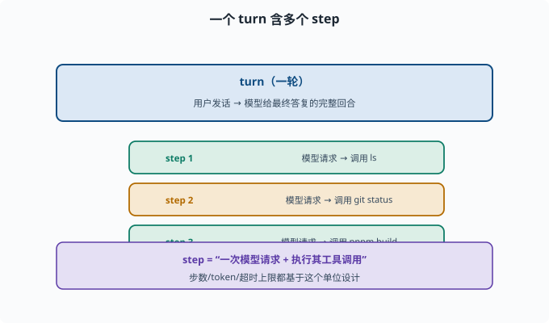
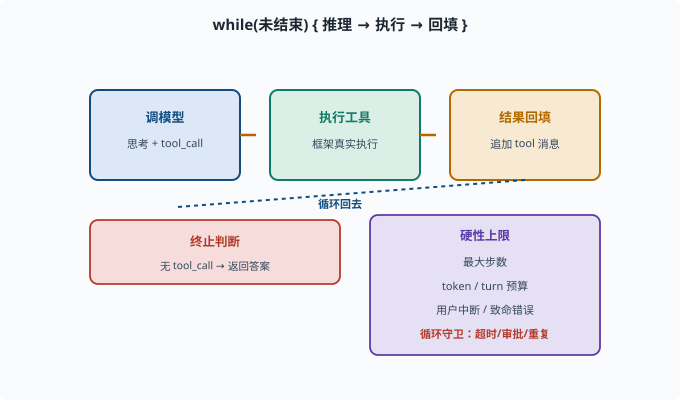

# Agent 循环：思考–行动–观察的工程化

> 目标：把 ReAct 从"概念"变成"代码里能跑的循环"。读完这一页，你能说清 turn 与 step、终止条件、最大步数、循环守卫这些"把模型转成 Agent"的工程零件。

## 为什么"一个模型的调用"还不够

function calling（[08-02](08-02-tools-and-function-calling.md)）让我们"一次让模型调用一个工具"。但真实任务往往需要**连续多步**：先查、再决策、再执行、再验证。这一连串"调用模型→执行工具→看结果→再调用模型"的循环，就是 **Agent 循环（agent loop）**。

一个任务不是"一次模型请求"，而是一**系列**迭代：

```text
模型思考 → 调工具 → 看结果 → 再思考 → 再调工具 → ... → 完成
```

## turn 与 step：两个关键单位

先建立清晰术语（deepseek-harness 也这么用）：

```text
turn（一轮）：一次请求-响应的完整回合（比如"用户发话，到模型给最终答复"）
step（一步）：一轮里"模型请求一次并执行其工具调用"的单位
```

一个 turn 可以包含很多 step：

```text
turn: 处理用户"帮我部署"
  step 1: 模型请求 → 调用 ls
  step 2: 模型请求 → 调用 git status
  step 3: 模型请求 → 调用 pnpm build
  ...
```

理解这两个单位，是设计循环控制（步数上限、token、超时）的基础。



上图用一个具体例子说明两者：外层是我们熟悉的 `turn`（"用户发话 → 模型最终答复"的一轮），内层是这一轮里多次发生的 `step`（每一次"模型请求 + 一次工具执行"）。同一个 turn 里可以连续发生 `step 1`（调 `ls`）、`step 2`（调 `git status`）、`step 3`（调 `pnpm build`），直到收敛。步数、token、超时这些预算，都是按 `step` 这个最小单位来设的。

## 循环的三要素：思考、行动、观察怎么落地

在代码层面，循环大致是：

```text
while (未结束) {
  response = 调用模型(messages, tools)      // 思考 + 可能输出 tool_call
  if (response 是最终答案) break;           // 无工具调用 → 完成
  把 response 追加到 messages               // 先记住"我请求了什么"
  for (每个 tool_call) {
    结果 = 执行工具(tool_call)               // 行动
    把结果作为 tool 消息追加到 messages      // 观察
  }
}
```

三个关键判断：

- **是否继续**：如果模型只回复文字、没有 tool_call，就说明它认为任务完成，可以终止。
- **是否安全**：每步执行前检查审批/白名单。
- **何时强制停**：要有硬性上限，防无限循环。

## 终止条件：让循环"会停"

循环不能无限跑（模型可能一直调工具转圈）。终止靠几类条件：

```text
正常终止：模型输出最终答案（无 tool_call）
步数上限：超过最大 step 数强制停（如 20 步）
turn / token 上限：超过预算停
用户中断：用户喊停
工具致命错误：无法继续时停
```

尤其**最大步数**是防死循环的必备保险：

```python
max_steps = 20
for step in range(max_steps):
    ...
```

## 循环守卫：防模型跑偏

"守卫（guard）"是循环里的安全与健康检查——在循环体里额外插的一道道检查点，不参与决策、只负责"发现异常就拦下或上报"：

```text
工具超时：单工具太久要中断
结果过大：工具输出太长要截断/摘要，防止爆上下文
敏感操作：写文件/删文件/跑命令要审批
重复检测：模型反复做同一件事要干预
```

deepseek-harness 的 `guard`/`interaction` 插件（权限与审批）就是干这个的（[11](../11-safety-governance/README.md)）。



上图是循环骨架与终止条件的合体：中间一段是"调模型 → 执行工具 → 结果回填 → 循环回去"，右侧列出若干硬性上限（最大步数、token/turn 预算、用户中断、致命错误）以及循环守卫（超时、审批、重复检测）。无 `tool_call` 时模型给出最终答案、循环正常终止；其余全是"会停下来"的保险丝，缺一不可。

## 一个最小的 Agent 循环示意

```python
def run_agent(model, messages, tools, max_steps=20):
    tool_by_name = {t["function"]["name"]: t for t in tools}
    for _ in range(max_steps):
        msg = model(messages, tools)            # 模型决定：最终答案 or tool_call
        # getattr(msg, "tool_calls", None)：读 msg 的 tool_calls 属性，
        # 没有这个属性时返回 None 而不报错（消息可能根本没有工具调用）
        if not getattr(msg, "tool_calls", None):
            return msg.content                  # 无工具调用 → 完成
        messages.append(msg)                    # 先把带 tool_call 的助手消息记入历史
        for tc in msg.tool_calls:
            fn = tool_by_name[tc.function.name]
            result = execute(fn, tc.function.arguments)   # 真实执行
            messages.append(tool_message(tc.id, result))  # 结果作为 tool 消息回填
    return "达到步数上限，已停止"
```

这个骨架抓住了循环的本质：**反复让模型决定，执行命中的工具，把真实结果回填，直到无工具调用的最终答案。**

## 在 deepseek-harness 里的对应

官方范式（[08-01](08-01-what-is-an-agent.md) 提过）：

```text
ctx.agentLoop：默认 turn/step 驱动
session：把每一步 event 追加进 append-only 日志（persist 可回放）
tools：作用域化工具注册表，循环在这里查表执行
```

这意味着整个循环的"决策轨迹"被记录、可审计——这正是可靠 Agent 的基石（[09](../09-agent-architecture/README.md)）。

## 思考题

1. turn 和 step 的区别是什么？一个 turn 里能有多少 step？
2. Agent 循环"何时终止"通常由哪几类条件决定？
3. 为什么必须设"最大步数"？只靠模型自己判断会有什么风险？
4. 循环守卫通常检查哪些健康/安全问题？
5. 为什么工具结果必须来自真实执行、作为新消息回填？

## 参考答案

1. turn 是一次请求-响应的完整回合；step 是回合内"一次模型请求 + 执行其工具调用"的单位。一个 turn 可以包含多个 step（连续查、执行、验证）。
2. 模型输出最终答案（无 tool_call）、达到最大步数、token/预算超限、用户中断、工具致命错误无法继续。
3. 因为模型可能陷入无限转圈（反复调用工具不收敛）。只靠模型自己判断没有硬保障，最大步数是防死循环、防烧钱的硬保险。
4. 工具超时、工具结果过大要截断/摘要、敏感/危险操作要审批、重复动作要检测和干预。
5. 因为模型只能"说"，不能"做"，工具必须由框架真实执行并把真实输出回填，这样决策才基于真实状态，避免模型"猜结果"导致幻觉和误判（[06-09](../06-llm-fundamentals/06-09-limits-hallucination.md)）。

## 下一步

- 想让 Agent 记得过往与长期目标 → [08-04 记忆系统](08-04-memory-systems.md)。
- 想理解复杂任务的拆解 → [08-05 规划](08-05-planning.md)。
- 想把这些循环放进真实框架 → [09 Agent 架构](../09-agent-architecture/README.md)。

[返回本章目录](README.md)
