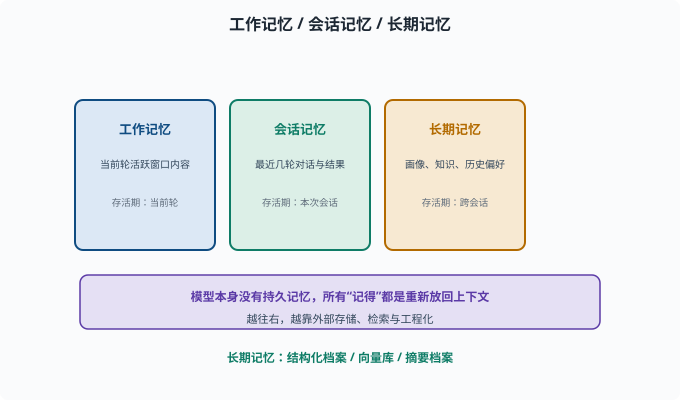
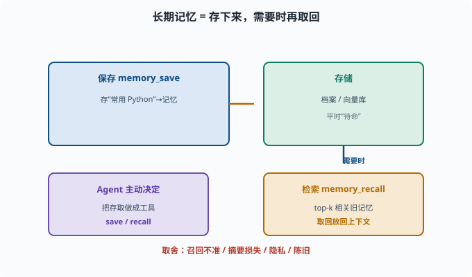

# 记忆系统：Agent 如何"记得"并演化

> 目标：理解 Agent 的"记忆"不是一种，而是有分层、有机制的系统。读完这一页，你能区分工作记忆/会话记忆/长期记忆，知道 Agent 用什么技术"记住"跨轮的信息。

## 记忆不只是"存档"

在 [08-01](08-01-what-is-an-agent.md) 我们说过：记忆塑造行为。对 Agent 而言，"记忆"是它**能在决策时访问的历史与状态**，分层更多、形式更多样。

先把话说清楚：Agent 模型本身**没有**持久记忆（[06-07](../06-llm-fundamentals/06-07-context-window.md)），所有"记得"都是工程上把信息重新放回上下文的结果。

## 三层记忆框架

先认两个来自认知心理学的词（后续 Agent 文献里会反复见到）：**episodic（情景的）**指"发生过的事件经历"——某次对话、某个任务的过程；**semantic（语义的）**指"沉淀下来的知识与事实"——用户偏好、领域结论。拿人打比方：记得"上周三你让我改过登录页"是情景记忆，知道"你常用 Python"是语义记忆。

```text
工作记忆（working memory）：当前这一轮 prompt/上下文里正活跃的信息
会话记忆（episodic）：最近几轮"用户说了什么、我做了什么、结果如何"
长期记忆（semantic / long-term）：跨会话保持的用户画像、领域知识、历史偏好
```

| 层 | 存活期 | 放哪 | 例子 |
|---|---|---|---|
| 工作记忆 | 当前轮 | 上下文窗口 | 正在处理的文档 |
| 会话记忆 | 本次会话 | 上下文摘要/日志 | 前几轮对话 |
| 长期记忆 | 跨会话 | 外部存储 | 用户偏好、历史任务记录 |



上图把三层记忆按"存活期"从左到右放：工作记忆活着当前轮、住在上下文窗口；会话记忆活着本次会话、靠消息序列或摘要；长期记忆跨会话、靠外部存储（结构化档案、向量库、摘要档案）。越往右越依赖外部与检索——因为模型权重本身不变，任何"记得"都是工程上把信息重新放回上下文的结果。

## 工作记忆：窗口内的一时一刻

工作记忆就是"此刻在上下文里的内容"（prompt、历史、工具结果）。它最直接，但也有窗口上限（[06-07](../06-llm-fundamentals/06-07-context-window.md)）。

管理手段（[07-03](../07-llm-engineering/07-03-context-engineering.md)）：

```text
截断：只留最近 N 轮
摘要：把旧内容压成要点
检索：只放与当前问题相关片段
优先级：关键信息放首尾
```

## 会话记忆：把"轮"变成可用的序列

Agent 要把之前的 user/assistant/tool 消息传给下一次模型调用（[08-03](08-03-agent-loop.md)），这就是会话记忆。

工程要点：

```text
消息要结构化（role、content、tool_call、tool_result）
超长时要压缩（摘要中间、保留首尾）
持久化：存到数据库/日志，崩溃后能恢复（deepseek-harness 的 session 就是 append-only 日志）
```

会话记忆保证同一任务内"连贯"，但跨任务/跨时间它会被压缩或丢弃。

## 长期记忆：跨会话的"用户画像"

长期记忆是真正的"记得你"。常见实现：

```text
结构化档案：存取用户的偏好、关键事实（"用户常用 Python"）——像一张张填好的表格，按字段查
向量记忆：把重要内容转成向量存向量库，需要时检索（向量库与检索原理见 [07-08](../07-llm-engineering/07-08-rag.md)）
摘要档案：把历史会话摘要沉淀成长期笔记
```

检索式长期记忆是主流：平时存，需要时用一个"记忆检索工具"把相关旧记忆取回放进上下文。

## 一个最小记忆检索工具

长期记忆常用"存-取"两个动作实现成工具（让 Agent 自己决定怎么用）：

```python
# 概念示意
class MemoryStore:
    def save(self, key, text): ...       # 长期保存一段记忆
    def recall(self, query, k=3): ...    # 检索最相关的旧记忆（top-k）

def tools():
    return [
        {"name": "memory_save", "description": "保存一条长期记忆"},
        {"name": "memory_recall", "description": "检索之前保存的相关记忆"},
    ]
```

`top-k` 是检索系统的常用词：不返回全部，只按相关度排序后取最靠前的 k 条（07-08 的 RAG 检索取 top-k 片段是同一件事）。Agent 在对话里可以主动 `memory_save` 用户偏好，下轮/下次再 `memory_recall`。这就是"记得你"的实现方式——不是模型记得，而是工程存下来再取回。



上图把长期记忆画成"存-取"两个动作：平时通过 `memory_save` 把关键信息存进档案或向量库，让记忆"待命"；当需要时再通过 `memory_recall` 按语义检索 top-k 相关旧记忆、取回放回上下文。Agent 主动决定何时存、何时取，这正是把记忆变成可编程工具、而不是靠模型"凭空记得"的原因。

## 记忆的取舍与陷阱

```text
召回不准：检索不到该记的 → 等于没记
摘要损失：压缩会丢细节 → 折中摘要粒度
隐私：长期存储用户信息要合规（[11](../11-safety-governance/README.md)）
陈旧：旧记忆会过时 → 需要更新/淘汰
```

所以记忆系统不只是"存下来"，还包括更新、淘汰、检索、隐私边界的设计。

## 思考题

1. 三层记忆框架是哪三层？各存活多久？
2. 为什么会话记忆需要"截断/摘要/检索"而不是全保留？
3. 长期记忆通常用什么技术实现"跨会话取回"？
4. 为什么说"模型本身没有记忆，记忆都是工程取回的"？
5. 记忆系统有哪些取舍与陷阱？

## 参考答案

1. 工作记忆（当前轮，活跃的窗口内容）、会话记忆（本次会话最近几轮）、长期记忆（跨会话的用户画像/历史）。
2. 因为上下文窗口有限、token 有限且成本高（[06-07](../06-llm-fundamentals/06-07-context-window.md)），全保留会塞爆窗口；截断/摘要/检索让窗口里只留最有用的部分。
3. 常用检索式记忆：把记忆内容转成向量存进向量库（或结构化档案），需要时用"记忆检索工具"（如 similarity search）把相关旧记忆取回放进上下文。
4. 因为 LLM 的权重在训练完成后是固定的，不随对话更新；模型没有持久状态。所谓"记住"都是把历史（最近消息或检索回的长期记忆）重新作为上下文塞给模型。
5. 召回不准等于白记、摘要会丢细节、长期存用户信息有隐私合规风险、旧记忆会过时需要更新淘汰。记忆系统要设计存取、更新、淘汰与隐私边界。

## 下一步

- 想理解复杂任务的拆解与计划 → [08-05 规划](08-05-planning.md)。
- 想让 Agent 发现并改正错误 → [08-06 反思与自我修正](08-06-reflection.md)。
- 想研究记忆与工具的工程落地 → [09 Agent 架构](../09-agent-architecture/README.md)。

[返回本章目录](README.md)
