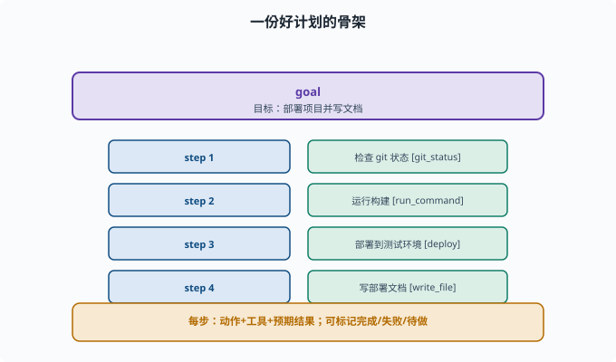
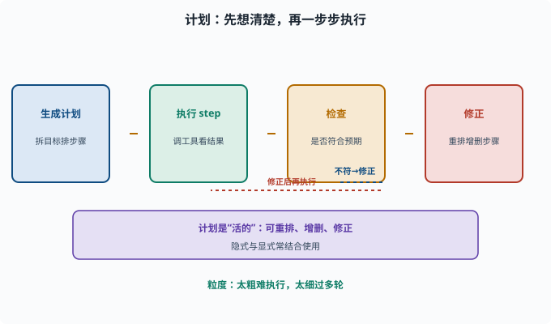

# 规划：把复杂任务拆成可执行的步骤

> 目标：理解 Agent 如何把"一个大目标"变成"一系列可执行动作"。读完这一页，你能讲清任务分解、计划数据结构、以及为什么"先想后做"能提高成功率。

## 为什么需要"计划"

简单任务（"查一下今天的天气"）一步就够。但复杂任务（"把项目部署上线并写份文档"）不可能一步完成，需要：

```text
拆成子任务
决定先后顺序
预判每步需要什么工具/信息
执行中根据情况调整
```

这就是**规划（planning）**。Agent 通过"先想清楚怎么干，再一步步执行"，大幅提高复杂任务的完成率。

## 两类规划方式

"隐式/显式"是这对术语的字面意思：计划**有没有被写成一份独立、可见的产物**。

```text
隐式规划（implicit）：模型边做边决定（ReAct 那种"走一步看一步"），计划只存在于它每一步的思考里
显式规划（explicit）：先产出一份计划（plan）——一份看得见、可检查、可修改的步骤清单，再按计划执行
```

实际工程常两者结合：先让模型"列个计划"，执行时再随时修正（因为中途会发现未知情况）。

## 显式计划的数据结构

一个计划通常是一份**结构化的步骤列表**：

```json
{
  "goal": "部署项目并写文档",
  "steps": [
    {"id": 1, "action": "检查 git 状态", "tool": "git_status"},
    {"id": 2, "action": "运行构建", "tool": "run_command"},
    {"id": 3, "action": "部署到测试环境", "tool": "deploy"},
    {"id": 4, "action": "写部署文档", "tool": "write_file"}
  ]
}
```

关键点：

```text
目标（goal）清楚
步骤（steps）有序、每步对应一个动作与工具
步骤可标记完成/失败/待做
计划可变（执行中被修改）
```



上图把一份显式计划的结构画出来：顶部是一个明确的 `goal`，下面是一串有序步骤，每一步都绑定一个动作和一个工具（`git_status`、`run_command`、`deploy`、`write_file`），并且每步可以标记完成/失败/待做。这样一个计划既"看得见进度"，也"可定位在哪一步失败"。

## 任务分解的学问

好的拆解原则：

```text
步骤粒度适合"一次工具调用/一次思考"
顺序与依赖清晰（先装环境再构建）
可验证：每步有明确的"成功信号"
可回退：某步失败时能知道回到哪
```

坏的计划常常是"一步太空泛"（无法执行）或"拆得过碎"（浪费轮数）。这是 prompt 与模型能力的协同问题。

## 计划循环：计划→执行→检查→修正

规划的完整循环：

```text
1. 生成计划（拆目标）
2. 逐 step 执行（调工具、看结果）
3. 每步后检查"是否符合预期"
4. 若偏离：更新计划（重排、增删步骤）
5. 直到全部完成（或判失败）
```

这个"执行中可调整"很重要：真实世界有不确定性，计划是"活的"，不是写死不可改。



上图把规划的完整循环画成"生成计划 → 执行 step → 检查 → 修正"四段：检查发现偏离预期时，不是硬着头皮继续，而是回到"修正"重排、增删步骤，再进入执行。这条虚线回环就是计划"活的"的原因——它把不确定性纳入处理，而不是假装一切可预知。

## 一个让模型生成计划的 prompt

```python
def plan_prompt(task):
    return f"""请把下面的任务拆解成一个可执行的计划。
要求：每个步骤 = 一个"动作 + 需要的工具 + 预期结果"。
先输出计划列表，再等指令逐步执行。

任务：{task}"""
```

配合 [07-03](../07-llm-engineering/07-03-context-engineering.md) 的 few-shot 和结构化格式，能让模型给出更规范的计划。

## 规划与"最小步数"的平衡

```text
计划太粗 → 每步还是很大，难执行
计划太细 → 需要很多步、很多轮，成本高
合理粒度 → 每步能"一个动作完成、失败可定位、进度看得见"
```

找到这个平衡是 Agent 设计的重要艺术。deepseek-harness 把"显式计划"做成了产品里的 plan 模式——计划本身作为被记录、可更新的状态，而不是散落在对话文本里；这套"状态化的计划"思想属于 [09 Agent 架构](../09-agent-architecture/README.md) 的范畴。

## 思考题

1. 简单任务和复杂任务在 Agent 处理上的关键区别是什么？
2. 隐式规划和显式计划的区别是什么？
3. 一份好的显式计划包含哪些要素？
4. 为什么计划必须是"活的"、执行中可以改？
5. 任务拆解的粒度"过粗"和"过细"分别有什么坏处？

## 参考答案

1. 简单任务一步即可；复杂任务需要拆解成子任务、安排顺序、预判工具与信息、执行中调整，并靠"先计划再执行"提高成功率。
2. 隐式规划是模型边走边决定（ReAct），显式计划是先产出一份结构化的步骤列表再按它执行；工程常两者结合。
3. 清晰目标、有序的步骤（每步一个动作+工具+预期结果）、做完/失败/待做的状态、以及允许执行中修正。
4. 因为真实世界有不确定性，执行中会发现没预见到的情况；若计划不可改，遇到偏差就僵住或继续错下去，所以计划要能重排、增删、修正。
5. 过粗则每步空泛难执行、难定位失败；过细则步骤繁多、轮数和成本高。合理粒度应"一步一个可完成的动作、失败可定位、进度看得见"。

## 下一步

- 想让 Agent 在执行中自查纠错 → [08-06 反思与自我修正](08-06-reflection.md)。
- 想看多步推理如何增强正确率 → [08-07 多步推理](08-07-multi-step.md)。
- 想在框架里落地计划状态 → [09 Agent 架构](../09-agent-architecture/README.md)。

[返回本章目录](README.md)
