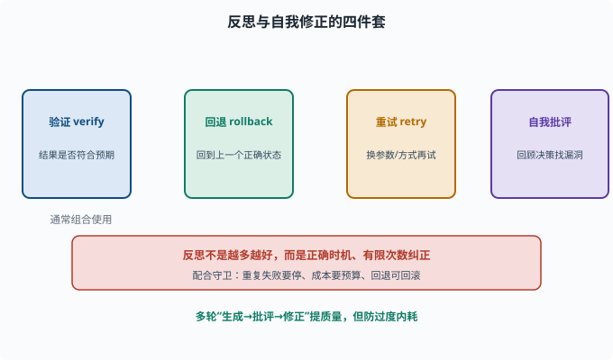
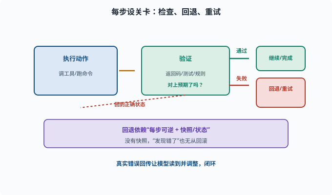

# 反思与自我修正：让 Agent 发现自己错了

> 目标：理解 Agent 如何"检查、回退、改进"，不是盲目往下冲。读完这一页，你能说清验证、回退、自我批评、重试这些机制如何让 Agent 更可靠。

## Agent 为什么需要"承认错了"

Agent 会犯错：

```text
工具返回错误 → 选错策略
计划假设不成立 → 一步做错
模型推理偏差 → 结论错误但很自信
```

如果 Agent 只会"一路往前冲"，一个小错误就可能滚成灾难。**反思与自我修正**让 Agent 在关键点停下来：检查、发现异常、回退重来或换方案。

## 反思的四件套

```text
验证（verify）：每步做完后，检查结果是否符合预期
回退（rollback）：发现不对时，回到上一个正确状态
重试（retry）：换个参数/方式再试
自我批评（self-critique）：让模型回顾自己刚才的决定，找问题
```

它们通常组合使用。



上图把反思的四件套并排列出：验证（每步检查结果对不对）、回退（发现不对时回到正确状态）、重试（换参数/方式再来）、自我批评（让模型回顾决策找漏洞）。它们经常组合使用：先验证发现问题，再决定是回退、重试还是自我批评修正。要点是"在正确时机、有限次数地纠正"，而不是无休止地内耗。

## 验证：给结果"设关卡"

每步做完要判断"这步成不成"。方式：

```text
工具返回码/错误：命令失败要知道
现实验证：跑测试、check 文件、查输出
规则校验：输出是否符合格式/预期
让模型自查：请模型检查自己给的答案/计划是否合理
```

没有验证的 Agent 会"以为自己成功了"。验证是把"实际状态"与"预期"对上。



上图把"设关卡"画成一个分支：执行动作后进入验证，结果符合预期就走"继续/完成"，不符合就"回退/重试"，虚线回到正确状态再试。回退之所以可能，前提是"每步可逆 + 有快照/状态"——没有快照，就算发现错了也无从真正回到安全点。

## 自我批评 / 自我反思

一个经典技巧：让模型生成完回答后，**再让它回顾一遍自己的推理**，找出漏洞并修正。

```python
def reflect(answer):
    prompt = f"""请审视下面这个回答，找出其中的错误、遗漏或不严谨之处，然后给出修正后的答案。
回答：{answer}
输出：<错误分析> ... <修正后答案> ..."""
    return model(prompt)
```

多轮"生成→批评→修正"能提升回答质量，但也要防"过度内耗"（来回改、越改越差、烧 token）。

## 回退：状态管理

要让 Agent 能"回到正确点"，系统必须能**撤销/快照**：

```text
文件系统：删除/回滚刚做的修改
命令：能识别失败并清理副作用
计划：把步骤状态标为"失败/待做"，跳过错误步骤
```

回退依赖"每步可逆 + 有快照"。没有它，"发现错了"也没法真正回到安全点。

## 循环守卫与反思如何配合

反思和 [08-03](08-03-agent-loop.md) 的循环守卫常常配合：

```text
重复失败：同一步试了 N 次仍失败 → 停止并上报，而不是无限重试
步数上限：反思也耗 step，要计入
成本控制：反思多几轮会烧更多 token，要设预算
危险操作回退：写坏文件前要有可回滚
```

所以反思不是"越多越好"，而是"在正确时机、有限次数地纠正"。

## 在 deepseek-harness 里的体现

harness 里"工具失败会回传真实错误、会话日志可回放、计划/状态可追踪"，为反思提供基础设施：

```text
真实错误 → 模型能读到并调整
会话事件 → 能回溯"哪一步开始错"
plan 状态 → 能标记失败、跳过、回退
```

这些让"自我修正"不是模型嘴上说说，而是有真实数据支撑的闭环。

## 思考题

1. 反思四件套是哪四样？
2. 为什么"验证"如此关键？没有它会怎样？
3. 自我批评需要注意什么陷阱？
4. 回退依赖什么前提？为什么没有快照就无法真正回退？
5. 无限重试有什么风险？应如何约束？

## 参考答案

1. 验证（每步检查结果是否符合预期）、回退（回到上一个正确状态）、重试（换方式再试）、自我批评（回顾决策找问题）的组合，通常搭配使用。
2. 因为 Agent 会以为自己成功，实际出错。验证把实际状态与预期对上，是发现"计划假设不成立/一步做错"的第一道防线；没有它就只能盲目继续。
3. 过度内耗：来回批评修改、越改越差、烧 token；也可能把本来对的答案改错。应限制轮数并用验证兜底。
4. 回退依赖"每步可逆 + 有快照/状态"，因为只有记录了一个可恢复的正确状态，才能"回到那一步重新来"。没有快照，发现错了也无从回滚。
5. 无限重试会烧光 token/时间（死循环），甚至重复制造副作用。应设"最大重试次数"，失败 N 次后停止并上报，把控制权交给人或用户。

## 下一步

- 想理解多步推理如何减少错误 → [08-07 多步推理](08-07-multi-step.md)。
- 想量化 Agent 靠不靠谱 → [08-08 Agent 评估](08-08-agent-evaluation.md)。
- 想设定对失败/安全的边界 → [11 安全与治理](../11-safety-governance/README.md)。

[返回本章目录](README.md)
