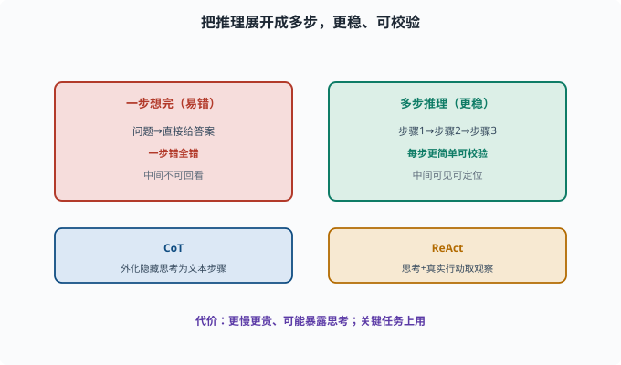
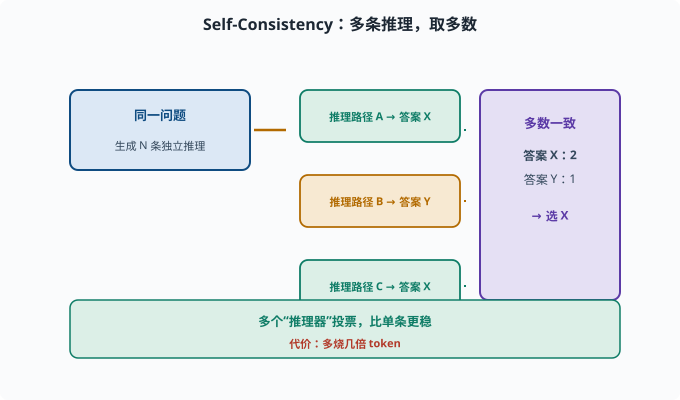

# 多步推理：从"一步回答"到"拆开一步步想"

> 目标：理解 CoT、ReAct、自一致性这类"把推理展开"的技巧为什么有用、怎么用。读完这一页，你能说清多步推理如何提升复杂任务正确率，也知道它的代价。

## 为什么"一步想完"容易错

让模型直接回答一个复杂问题：

```text
问：三个人各有年龄，条件……最后问某人的年龄？答：X
```

模型若试图"一步算完"，中间步骤容易出错、且没法回看。而把推理"展开成多步"，每一步更简单、也可校验，整体准确率更高（[06-08](../06-llm-fundamentals/06-08-emergent-capabilities.md)）。

这就是**多步推理（multi-step reasoning）**的价值：把复杂问题拆成"看得见、能检查"的中途步骤。

## 思维链 CoT：让中间步骤显式化

**Chain-of-Thought（思维链）**：在 prompt 里让模型"先一步步推理，再给结论"。07 章你已经把它当 prompt 技巧用过（[07-03](../07-llm-engineering/07-03-context-engineering.md)）；这一页换一个角度看它——它不只是"提示词写法"，更是一切多步推理的基础形态。

```text
直接问：这个逻辑题答案是？   （可能直接错）
引导：请一步步推理再给答案。 （准确率更高）
```

可以说 CoT 把"模型的隐藏思考"外化成可读文本，既提高了正确率，也让每一步可被人类/系统检查。



上图对比两种做法：左边"一步想完"问题直接给答案，推理链一长就容易一步错全错，中间步骤也没法回看；右边把推理展开成步骤 1 → 2 → 3，每一步更简单、可检验、中间结果可见可定位。下方补上 CoT 与 ReAct 的区分：CoT 侧重把隐藏思考外化成一串文本步骤，ReAct 则再加"真实行动取 Observation"。

## ReAct：推理 + 行动交替

如果"推理"还需要外部事实，光靠模型自己想不够。**ReAct**（Reason + Act）让"推理"和"取信息/行动"交替：

```text
Thought：我该查什么？
Action：调用搜索/工具
Observation：检索到结果
Thought：根据结果下一步
...
```

你已经接触过它（[08-01](08-01-what-is-an-agent.md)）。ReAct 本质上就是"Agent 循环里的多步推理"：每一步都从真实工具结果获取新依据，再决定下一步。

## 自一致性 CoT-SC：多路采样取多数

一个模型一次推理可能错。**Self-Consistency（自一致性，CoT-SC）**——SC 就是 Self-Consistency 的缩写——思路是：

```text
同一个问题，让模型生成多条独立推理路径
统计每条路径的最终答案，投票/取多数
→ 多数一致性答案往往更可靠
```

这相当于"多个推理器投票"，比单条更稳，但要多烧几倍 token。



上图演示 Self-Consistency：对同一个问题生成多条独立推理路径，路径 A 与 C 都得到答案 X、路径 B 得答案 Y，于是按多数投票选 X。这相当于"多个推理器投票"消减单条路径的偶然错误，代价是多烧几倍 token——适合关键、复杂、高风险任务。

## 一个 CoT 的 prompt 示例

```python
def cot_prompt(question):
    return (
        "请一步一步思考，最后再给出答案。\n"
        "问题：" + question
    )

# 或给 few-shot 例子，展示"先步骤后答案"的格式
few_shot = """示例：
问：3+4*2=?
答：先算乘法 4*2=8，再算 3+8=11。答案是 11。
"""
```

## 多步推理的代价与边界

```text
慢/贵：每多一步都要多 token、多轮次
会暴露中间思考：产品上有时要隐藏/裁剪（不暴露给用户）
仍可能错：一步步推理不代表绝对正确，只是更稳
需可验证：有工具结果/规则时，配合验证（[08-06](08-06-reflection.md)）更可靠
```

所以多步推理是有取舍的：**在关键、复杂、高风险任务上用，简单任务别浪费。**

## 与 Agent 的关系

对 Agent，多步推理几乎就是"决策展开"：

```text
复杂任务 → 先 CoT 拆计划（[08-05](08-05-planning.md)）
执行中 → ReAct 看结果再决定
出错 → 反思修正（[08-06](08-06-reflection.md)）
```

把"会推理"变成"会行动、会查证、会纠错"，正是这套文档从模型到 Agent 的主线。

## 思考题

1. 为什么"把推理展开成多步"往往比"一步想完"正确率高？
2. CoT 与 ReAct 的区别是什么？
3. 自一致性（CoT-SC）的思路是什么？
4. 多步推理的代价有哪些？
5. 在什么场景下应该"别滥用"多步推理？

## 参考答案

1. 因为每一步更简单、更容易用已有子能力完成，且中间步骤可被检查/校验；一步想完时推理链过长、一步错全错且无法定位。
2. CoT 侧重"模型在内部把推理外化成一串思考步骤"；ReAct 是在思考之外还穿插真实行动（查信息/调用工具换取 Observation），让推理有外部依据。
3. 让模型对同一问题生成多条独立推理路径，统计各答案出现的次数，取多数一致的那个，靠"多数投票"消减单条推理的偶然错误。
4. 更慢更贵（多 token、多轮）、中间思考可能需隐藏/裁剪、仍可能错（不绝对）、需要配合验证才可靠。
5. 简单或低风险任务用多步推理是浪费（烧 token、加延迟）；应在关键、复杂、高风险、需要查证的任务上使用，并配验证与预算上限。

## 下一步

- 想量化 Agent 的表现 → [08-08 Agent 评估](08-08-agent-evaluation.md)。
- 想了解它为什么会失败 → [08-09 常见失败模式](08-09-failure-modes.md)。
- 想在架构里组织这些推理/行动 → [09 Agent 架构](../09-agent-architecture/README.md)。

[返回本章目录](README.md)
