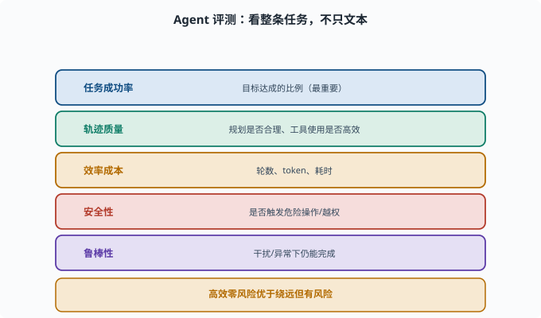
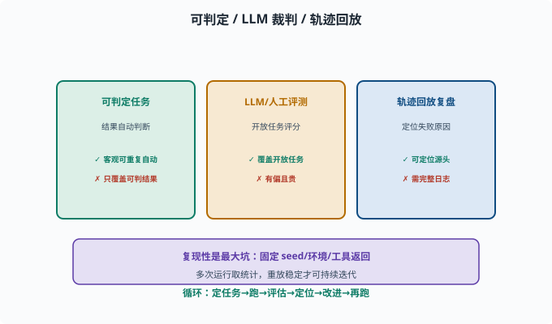

# Agent 评估：怎么知道一个 Agent 好不好

> 目标：把 [07-07](../07-llm-engineering/07-07-evaluation.md) 的评测延伸到"整个 Agent 系统"。读完这一页，你能说出 Agents 评测不同于单模型评测的维度、常见方法和陷阱。

## 评测 Agent ≠ 评测模型

单模型评测看"一句回答"（[07-07](../07-llm-engineering/07-07-evaluation.md)）。但 Agent 是一整套"感知、规划、行动、记忆"的系统——一句回答好不好远远不够。你要评估的是**整条任务的完成质量**。

```text
是否完成了用户的真实目标？
调了该调的工具、参数对不对？
轨迹是否合理（有没有绕远、反复试错）？
安不安全？花了多少 token/时间？
```

## 五类核心指标

```text
任务成功率：目标达成的比例（最重要）
轨迹质量：规划是否合理、工具使用是否高效
效率成本：轮数、token 数、耗时
安全性：是否触发危险操作/越权
鲁棒性：面对干扰/异常是否仍能完成
```

一个"能在 20 步内高效完成、从不出危险操作"的 Agent，可能比"能完成但绕了 50 步、冒了风险"的更好。



上图把五类核心指标并排列出：任务成功率（达成目标的比例，最重要）、轨迹质量（规划是否合理、工具使用是否高效）、效率成本（轮数/token/耗时）、安全性（是否触发危险操作或越权）、鲁棒性（面对干扰异常仍能完成）。一个 Agent 好不好，是多维度权衡，而不是单看"给没给出正确文本"。

## 三种评估方法

### 1. 可编程/可判定的任务（golden）

结果可以自动判断：比如"能否从仓库构建出程序""某文件内容是否符合预期"。golden 在这里指"预先写好的标准答案/判定条件"——任务带着一份期望结果，跑完直接比对，不需要人参与。这种最硬核、可复现。

```text
优点：客观、可重复、能自动跑
缺点：只覆盖"结果可判定"的任务
```

### 2. LLM-as-a-Judge / 人类评测

对开放结果用大模型或人工评分（[07-07](../07-llm-engineering/07-07-evaluation.md)）：从"是否正确利用工具""规划是否合理"等角度打分。

```text
优点：覆盖开放任务
缺点：有偏、贵（人工）
```

### 3. 轨迹回放与复盘

通过**会话日志/轨迹**回放 Agent 每一步，人工或自动复盘"哪里开始出错、为什么"（deepseek-harness 的 session 日志就是为此准备的）。

```text
价值：不只判断"成没成"，还能定位"为什么失败"
```



上图把三种方法并列：可判定任务靠自动化判断结果（客观、可重复但覆盖面窄）；开放任务用 LLM 裁判或人工评分（覆盖面广但有偏、贵）；轨迹回放复盘则通过会话日志回放每一步、定位"从哪一步开始错、为什么"。下方强调复现性：固定 seed/环境/工具返回、多次运行取统计，重放稳定才能支撑迭代。

## 复现性：评测要能"重放"

Agent 评测最大的坑是**不可复现**：

```text
模型输出有随机性（采样）→ 同问题可能不同结果
外部工具/网络状态变化 → 结果漂移
```

改善手段：

```text
固定 temperature/seed（尽量）——采样温度与随机种子，见 [06-02](../06-llm-fundamentals/06-02-token-through-model.md)
固定环境（沙箱快照）
多次运行取统计（跑 N 次看成功率）
固定 tool 返回（mock 掉外部不确定性）
```

其中 **mock（模拟替身）** 是测试术语：用一个"返回值写死的假实现"替换真实外部依赖（网络、数据库），让被测对象以为自己在调真东西。只有"重放能得到稳定结果"的评测，才能支撑迭代决策。

## 评测驱动开发：Agent 也是这么迭代出来的

一个健康的循环：

```text
定任务集（真实/典型的用户场景）
→ 跑 Agent
→ 自动+人工评估
→ 定位失败点（轨迹复盘）
→ 改进 prompt/工具/规划/守卫
→ 再跑，确认提升且没回归
```

没有这个循环，"感觉变好了"是虚幻的，无法保证可靠。

### deepseek-harness 的样本：快照测试就是 Agent 评测

仓库自己的测试策略就是这套方法的落地样本。`pnpm run test:snapshot`（快照测试）的思路：给一个固定的 Agent 任务，把它跑出的**完整输出轨迹**录下来作为"期望产物"；以后每次改动都重跑一遍、与期望比对——任何行为漂移（工具调用变了、回答结构变了）都会被立刻发现。而无密钥时测试自动跳过、`test:e2e` 只在有真实 API key 时运行，则是"可复现性"的另一种体现：**外部依赖（模型 API）的可用性不决定测试套件是否健康**。

对照来看：golden 任务 ≈ 快照比对；轨迹复盘 ≈ 读 session 日志定位漂移步骤；多次运行统计 ≈ CI 在多平台上跑。方法与工程是一一对应的。

## 思考题

1. 为什么说"评测 Agent ≠ 评测模型"？
2. 五类核心指标分别是什么？
3. 什么是"可编程/可判定"任务？它的优缺点是什么？
4. Agent 评测为什么容易"不可复现"？如何改善？
5. 轨迹回放的价值主要体现在哪里？

## 参考答案

1. 因为 Agent 是一整套感知/规划/行动/记忆系统，"一句回答好不好"不足以反映"是否完成用户目标、是否高效安全"。必须评估整条任务的完成质量与轨迹。
2. 任务成功率、轨迹质量、效率成本（轮数/token/耗时）、安全性、鲁棒性。
3. 结果可以自动化判断的任务（如"构建成功""文件内容符合预期"）。优点是客观、可重复、能自动跑；缺点是只覆盖结果可判定的任务。
4. 因为模型采样有随机性、外部工具/网络状态会变化。改善：固定 temperature/seed、固定沙箱环境与 tool 返回、多次运行取成功率统计。
5. 不只判断"成没成"，还能定位"从哪一步开始错、为什么错"，从而指导改进（改 prompt/工具/规划/守卫），是评估驱动开发的关键。

## 下一步

- 想知道 Agent 为什么"跑偏/卡死" → [08-09 常见失败模式](08-09-failure-modes.md)。
- 想研究评估落地的平台 → [10 实战 Lab](../10-practical-lab/README.md)。
- 想在架构里嵌评估 → [09 Agent 架构](../09-agent-architecture/README.md)。

[返回本章目录](README.md)
