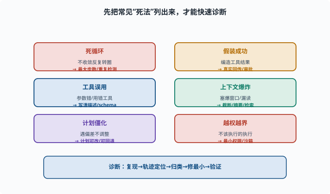
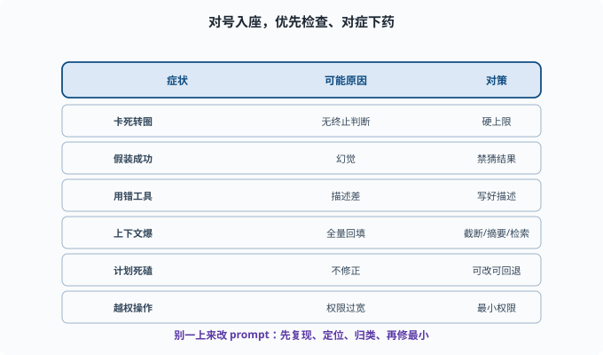

# 常见失败模式：Agent 为什么会"卡死、跑偏、出错"

> 目标：系统认识 Agent 出问题的套路，能"对号入座"地诊断。读完这一页，你能列出循环失控、幻觉、工具误用、上下文爆炸等高频失败，并知道怎么防。

## 认识失败 = 提高可靠性

Agent 不总成功。与其等它"翻车"，不如**预先把常见死法列出来**，遇到时能快速判断是哪一类、该怎么修。这一页建立一个"故障诊断表"。

## 失败模式一：循环失控 / 死循环

```text
现象：Agent 反复调用工具、转圈，不收敛
原因：模型无法判断"完成"，或不断做相同动作
对策：最大步数硬上限（[08-03](08-03-agent-loop.md)）、重复检测、超时
```

死循环是最常见的"卡死"，几乎必须靠硬性上限兜底。

## 失败模式二：幻觉与"假装成功"

```text
现象：Agent 说"我做好了"其实没做；或编造工具结果
原因：模型幻觉（[06-09](../06-llm-fundamentals/06-09-limits-hallucination.md)）
对策：真实工具结果回传、禁止模型"猜结果"、审批、证据链
```

对 agent 尤其致命，因为"假装做完"比"做错了"更危险。

## 失败模式三：工具误用 / 参数错

```text
现象：用了不该用的工具、填错参数、对结果理解偏差
原因：工具描述不清晰、模型对工具理解不足（[08-02](08-02-tools-and-function-calling.md)）
对策：写好工具描述/schema、加推理约束、工具结果语义化
```

这类往往不是"模型笨"，而是"工具没给够信息"。

## 失败模式四：上下文爆炸 / 丢失

```text
现象：一轮之后消息太多，塞爆窗口；或关键信息被"漏读"
原因：每轮都把旧历史和工具输出全塞回（[06-07](../06-llm-fundamentals/06-07-context-window.md)——长文的中间部分本来就容易被模型忽略）
对策：截断、摘要、检索（[07-03](../07-llm-engineering/07-03-context-engineering.md)、[08-04](08-04-memory-systems.md)）
```

长任务里，上下文管理是隐性但极关键的失败源。

## 失败模式五：计划僵化 / 无法应对偏差

```text
现象：计划写好就死磕，遇到新情况不调整，一路错到底
原因：缺少"执行中修正"（[08-05](08-05-planning.md)、[08-06](08-06-reflection.md)）
对策：计划可改、失败可回退、受阻时重规划
```

## 失败模式六：权限/安全越界

```text
现象：执行了不该执行的命令、改了不该改的文件
原因：工具权限过宽、缺少审批
对策：最小权限、沙箱、审批（[11](../11-safety-governance/README.md)）
```

这是最需要"红线"的失败，工程上必须硬约束，不能只靠模型自觉。



上图把六类高频失败集中成一张"体检表"：死循环、假装成功、工具误用、上下文爆炸、计划僵化、越权越界，每类都标注了典型现象和主要对策。遇到故障时先看它属于哪一类，往往比漫无目的地改 prompt 更有效。

## 一张故障快速排查表

| 症状 | 可能原因 | 优先检查 | 对策 |
|---|---|---|---|
| 卡死转圈 | 无终止判断 | 最大步数 | 硬上限、重复检测 |
| 假装成功 | 幻觉 | 工具真实回传 | 禁猜结果、审批 |
| 用错工具 | 描述/schema 差 | 工具文档 | 写好描述、约束 |
| 上下文爆 | 全量回填 | 窗口统计 | 截断/摘要/检索 |
| 计划死磕 | 不修正 | 计划状态 | 可改、可回退 |
| 越权操作 | 权限过宽 | 权限配置 | 最小权限、审批 |



上图是更紧凑的速查表：最左列是"症状"（卡死转圈、假装成功、用错工具、上下文爆、计划死磕、越权操作），中间列对到"可能原因"，最右列直接给"对策"。配合上面的诊断方法论，可以做到"对号入座"：先复现、从轨迹定位、归类、修最小、再验证。

## 诊断方法论：先隔离再修

遇到 Agent 故障，别一上来改 prompt。建议顺序：

```text
1. 复现：能不能稳定重放？
2. 定位：从轨迹看哪一步开始错（[08-08](08-08-agent-evaluation.md)）
3. 归类：属于上面哪类？
4. 修最小：改工具/守卫/记忆/权限，先修最可能的那类
5. 验证：再跑，看是否修复且无回归
```

### 为什么"别一上来改 prompt"

因为 prompt 是**全局变量**：它影响每一次请求。为修一个案例改了措辞，很可能同时弄坏了另外 20 个原本正常的案例——而且你不会立刻发现。相比之下，"给循环加硬上限"、"把工具描述写清楚"、"收紧权限"都是**局部改动**，影响面可枚举。正确的顺序是：能靠结构（守卫、权限、工具契约）解决的不碰 prompt；确认必须动 prompt 时，也要带着评估集一起改（改前跑一遍基线，改后对比），而不是凭单个案例的直觉。这与 [02-04 工程习惯](../02-programming-basics/02-04-engineering-habits.md) 里"测试给行为兜底"是同一条纪律。

### deepseek-harness 把这些对策做成了什么

这张诊断表在仓库里都有对应物，可以对照源码加深理解：

```text
死循环   → guard 包的 repeat-tool-reminder（重复调用提醒）与 timeout-policy（工具超时）
假装成功 → model-visible ⟺ logged：模型看到的必须来自真实工具结果（09-05）
工具误用 → defineTool 的 description/schema 是一等公民（10-05）
上下文爆 → compaction 能力（压缩旧历史、修剪工具结果的专用插件位）
越权     → permission/interaction 的审批链（11-01）
```

对照着读一遍 `packages/guard/` 与 `packages/compaction/` 的 README，你会发现"失败模式表"不是纸上谈兵——每一条都已经长成了可安装的插件。

## 思考题

1. 列举至少四个 Agent 的高频失败模式。
2. "假装成功"的根本原因和关键对策是什么？
3. 工具误用通常意味着什么？（是模型笨吗？）
4. 为什么上下文爆炸是"隐性"的失败源？
5. 遇到 Agent 故障，推荐的诊断顺序是什么？

## 参考答案

1. 循环失控/死循环、幻觉与假装成功、工具误用/参数错、上下文爆炸或丢失、计划僵化无法应对偏差、权限/安全越界。
2. 根本原因是模型幻觉——它可能"自信地认为做完了"或编造工具结果。关键对策是让工具结果必须来自真实执行、禁止模型猜测结果，并配合审批与证据链。
3. 往往不是"模型笨"，而是工具描述/schema 不清晰、模型对何时用如何使用理解不足。修工具文档、schema 和示例通常比怪模型更有效。
4. 因为每轮把旧历史和工具输出全量塞回去会悄悄塞爆窗口或把关键信息挤到"被漏读"的中间区，表面没报错，但模型其实看不到该看的信息，导致"莫名"答错。
5. 先复现（能否稳定重放）→ 从轨迹定位哪一步开始错 → 归入某一类失败模式 → 修最小（改工具/守卫/记忆/权限）→ 再跑验证且无回归。

## 下一步

- 想把 Agent 做成真正可靠的系统 → [09 Agent 架构](../09-agent-architecture/README.md)。
- 想动手诊断真实 Agent → [10 实战 Lab](../10-practical-lab/README.md)。
- 想守住安全/权限边界 → [11 安全与治理](../11-safety-governance/README.md)。

[返回本章目录](README.md)
