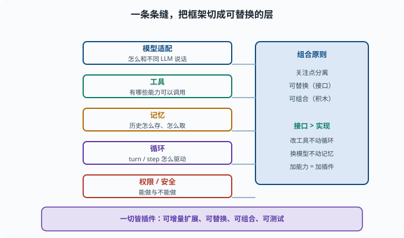

# 框架设计原则：为什么"一切皆插件"是有效范式

> 目标：理解 Agent 框架设计的关注点分离、可替换、组合性。读完这一页，你能说清为什么"一切皆插件"能让系统既灵活又可维护，而不是堆成一个巨无霸。

## 从"能跑"到"能扩展"

第八章我们学会了把模型、工具、记忆、循环装进一个 Agent。但真实产品的难点不是"写一个能跑的 demo"，而是：

```text
不同用户要不同的工具/模型/记忆策略
要加新能力而不改坏旧的
要能组合、能替换、能定制
要可测试、可观察、可安全
```

这些需求逼着我们把 Agent 的设计从"一段写死的代码"提升为**一套可组合的框架**。

## 关注点分离：把"什么"和"怎么做"分开

框架设计的第一原则是**关注点分离（separation of concerns）**：

```text
模型适配：怎么和不同 LLM 说话
工具：有哪些能力可以调用
记忆：历史怎么存、怎么取
循环：turn/step 怎么驱动
权限/安全：能做与不能做
```

每一块只关心自己的事，通过清晰的边界互相协作。这样改"工具"不影响"循环"，换"模型"不用动"记忆"。



上图把"能跑起来的一团逻辑"拆成了几根并行的轨道：模型适配、工具、记忆、循环、权限/安全各占一条缝，彼此只通过稳定的接口相接。右侧罗列的是支撑这套切分的组合原则——关注点分离、可替换、可组合、最小安全面。正是因为有这些缝，改动才能被限制在单条轨道里，而不是牵一发动全身。

## 可替换性：接口比实现重要

要让部件"可换"，就要**定义接口、隐藏实现**：

```text
`我收发消息`（接口）  而不是  `我是 OpenAI SDK`（实现）
`我读写文件`（接口）  而不是  `我用 xxx 库`
```

只要接口稳定，底层实现随便换：换供应商、换存储、换工具，都不动其它部分。这是 [09-02](09-02-capability-seam.md) 能力缝的思想来源。

## 组合性：小积木拼大系统

好的框架让"能力"像积木：按需拼装，而不是预装所有。

```text
用户 A：只需要 +文件 +shell
用户 B：只需要 +web 搜索
用户 C：+文件 +shell +web +审批
```

组合性让系统"最小可用 + 按需扩展"，减少无关能力带来的安全面和复杂度（[09-06](09-06-scope-permission.md)）。

## 为什么"一切皆插件"

deepseek-harness 的核心范式是 **everything is a plugin（一切皆插件）**。它的好处：

```text
可增量扩展：新能力 = 新插件，不动核心
可替换：插件可插可拔
可组合：不同插件搭成不同的 agent
关注点分明：每个插件管一件事
可测试：小插件易测
```

这也契合 [02](../02-programming-basics/02-06-reading-typescript.md) 讲过的"模块化 + 良好接口"工程习惯，只是放大到了整个 agent 系统。

### "一切皆插件"有一条纪律底线

插件自由组合的前提是**每个插件都守规矩**。仓库的 AGENTS 约定里有几条直接决定这套范式能否成立的纪律，值得在这里先见一面（后面各页都会用到）：

```text
注册即效果：一切贡献走 ctx.effect()/ctx.on()，返回销毁器
插件不改循环：新行为挂在文档化的扩展点上，不碰 agent-loop 核心
模型可见必入日志：给模型的新输入必须对应一条会话事件
配置可校验：部署差异是 Config 字段，不是代码里的常量
```

没有这些纪律，"自由组合"会退化为"互相踩踏"：一个插件忘了清理监听器，另一个直接改循环内部，系统依然会烂掉。**范式给自由，纪律保自由**——这是读框架源码时最值得体会的平衡。

## 一个框架应有的"骨架"

一个可维护的 agent 框架通常有：

```text
核心循环：turn/step 驱动（[09-04](09-04-event-loop.md)）
扩展点：能力缝/插件（[09-02](09-02-capability-seam.md)、[09-03](09-03-plugin-composition.md)）
数据：可追溯会话日志（[09-05](09-05-session-log.md)）
边界：作用域与权限（[09-06](09-06-scope-permission.md)）
运维：可观测与恢复（[09-09](09-09-observability.md)、[09-10](09-10-state-recovery.md)）
```

## 设计原则速查

```text
关注点分离：各管一事，边界清晰
接口稳定：面向接口不面向实现
可组合：按需拼装能力
可替换：换实现不动架构
可追溯：一切决策可回放
最小安全面：只暴露需要的能力
```

## 思考题

1. 什么是关注点分离？它带来什么好处？
2. 为什么"接口比实现重要"？举一个例子。
3. 组合性如何影响安全面？
4. "一切皆插件"有哪些好处？
5. 一个可维护的 agent 框架通常包含哪几个部分？

## 参考答案

1. 把模型适配、工具、记忆、循环、权限等按关注点切分，每块只管自己并通过清晰边界协作。好处是改一块不影响另一块，系统可维护、可测试。
2. 因为只要接口稳定，底层实现可随时更换而不影响其它部分。例如定义"我收发消息"这个接口，底层用 OpenAI、DeepSeek 或本地模型随便换，其它代码不用动。
3. 组合性让用户只装上需要的能力，减少无关插件暴露的攻击面与复杂度（最小可用+按需扩展），从而降低安全风险（[09-06](09-06-scope-permission.md)）。
4. 可增量扩展（新能力=新插件不动核心）、可替换（可插可拔）、可组合（拼成不同 agent）、关注点分明、小插件易测试。
5. 核心循环（turn/step）、扩展点（能力缝/插件）、可追溯数据（会话日志）、边界（作用域与权限）、运维（可观测与恢复）。

## 下一步

- 想看清"能力缝"这个核心抽象 → [09-02 能力缝](09-02-capability-seam.md)。
- 想看插件如何组合起来 → [09-03 插件化组合](09-03-plugin-composition.md)。
- 想复习工程模块化 → [02-06 读 TypeScript 仓库](../02-programming-basics/02-06-reading-typescript.md)。

[返回本章目录](README.md)
