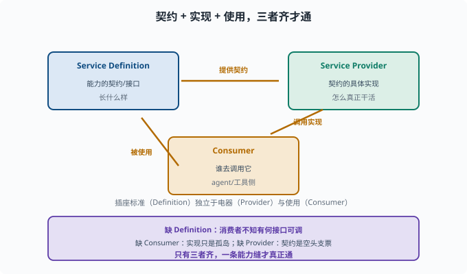

# 能力缝：定义 / 提供者 / 消费者的三件套

> 目标：吃透 deepseek-harness 最核心的抽象——能力缝（capability seam）。读完这一页，你能讲清一个能力为何由"Service Definition / Service Provider / Consumer"三部分组成，以及它对可扩展的意义。

## 什么是"能力缝"

agent 要调用"文件、shell、web、llm、subagent、workflow"等能力。但如果这些能力在核心里写死，系统就僵硬、难扩展。**能力缝（capability seam）**是一个"接缝"设计：

> 在"框架"和"具体能力"之间留一条缝，让新能力可以从外面"插"进来，而不改核心。

它把"一项能力"抽象成可插拔单元，缝就是这条抽象的边界。

## 一个能力的三件套

每个能力缝由**三个角色**组成，缺一不可：

```text
Service Definition（服务定义）：这个能力"长什么样"的契约（有哪些字段/接口）
Service Provider（服务提供者）：这些接口的具体实现（怎么真正干活）
Consumer（消费者）：谁去用它（agent/工具怎么调用这个能力）
```

举例（以 llm 为例）：

```text
Definition：llm 包定义 LlmRuntime 抽象服务与消息/配置的词汇表，说明"模型服务"有哪些能力与接口
Provider：dsh-llm-deepseek 提供者，实现"怎么调用 DeepSeek API"
Consumer：agent-loop / tools 调用这个能力的代码
```

## 为什么必须三件套、不能只有 Provider

只留 Provider（实现）不够，因为：

```text
没有 Definition，消费者不知道"有什么接口可调"
没有 Consumer，Provider 只是"孤岛"没人用
没有 Provider，Definition 只是"空头支票"
```

一条缝是完整的三角：**契约（Definition）+ 实现（Provider）+ 使用（Consumer）**。只有三者齐备，能力才真正"通"。



上图把三个角色摆成一个互相咬合的三角形：Definition 提供契约，Provider 按契约实现"怎么干活"，Consumer 负责真正调用它。三者缺一，这条"缝"就不通——只有实现而无契约时消费者无从知晓可调用什么，只有契约而无实现时它只是一纸空文。理解这张图，也就理解了 deepseek-harness 中任何一个能力（llm、shell、fs、web……）为什么都要成套出现。

## 一个直观的类比

把能力缝想成"插座-插头-电器"：

```text
Definition = 插座标准（规格：什么电压/接口形状）
Provider   = 一个具体的电器厂商（按标准实现）
Consumer   = 用插座的设备/人
```

只要插座标准稳定，任何符合标准的电器都能插上去。**缝的价值在于"标准（Definition）"独立于"实现（Provider）"与"使用（Consumer）"。**

## 能力缝如何带来可扩展

有了缝：

```text
要加新能力："新 Provider + 遵循新/复用 Definition + 让 Consumer 能指向它"
换实现：换 Provider，接口不变，消费者无感
组合：不同 Provider 可并行（如本地 llm + 远程 llm）
测试：可 mock Provider，独立测 Consumer
```

这正是 [09-01](09-01-design-principles.md)"关注点分离 + 可替换"的具体落地。

## 在 deepseek-harness 里看

在源码（`packages/`）里，每个能力（llm、shell、fs、web、subagent 等）都落成一套缝：

```text
Service Definition：定义能力契约（如 ShellExecutor 抽象类、defineTool 工具注册接口）
Provider：各厂商/实现
Consumer：agent 侧调用
```

而运行时用"注册表注册 + 插件加载"把它们连起来，见 [09-03](09-03-plugin-composition.md)。

### 用目录结构验证"每个能力都是一套缝"

打开仓库看一眼 `packages/` 就能发现规律——以 shell 能力为例，它不是一个包而是按角色拆开的多个包：

```text
packages/shell/
  shell/                 Definition：能力契约（ShellRequest/Spec 词汇表）
  bash-local/            Provider：本机 bash 实现
  pwsh-local/            Provider：本机 PowerShell 实现
  bash-sandbox/、pwsh-sandbox/   Provider：沙箱化实现
  tool-bash/、tool-pwsh/         Consumer：把 shell 暴露成模型可调用的工具
```

同目录下并排多组 Provider（bash-local/pwsh-local 与它们的沙箱变体）正是"换实现不动消费者"的直接证据：换 shell 后端或加沙箱只改配置里的插件行，`tool-bash` 与模型提示词完全不用动。其他能力（fs、web、llm、subagent）都是同样的目录切法——比如 `packages/web/` 下 web/ 是 Definition，web-fetch-http、web-search-deepseek、web-search-exa、web-search-perplexity 是并列的 Provider，tool-web 是 Consumer。这也解释了 [10-05](../10-practical-lab/10-05-write-a-tool.md) 的"请求/规格分离"约定为什么长那样：**显式 > 隐式**的解析步骤（`resolve(request): Spec`）正是缝的 Definition 侧给 Consumer 的承诺。

## 思考题

1. 能力缝（capability seam）解决什么问题？
2. 一个能力缝由哪三个角色组成？各负责什么？
3. 为什么只留 Provider 不行？
4. 用"插座-插头-电器"类比说明三者的关系。
5. 能力缝带来了哪些可扩展好处？

## 参考答案

1. 解决"核心写死、难扩展"的问题：在框架与具体能力之间留一条可插拔的缝，让新能力能从外部接入而不改动核心。
2. 服务定义（能力的契约/接口）、服务提供者（契约的具体实现）、消费者（调用该能力的 agent/工具侧）。三者缺一不可。
3. 因为只有 Provider 时，消费者不知道有哪些接口可调（缺 Definition），也没有人真正用它（缺 Consumer），实现只是孤岛。
4. Definition 像插座标准（规格），Provider 像符合标准的电器厂商（实现），Consumer 像使用插座的人/设备。标准独立于实现和使用，是"缝"能稳定的关键。
5. 新能力 = 加 Provider + 遵循/复用 Definition + 让 Consumer 指向；换实现只换 Provider 接口不变；不同实现可并行；可 mock Provider 单独测试 Consumer。

## 下一步

- 想看到插件如何按配置"拼"起来 → [09-03 插件化组合](09-03-plugin-composition.md)。
- 想理解能力缝与事件驱动循环如何配合 → [09-04 事件驱动循环](09-04-event-loop.md)。
- 想深入角色间语义 → 官方 [glossary](../../docs/glossary.md)。

[返回本章目录](README.md)
