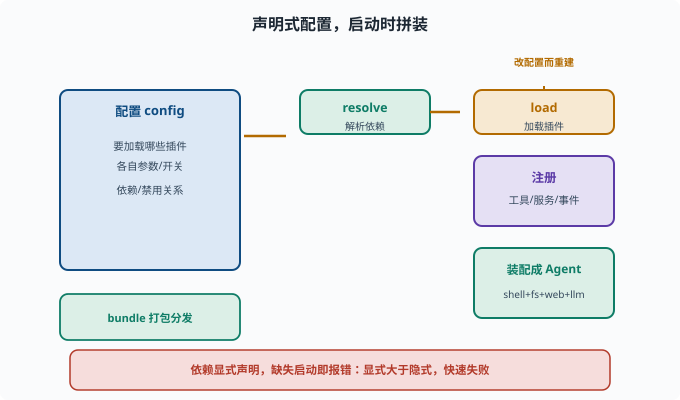
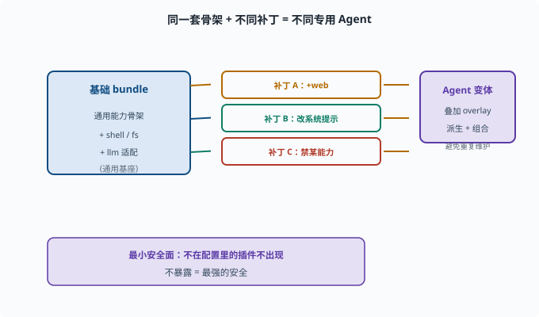

# 插件化组合：系统如何在启动时被"拼"起来

> 目标：理解配置驱动 vs 代码堆叠，以及 bundle、配置、补丁如何组合成一套 agent。读完这一页，你能说清"声明式配置把插件拼起来"这件事，而不是在代码里硬编码。

## 为什么"拼系统"要用配置而不是改代码

如果每次定制 agent 都要改核心代码，框架就失去了灵活性（[09-01](09-01-design-principles.md)）。更好的方式是**声明式配置**：

```text
通过一份配置（如 cordis.yml / bundle）说明：
  要加载哪些插件、各自的配置是什么
  插件之间的依赖/禁用关系
```

框架在启动时**按配置把插件拼装起来**。加能力 = 改配置，不改代码。

## 插件化组合的核心概念

```text
插件（plugin）：一个可复用、可配置、可组合的能力/行为单元
配置（config）：告诉插件"怎么工作"（如用哪个模型、开哪些工具、超时多久）
bundle：一组插件+附件的打包，作为可分发的最小安装单元（profile 补丁层）
```

这三个词串联起来：

```text
选 bundle（想装哪组能力）→ 配置 plugin（各自的参数）→ 启动时框架 resolve 依赖并加载
```

## 一个配置的示意

```yaml
# cordis.yml（示意）
plugins:
  shell: { enabled: true }
  fs:    { cwd: "/workspace", allowWrite: true }
  web:   { search: true }
  llm:
    provider: deepseek
    model: deepseek-chat
  guard:
    maxSteps: 20
```

启动时框架读取这份配置，创建对应的插件实例、注册它们的能力（工具/服务/事件监听），于是一个"带 shell + fs + web + llm + 守卫"的 agent 就被拼出来了。



上图把这套装配过程画成一条流水线：从左边"声明式配置 + bundle"出发，框架先 `resolve` 解析插件之间的依赖，再 `load` 加载插件并 `注册` 工具/服务/事件，最后装配成一个可用的 Agent。左下角的绿色块提醒你，配置文件本身就是一种可分发、可裁剪的"打包单元"。只要想加或减能力，改配置再重建即可，核心代码一行都不用碰。

## 依赖解析与"显式 > 隐式"

插件间可能有依赖（fs 用 shell 的命令、tools 依赖某个模型）。工程原则：

```text
依赖要在配置/清单里显式声明，而不是隐式"碰运气"
缺失的依赖要"启动时就报错"，而不是运行到一半悄悄失败
```

这呼应了 [02](../02-programming-basics/02-06-reading-typescript.md) 讲的"显式契约"与"快速失败"。

## 补丁与 Profile：让同一套基础能派生出不同变体

现代 agent 框架常支持 **profile / patch layer**：

```text
基础 bundle：通用能力
overlay / patch：在基础之上增改（加工具、改系统提示、禁某能力）
```

这样"同一套骨架 + 不同补丁 = 不同专用 agent"，避免为每个变体维护整份配置。



上图用一个紧凑的分支图说明"补丁"的价值：一套基础 bundle 作为通用基座，在其上叠加"加 web""改系统提示""禁某能力"等一个个补丁，就派生出多种专用 Agent。更妙的是，未被配置的补丁根本不会出现在系统里——这正好呼应最小安全面：不暴露的能力就是最强的安全。

## 组合与"最小安全面"

组合性也带来安全：**只加载需要的能力**（[09-06](09-06-scope-permission.md)）。不在配置里的插件不会出现，等价于"不暴露就是最强的安全"。

```text
默认最小：只加载你需要的插件
按需开启：要 web 才开 web
```

## 一个思维实验：如果要加新能力

假设要给 agent 加"数据库查询"能力：

```text
写一个新的 db 插件（Provider + 工具注册）
在配置里把 db 插件加上、配好连接参数
启动，agent 就能调用这个工具
```

内核完全不动。这就是"插件化组合 + 能力缝"带来的扩展体验。

## 思考题

1. 为什么"拼系统"用配置优于改代码？
2. 插件、配置、bundle 分别是什么？
3. 依赖为什么要在配置/清单里显式声明？
4. profile/patch 让你能做什么？
5. 组合性和安全面有什么关系？

## 参考答案

1. 因为加能力/换能力只改配置，不动核心代码，框架保持稳定可维护、可按需组合，也降低改代码带来的风险。
2. 插件是可复用、可配置的能力单元；配置是告诉插件怎么工作的参数；bundle 是插件+附件的打包，作为可分发的最小安装单元（profile 补丁层）。
3. 为了"启动时就看清依赖、快速失败"，而不是运行到一半才发现缺失；隐式依赖会生成难以排查的故障。
4. 用"基础 bundle + overlay/patch 补丁"派生出不同 agent 变体（改工具、改系统提示、禁能力），避免每变体维护整份配置。
5. 只加载配置里声明的能力，未加载的插件不会出现，等于"不暴露＝最强的安全"，从而缩小攻击面、降低越权风险（[09-06](09-06-scope-permission.md)）。

## 下一步

- 想理解"拼好的系统如何被驱动" → [09-04 事件驱动循环](09-04-event-loop.md)。
- 想让拼好的能力有边界 → [09-06 作用域与权限](09-06-scope-permission.md)。
- 想复习配置/依赖解析的工程直觉 → [02-06 读 TypeScript 仓库](../02-programming-basics/02-06-reading-typescript.md)。

[返回本章目录](README.md)
