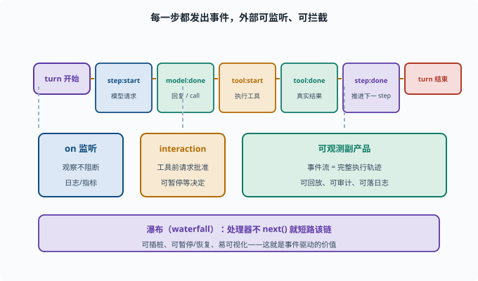

# 事件驱动循环：turn/step 如何被"事件"驱动

> 目标：理解 agent 循环不只是"while 循环"，而是由事件/回调驱动的可观察系统。读完这一页，你能说清事件驱动如何让循环可暂停、可恢复、可插桩（插桩 instrumentation：在程序的关键点埋上"记录/干预"的探针，让运行过程可被看见、可被测量）。

## 从"死循环"到"事件驱动"

第八章的循环（[08-03](../08-agent-foundations/08-03-agent-loop.md)）看起来像"while 一直跑"。但真实框架常常不是"一个把自己跑完的循环"，而是**事件驱动**：

```text
循环不是主动"转完所有步"，而是"响应事件、发事件"
每一步：触发"模型请求事件"→ 结果交给监听者 → 触发"工具执行事件"→ ...
```

事件驱动的好处：

```text
可暂停/恢复（不阻塞、可中断）
可插桩（每个事件都能被外部监听/记录）
可扩展（第三方可挂钩子改行为）
易可视化（事件流 = 执行轨迹）
```

## turn 与 step 在事件模型里

延续 [08-03](../08-agent-foundations/08-03-agent-loop.md) 的术语：

```text
turn（一轮）：处理一个用户请求到给最终答复
step（一步）：turn 内一次"模型请求→(可能)执行工具"
```

事件模型把每个 step 的"开始/结束/结果"都暴露成事件（下面是示意名，帮你看清粒度）：

```text
step:start → 模型调用
model:done（含回复/tool_call）
tool:start / tool:done（含真实结果）
step:done
```

在 deepseek-harness 里，真实的钩子点是这些名字（对照着看粒度即可，不必背）：

```text
agent/pre-step：一步组装完消息、即将请求模型前（可改写或否决）
agent/request：模型请求配置的瀑布点
tools/pre-execute：工具执行前（可 allow / deny / ask 转审批）
tools/post-execute：工具执行后（可改结果、追加反馈）
```

外部监听者可以在这些点上做审批、记录、拦截、注入。



上图把一次 turn 的时间线展开：从 `turn 开始` 到 `step:start`、`model:done`、`tool:start`、`tool:done`、`step:done`，每一格都是一个可被外部观察或拦下的"钩子点"。下方三块是这套设计的直接回报：`on` 监听观察而不阻断（用于日志/指标），`interaction` 在工具执行前请求人类批准（可暂停），而整条事件流天然就是一份可回放、可审计的执行轨迹。

## 事件如何让循环"可挂"

在事件驱动模型里，"等你做一件事"常通过异步/回调（回调 callback：先登记一个"结果到了请调用我"的函数，自己不等在原地——正是 [02-06](../02-programming-basics/02-06-reading-typescript.md) 里 `Promise`/`await` 背后的机制）：

```text
模型请求发出后，循环"挂起"等待结果
结果到达 → 触发下一阶段
期间外部可以注入（比如通过 interaction 事件请求人类审批一条危险命令）
```

这正是 deepseek-harness 里 `interaction` 能力做的事：工具要执行时，触发"请求批准"事件，等用户/策略决定后再继续（[09-06](09-06-scope-permission.md)）。

## 事件与"瀑布"/"挂载"扩展点

框架常用两类扩展：

```text
监听（on）：观察事件，不阻断（如日志、指标）
瀑布（waterfall / next）：事件处理器可"接力"或拦截，能改行为
```

规则（参考 AGENTS.md 的瀑布语义）：

```text
瀑布处理器若不调用 next()，就拦截、短路该链；
要委托给后续处理器，就必须调用 next()
```

这套机制给了插件"在循环的关键点介入"的能力。

## 事件驱动循环的可观测副产品

因为每个决策都用事件发出，天然得到：

```text
完整执行轨迹（可回放、可审计）
每个事件可落进会话日志（[09-05](09-05-session-log.md)）
可观测（[09-09](09-09-observability.md)）
```

所以事件驱动不只是"实现方式"，也是"可追溯、可运维"的基础。

## 思考题

1. 事件驱动循环相比"while 死循环"有什么优势？
2. turn 和 step 在事件模型里如何体现？
3. 事件如何让循环"可挂起/可插入审批"？
4. 监听（on）和瀑布（waterfall）有何不同？
5. 为什么事件驱动等于天然的"执行轨迹"？

## 参考答案

1. 可暂停/恢复、可中断、可被外部监听/插桩、易扩展、易可视化；每一步都暴露为事件，行为可被注入而不改核心。
2. turn 是处理一个请求到最终答复；step 是 turn 内一次"模型请求→可能执行工具"。每个 step 的 start/done 与模型、工具事件都被发出。
3. 关键点（如工具执行前）触发"请求批准"事件，循环挂起等待；外部策略或人工在事件上决定放行/拒绝，随后循环继续，因此可挂起、可插入审批。
4. 监听（on）只观察不阻断（日志/指标）；瀑布（waterfall）处理器可"接力/拦截"并改变行为，若不调用 next() 就会短路该链。
5. 因为每个决策与动作都发出事件，事件流本身就是完整的执行轨迹，可回放、可审计、可落日志、可观测，而非事后拼凑。

## 下一步

- 想让轨迹可追溯、可恢复 → [09-05 会话日志与可追溯](09-05-session-log.md)。
- 想控制边界与审批 → [09-06 作用域与权限](09-06-scope-permission.md)。
- 想对比确定性工作流 → [09-07 工作流 vs Agent](09-07-workflow-vs-agent.md)。

[返回本章目录](README.md)
