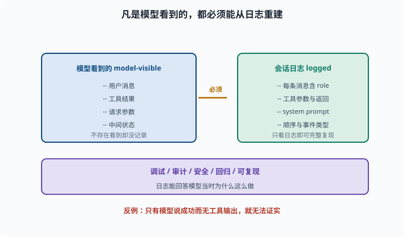
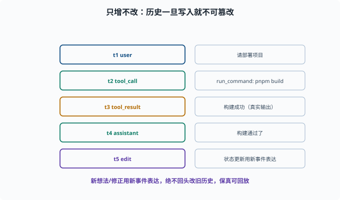

# 会话日志与可追溯：model-visible ⟺ logged

> 目标：理解"凡是模型看到的，都必须能被会话日志重建"这条硬规则。读完这一页，你能说清追溯性为什么是 agent 的硬要求，以及它在调试、审计、回放里的价值。

## 一条硬定律

deepseek-harness 有一个核心不变量（AGENTS.md 也强调）：

```text
model-visible ⟺ logged
凡是"能被模型看到的输入"，都必须能从会话日志里重建出来。
```

翻译成人话：

> 模型看到的一切（用户消息、工具结果、请求参数、中间状态）都必须被记录下来，且"只看日志"就能完整复现模型当时看到的内容。

这保证了**不存在"模型看到了日志里没有的东西"**，也**保证日志能回答"模型当时为什么这么做"**。



上图把这条硬规则画成"左右镜像"：左边是模型当时看到的一切（用户消息、工具结果、请求参数、中间状态），右边是会话日志必须同样包含的内容（每条消息带 role、工具参数与真实返回、system prompt、顺序与事件类型）。箭头既表示"必须被记录"，也意味着"只看日志就能完整复现"。一旦某一侧缺了一块，等式就不成立。

## 为什么追溯性如此重要

对 agent，追溯不是"锦上添花"，而是硬要求：

```text
调试：能回放"哪一步开始错"
审计：能证明"做了什么、为什么做"
安全：能定位越权/危险操作的时间和依据
回归测试：能重放旧轨迹验证改动（[08-08](../08-agent-foundations/08-08-agent-evaluation.md)）
可复现：模型输入可重建 → 结果可对比
```

一个"不能回放"的 agent 就像"没有仪表盘的机器"——失控了也不知道哪出了问题。

## 日志里要记什么

为了满足"model-visible ⟺ logged"，至少记录：

```text
每条用户/助手/工具消息（含内容与 role）
工具调用的参数与真实返回
模型请求的 system prompt、模型、温度等
时间顺序（append-only）与事件类型
会话标识（便于整段回放）
```

理想上，"读日志"能重建出一份"模型视角的完整 transcript"（transcript 即"逐字记录的对话稿"——用户、助手、工具往来的完整原文）。

## append-only：只增不改

会话日志通常是 **append-only（只追加、不修改历史）**：

```text
已发生的事件不能被篡改/覆盖（保审计）
回放依赖"时间不变"
新想法/修正用"新的事件"表达，而不回头改旧的
```

这保证了历史的真实性与可追溯性，代价是实现时要想清楚"如何更新状态而不改旧日志"。



上图把 append-only 的含义做得更直观：每一行都是带时间戳的只增事件，从用户消息、工具调用、工具真实返回，到助手答复，最后"状态更新"也用一个新事件表达，而不是去覆盖旧的那一行。正是这种"永不回头改历史"的纪律，让日志既能防篡改、又能在回放时保持时间顺序不变。

## 一个"可重建"的思维实验

假设模型给了一个答复"我运行了 pnpm build 并成功"。要让这条可被验证：

```text
日志里必须有：
  模型请求时的 tool_call（调用了 bash 工具，参数是 pnpm build）
  工具返回的真实输出（成功/失败）
```

如果日志里"只有模型的最终话，没有工具输出"，那模型说的"成功"就无法被证实——这正是防幻觉（[06-09](../06-llm-fundamentals/06-09-limits-hallucination.md)）和可追溯的核心场景。

## 追溯与调试联动

追溯不是"事后诸葛亮"，而是调试的第一手段：

```text
出问题 → 打开会话日志 → 逐事件回放
找到"从哪个 step 开始和预期不同"
定位是模型决策错、工具返回错、还是上下文缺信息
```

这正好支撑 [08-08](../08-agent-foundations/08-08-agent-evaluation.md) 的轨迹复盘和 [09-09](09-09-observability.md) 的可观测性。

## 思考题

1. "model-visible ⟺ logged" 是什么意思？
2. 为什么追溯是 agent 的硬要求（列举几个价值）？
3. 会话日志至少要记录哪些内容？
4. 为什么日志要 append-only？
5. 为什么"只有模型的话、没有工具输出"不足以证明它做对了什么？

## 参考答案

1. 凡是能被模型看到的输入（用户消息、工具结果、请求参数等）都必须能从会话日志重建；不存在"模型看到但日志没有"的东西。
2. 调试能回放定位错误、审计能证明做了什么、安全能定位越权、回归测试能重放旧轨迹、可复现支撑对比；没有它 agent 相当于没有仪表盘。
3. 各条 user/assistant/tool 消息（含 role 与内容）、工具调用的参数与真实返回、系统 prompt/模型/请求参数、时间顺序与事件类型、会话标识。
4. 保证历史不可篡改、审计可信、回放依赖时间不变；新变化用"新事件"表达而不改旧历史，从而维持可追溯性。
5. 因为"是否真做对了"只能由真实工具输出证实。日志若只有模型"说成功了"而没有工具的真实返回，就无法验证它是否真成功，也无法防幻觉。

## 下一步

- 想理解行为边界与审批 → [09-06 作用域与权限](09-06-scope-permission.md)。
- 想在日志基础上做可观测 → [09-09 可观测性](09-09-observability.md)。
- 想让日志支持崩溃恢复 → [09-10 状态与恢复](09-10-state-recovery.md)。

[返回本章目录](README.md)
