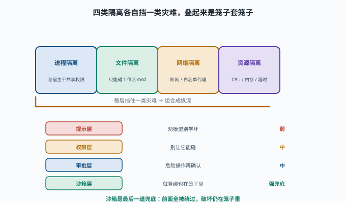

# 作用域与权限：一个 Agent 能碰哪些东西

> 目标：理解 agent 的"边界"不是靠模型自觉，而是靠作用域、权限、审批、沙箱这些硬约束。读完这一页，你能说清最小权限、白名单、审批流与沙箱如何守住失败的底线。

## 为什么"靠模型自觉"不安全

模型会犯错、会幻觉、会被注入（[06-09](../06-llm-fundamentals/06-09-limits-hallucination.md)）。如果让模型"想做啥就做啥"，一次幻觉就能造成破坏。所以 agent 的安全不能依赖"模型乖不乖"，而要**从系统层面硬性限制它能碰什么**。

```text
该读的不让读 → 越权
该执行的不让执行 → 危险
没边界 → 一次注入/幻觉就闯祸
```

## 三项硬约束

```text
作用域（scope）：在哪个上下文里，能看到哪些工具/资源
权限（permission）：能做/不能做的规则（最小权限）
审批（approval）：危险操作要人/策略点头才能执行
```

三者配合：作用域决定"能看见什么"，权限决定"能做什么"，审批决定"高风险时要确认"。

## 最小权限原则

**最小权限（least privilege）**：只给完成任务所需的最小能力。

```text
只读文件的场景 → 不给写/删
只查 web 的场景 → 不给 shell
只在 /tmp 里跑 → 不给访问整个磁盘
```

道理很简单：**不暴露的能力最安全**（呼应 [09-03](09-03-plugin-composition.md) 的组合性）。

## 白名单与黑名单

工具/命令访问常配合白名单：

```text
白名单：只允许调用列出的命令/工具（推荐，默认拒绝）
黑名单：默认允许，但禁止列出的危险项（不推荐，默认放开更危险）
```

安全上更倾向**默认拒绝 + 白名单**：没在白名单里的一律不允许。

## 审批流（human-in-the-loop）

对危险/不可逆操作，要有**人工/策略审批**：

```text
写文件？ → 有的策略允许
删文件？ → 必须审批
执行任意命令？ → 白名单之外审批
```

在 deepseek-harness 里，这由 `interaction`/`permission` 能力实现：工具要执行前发起"请求批准"事件，等批准/拒绝（[09-04](09-04-event-loop.md)）。

## 沙箱：把"能做"和"能碰"都关起来

**沙箱（sandbox）**是一个受限的执行环境：

```text
隔离文件系统（只给一个目录）
限制网络/资源
限制系统调用
超时/配额
```

即使模型"决定"执行一个命令，它也只在沙箱里跑，破坏范围被限制。`deepseek-harness` 的 e2b/sandbox 就是干这个的（[10](../10-practical-lab/README.md)）。

## 一场事故怎么被"挡"住

假设模型被提示注入，想"删光服务器文件"：

```text
作用域：只给 /workspace → 它根本看不到服务器别的目录
权限：删文件要审批 → 触发了审批请求
审批：策略/用户拒绝 → 命令未执行
沙箱：即便执行了，也只在隔离环境
```

四层里任一层挡住，破坏就被避免。**纵深防御（defense in depth）**让单点失误不至于全盘皆输。



上图把这四层防御画成一列从上到下的关卡：作用域决定"能不能看到"，权限决定"能不能做"，审批决定"高风险要不要确认"，沙箱决定"就算执行了也只能待在哪里"。每一层右侧各给了一个具体例子，例如"只给 `/workspace`""删文件要审批""白名单外拒绝""隔离文件/网络/资源"。只要其中任何一层未通过，危险动作就被挡下——这就是纵深防御的意义。

## 思考题

1. 为什么 agent 安全不能靠"模型自觉"？
2. 作用域、权限、审批分别管什么？
3. 最小权限原则的要点是什么？
4. 为什么推荐"默认拒绝 + 白名单"而非黑名单？
5. 沙箱提供了什么？和审批有何不同？

## 参考答案

1. 因为模型会犯错、会幻觉、会被注入，若"想做啥就做啥"，一次幻觉/注入就可能破坏。必须从系统层面硬性限制其能力边界。
2. 作用域决定能看到哪些工具/资源，权限决定能做什么（最小权限），审批决定高风险操作要确认。
3. 只给完成当前任务所需的最小能力：只读不给写、只查 web 不给 shell、只在固定目录跑，不暴露的能力最安全。
4. 因为默认拒绝+白名单意味着"没列出的都禁止"，把风险收敛到显式批准集；黑名单默认放开，漏掉一条就是漏洞。
5. 沙箱是受限执行环境（隔离文件/网络/资源、超时配额），即使命令执行也只在隔离区内；审批是执行前的"人/策略放行"。二者一个管"能到哪"，一个管"要不要批"。

## 下一步

- 想对比有没有"自主决策" → [09-07 工作流 vs Agent](09-07-workflow-vs-agent.md)。
- 想深入安全治理面 → [11 安全与治理](../11-safety-governance/README.md)。
- 想在真实沙箱上动手 → [10 实战 Lab](../10-practical-lab/README.md)。

[返回本章目录](README.md)
