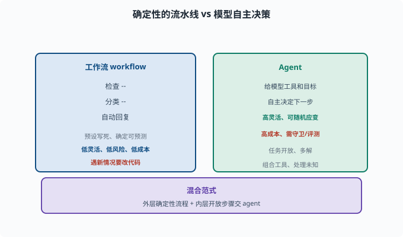

# 工作流 vs Agent：确定性与自主的取舍

> 目标：理解"写死流程"和"让模型随机应变"这两种范式的差别、各自适用场景与最佳实践。读完这一页，你能为任务选择合适的范式，而不是盲目选择"用 agent"。

## 两种范式的直觉

```text
工作流（workflow）：步骤是预设写死的确定性流水线
Agent：模型根据情况自主决定下一步
```

例（处理客户请求）：

```text
工作流：检查→分类→自动回复；每个分支都写死
Agent：给模型工具和目标，让它自己判断怎么处理
```

## 各自特点

| | 工作流 | Agent |
|---|---|---|
| 决策 | 预设、确定 | 模型自主、不确定 |
| 可控性 | 高（可预测） | 低（多变） |
| 灵活性 | 低（遇新情况要改代码） | 高（能随机应变） |
| 出错风险 | 结构性低 | 高（需守卫） |
| 成本 | 通常低、快 | 高、慢（多轮） |
| 适用 | 流程固定、结果明确 | 开放、复杂、多解 |



上图把两种范式并排放置对比：左侧的工作流像一条预设好的流水线（"检查→分类→自动回复"），每一步都被写死、结果可预测；右侧的 Agent 则是"给模型工具和目标"，由它自主决定每一步怎么走。两边的取舍一目了然——工作流低灵活、低风险、低成本，Agent 高灵活但更高成本、需要守卫与评测。底部还给出了现实中最常采用的"混合范式"。

## 什么时候用工作流

```text
流程完全固定：如"先登录→再查数据→格式化输出"
结果可判定：正确路径明确
不需要创造力/应对意外
追求稳定与低成本
```

工作流的关键是：**每一步都确定，错了就固定错，但可预测、可测试。**

## 什么时候用 Agent

```text
任务开放/多解：目标清楚但路径不固定
需要应对未知：中途会冒出意料之外的情况
需要组合工具：动态决定"先查什么、用什么"
需要推理与规划：任务本身是"理解-拆解-执行"
```

Agent 的价值在于"遇到没写过的分支还能应对"，但代价是必须配守卫（[08-03](../08-agent-foundations/08-03-agent-loop.md)）与评测（[08-08](../08-agent-foundations/08-08-agent-evaluation.md)）。

## 混合范式：工作流 + Agent

现实里最优解常常是**混合**：

```text
外层：确定的工作流（入口分类、必做步骤）
内层：让 agent 在某个"开放步骤"里发挥自主
或反过来：agent 规划，关键的确定性步骤用脚本/工作流兜底
```

原则：**确定性强的部分用工作流，开放多变的部分用 agent。** 这是避免"啥都上 agent，结果又慢又不可控"的关键。

### deepseek-harness 里的"第三条路"：模型写工作流脚本

这个仓库给混合范式提供了一个有意思的样本：`packages/workflow/workflow-worker-thread`（工作流引擎，provider 跑在 worker 线程——worker 线程是 Node.js 里与主线程并行、可被强制终止的轻量执行单元）。它让**模型自己写一段确定性的工作流脚本**，引擎在受控环境里执行：

```text
模型收到任务 → 写一段脚本（脚本里可调用 agent(...) 委托子代理）
→ 引擎在 worker 线程上跑这段脚本 → 脚本里的 agent() 调用回到宿主的子代理能力
```

也就是说：**"随机应变的智能"只用在"写脚本"这一步，"执行"交还给确定性代码**。配置面也体现了"工作流要兜住失控"的思路：`maxConcurrentAgents`（并发子代理上限）、`maxTotalAgents`（一次运行最多调多少次 agent，防 runaway 死循环）、`syncTimeoutMs`（同步执行切片超时）。这些正是把 [08-03](../08-agent-foundations/08-03-agent-loop.md) 的"循环守卫"搬进了工作流引擎。

## 用"最容易出问题"来选

一个实用判断题：

```text
如果"这一步必须 100% 按固定规则做"，用工作流/脚本更稳
如果"这一步没有唯一正确答案、要临场判断"，用 agent 更合适
```

比如"生成一份符合 format 的报告"中"格式排版"用固定脚本，"报告内容怎么写"用 agent。

## 思考题

1. 工作流和 agent 的核心区别是什么？
2. 什么条件下应该用工作流？
3. 什么条件下应该用 agent？
4. 为什么"混合范式"常常是最优解？
5. 给出一个"应该用工作流而不是 agent"的具体例子及理由。

## 参考答案

1. 工作流的步骤是预设写死、确定可预测的流水线；agent 由模型根据当前情况自主决定下一步，灵活但多变、需守卫。
2. 流程完全固定、结果可判定、不需要应对意外、追求稳定低成本时用工作流（如固定格式的批量处理）。
3. 任务开放/多解、需动态组合工具、需处理未知情况、需推理与规划时用 agent。
4. 因为真实任务往往是"部分确定、部分开放"：确定性强的步骤用工作流保证稳定，开放的部分交给 agent 保证灵活，能达到"又快又稳又能应对意外"。
5. 例：把用户上传的文件按固定规则重命名并归档到固定目录。该流程步骤固定、结果确定，用 agent 反而慢且可能出错，用写好的脚本/工作流更稳更省。

## 下一步

- 想组建多个 agent 协作 → [09-08 多智能体协作](09-08-multi-agent.md)。
- 想观察混合系统在真实运行中的状态 → [09-09 可观测性](09-09-observability.md)。
- 想动手实现 → [10 实战 Lab](../10-practical-lab/README.md)。

[返回本章目录](README.md)
