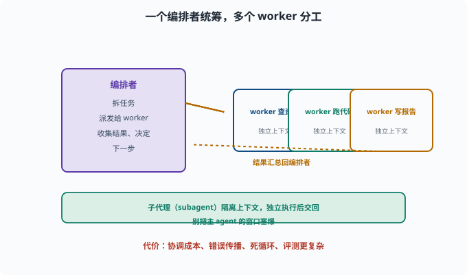
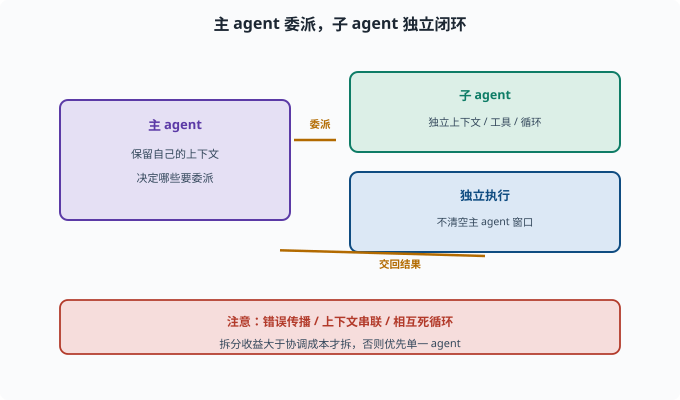

# 多智能体协作：多个 Agent 怎么分工

> 目标：理解把一个 Agent 拆成多个角色的模式（子代理、编排、通信）。读完这一页，你能说清为什么有时"拆分"比"一个全能 Agent"更好，以及它带来的新问题。

## 为什么要"多智能体"

一个超大的 Agent 做所有事，可能：

```text
上下文太重：一个 agent 塞太多工具/记忆，决策变差
角色混乱：又要写代码又要审核又要和用户聊，方向打架
单个失败风险集中：一步错就全错
```

**多智能体（multi-agent）**把一个大任务拆给多个各有专长的 agent 协作：

```text
一个"规划者"拆任务
若干"执行者"各查一块
一个"总结者/审核者"汇总把关
```

## 两种常见模式

### 1. 编排式（orchestrator-worker）

**orchestrator-worker** 直译"编排者-工人"：一个核心"编排者"负责拆任务，若干 **worker**（干活的一线 agent，如查资料、跑代码、写报告）各领一块：

```text
一个核心"编排者"负责拆任务、派给 worker、收集结果、决定下一步
worker 各司其职（查资料、跑代码、写报告）
```

这是最常用、最可控的模式：有一个"大脑"统筹全局。



上图展示了最典型的编排式结构：中央的"编排者"负责拆任务、派发给多个 worker（查资料、跑代码、写报告）、收集结果并决定下一步，worker 之间相互隔离、各有独立上下文。虚线表示"结果汇总回编排者"的回环。这种结构的可控性来自"只有一个大脑在统筹"；代价则是协调成本、错误传播和轨迹更难评估，因此要谨防"为了拆而拆"。

### 2. 对等协作 / 辩论

```text
多个 agent 地位接近，互相沟通/辩论
如：一个提案、一个挑刺，互相迭代改进
```

更灵活但协调成本高、结果更难控制。

## 子代理（Subagent）

一种落地方式是**子代理**：

```text
主 agent 把一部分任务"委派"给一个子 agent
子 agent 有自己的上下文/工具/循环，独立执行
完成后把结果交回主 agent
```

好处：**隔离上下文**——子 agent 处理它那块，不清空主 agent 的窗口（[09-04](09-04-event-loop.md)、[10](../10-practical-lab/README.md)）。



上图把子代理的委派关系单独画出来：主 agent 保留自己的上下文，把一部分任务"委派"给一个拥有独立上下文、工具和循环的子 agent；子 agent 独立执行完后把结果交回主 agent。最核心的价值是上下文隔离——主 agent 的窗口不会被一小块子任务塞爆。下方提醒你，委派同时带来了错误传播、上下文串联、相互死循环等新问题，拆分收益要大于协调成本才值得。

deepseek-harness 的 `subagent` 能力就是干这个的（[AGENTS](../../docs/AGENTS.md)）。

## 多智能体带来的新问题

```text
协调成本：谁对结果负责、怎么汇总
上下文串联：子 agent 的产出如何交给下一个
错误传播：前一个 agent 的错误如何被后面发现/纠偏
死循环：agent 之间互相踢皮球
成本：多个 agent 多轮调用，token/时间更贵
评测复杂：整条多 agent 轨迹难评（[08-08](../08-agent-foundations/08-08-agent-evaluation.md)）
```

所以要谨慎：**不是"越多 agent 越好"，拆分的收益要大于协调成本。**

## 一个规划：多 agent 的取舍清单

```text
任务是否可拆成明确子任务？  → 是才拆
子任务是否需要隔离上下文？ → 是 → 子代理
交互是否有界、可汇总？    → 是才用编排式
错误可被层层检漏？       → 需要"审核者"环节
成本可承受？            → 评估多 agent 的 token 开销
```

规则：**优先单一 agent 搞定；只有确有多样化角色/隔离需求时才拆多 agent。**

## 思考题

1. 单个全能 Agent 可能有哪些问题？
2. 编排式和对等协作模式的区别是什么？
3. 子代理（subagent）的价值主要体现在哪？
4. 多智能体会引入哪些新问题？
5. 何时才应该"拆分"为多 agent？

## 参考答案

1. 上下文太重导致决策变差、角色混乱、单个失败风险集中（一步错全错）。
2. 编排式有一个核心编排者拆任务、派发、汇总、决定；对等协作是多个 agent 地位接近，互相沟通/辩论迭代。前者更可控。
3. 隔离上下文：子 agent 用自己的上下文/工具/循环独立处理一块，完成后交回，避免把主 agent 的窗口塞爆（[09-04](09-04-event-loop.md)）。
4. 协调成本、上下文串联、错误传播、agent 间死循环、token/时间成本、多 agent 轨迹难评估。
5. 任务可拆成明确子任务、子任务需要隔离上下文、交互有界可汇总、能被层层检漏、成本可承受时；否则优先用单一 agent。

## 下一步

- 想"看见"多 agent 的运行时 → [09-09 可观测性](09-09-observability.md)。
- 想实现在真实框架里委派 → [10 实战 Lab](../10-practical-lab/README.md)。
- 想评估多 agent 效果 → [08-08 Agent 评估](../08-agent-foundations/08-08-agent-evaluation.md)。

[返回本章目录](README.md)
