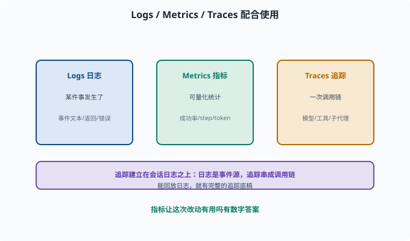
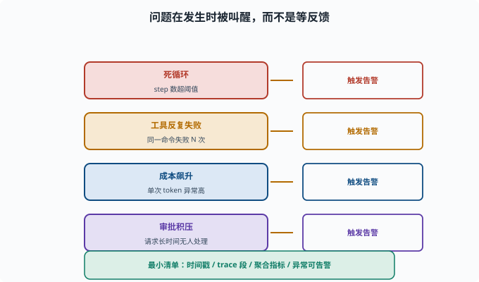

# 可观测性：生产环境如何"看见" Agent

> 目标：理解日志、追踪、指标、评估如何组成 agent 的可观测性。读完这一页，你能说清"看出来在干什么 + 统计表现 + 定位问题"三件事，也知道这与会话日志的关系。

## 为什么可观测性是"生产必备"

开发时你能盯着终端看。但 agent 一旦上线、无人盯守：

```text
它在干什么？
有没有跑偏/卡死？
这次成功率是升是降？
出问题时，是哪一步？
```

没有可观测性，这些问题全是盲区。**可观测性 = 让 agent 的"行为、状态、表现"在运行时可见。**

## 三大类信号：Logs / Metrics / Traces

```text
Logs（日志）：某件事发生了（事件文本、返回、错误）
Metrics（指标）：可量化统计（成功率、平均 step、token 用量、延迟）
Traces（追踪）：一条请求从进入到完成的完整调用链（模型、工具、子代理）
```

配合使用：

```text
Trace 看"一次任务怎么走"
Log 看"某个事件细节"
Metrics 看"这段时间整体怎么样"
```



上图把三大类信号并排放置：Logs 记录"某件事发生了"的细节，Metrics 提供可量化的统计（成功率、平均 step、token 用量、延迟），Traces 则把一次任务从进入到完成的完整调用链串起来。三者配合而不是互相替代——Trace 看一次任务怎么走，Log 看某个事件细节，Metrics 看这段时间整体表现。图下方还点出关键关系：追踪通常建立在上一页的会话日志之上。

## 追踪（Trace）与会话日志的关系

上一页讲过 [09-05](09-05-session-log.md) 会话日志是可追溯的根基。**追踪**常常就是建立在"会话日志/事件流"之上的更高层视图：

```text
会话日志：append-only 事件源（记录一切）
追踪：把相关事件串成"一次任务的调用链"（用户视角的一次请求）
```

因此"能回放会话日志"的能力，直接给了追踪一张完整的底稿。

## 指标：让"表现"可量化

生产 agent 常用的指标：

```text
成功率：N 次任务，成功几次
平均 step / turn 数：完成任务要多少步
工具调用分布：都用了哪些工具、成败如何
token 用量 / 成本：每次请求花多少
延迟：首 token 时间（用户看到第一个字要等多久——流式输出里最影响体感的数）、总时长
错误率：工具/模型报错频率
```

指标让"这次改动有用吗"有数字答案（[08-08](../08-agent-foundations/08-08-agent-evaluation.md)）。

## 主动告警：不只"事后看"

可观测要能**主动报警**，而不只是事后翻日志：

```text
死循环：step 数超过阈值
工具反复失败：同一命令失败 N 次
成本飙升：单次 token 异常高
审批积压：高风险请求长时间无人处理
```

告警让问题"在发生时被叫醒"，而不是等用户反馈。



上图列出四类最该主动触发告警的场景：死循环（step 数超阈值）、工具反复失败（同一命令失败 N 次）、成本飙升（单次 token 异常高）、审批积压（高风险请求长时间无人处理）。每一行最右侧都是"触发告警"的目标动作。可观测的价值正在于此——问题在发生时就被叫醒，而不是等用户反馈之后才翻日志。

## 一个可观测的最小清单

```text
每个事件有时间戳、类型、会话 id
模型请求/工具调用/子代理委派都有 trace 段
关键指标可聚合、可趋势
异常可触发告警
可一键"回放某次任务的完整轨迹"
```

## 思考题

1. Logs、Metrics、Traces 分别是什么？
2. 追踪（Trace）与会话日志什么关系？
3. 生产环境 agent 常用的指标有哪些（至少 4 个）？
4. 为什么可观测要"主动告警"而不只是事后看？
5. 一个可观测的最小清单应包含哪些？

## 参考答案

1. 日志是"某件事发生了"的细节记录；指标是可量化统计（成功率、step、token、延迟）；追踪是一次请求从进入到完成的完整调用链。
2. 追踪常建立在会话日志之上：会话日志是 append-only 事件源，追踪把相关事件串成"一次任务的调用链"。能回放日志，追求追踪就有底稿。
3. 成功率、平均 step/turn 数、工具调用分布与成败、token 用量/成本、延迟、错误率。
4. 因为 agent 上线无人盯守，问题需要"发生时被叫醒"（死循环、反复失败、成本飙升、审批积压），而不是等用户反馈才翻日志。
5. 每个事件有时间戳/类型/会话 id、模型/工具/子代理调用都有 trace 段、关键指标可聚合可趋势、异常可告警、能一键回放某次任务的完整轨迹。

## 下一步

- 想让崩溃后能续上 → [09-10 状态与恢复](09-10-state-recovery.md)。
- 想把观测连到评估 → [08-08 Agent 评估](../08-agent-foundations/08-08-agent-evaluation.md)。
- 想落地 → [10 实战 Lab](../10-practical-lab/README.md)。

[返回本章目录](README.md)
