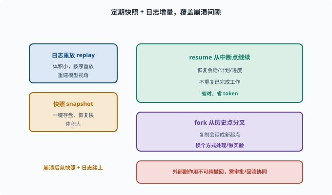

# 状态与恢复：崩溃后如何"续上"

> 目标：理解 agent 状态为何要可持久化、可恢复。读完这一页，你能说清"快照/日志重放/fork/resume"的差异，也知道为什么可追溯日志是恢复的基础。

## Agent 也有"状态"

一个正在跑任务的 agent 有大量状态：

```text
当前会话的消息（用户/助手/工具）
turn/step 走到哪了
计划（哪些步骤完成、待做）
暂存变量/中间结果
外部资源（打开的连接等）
```

如果进程崩溃、机器断电、或被中断，这些状态不会自己保留。**状态与恢复**就是解决"如何让 agent 在意外后能续上、而不是从头再来"。

## 三类持久化手段

```text
快照（snapshot）：某时刻把完整状态一键存盘，崩溃后整盘恢复
事件日志重放（replay）：记录 append-only 事件，恢复时按序重放重建状态（[09-05](09-05-session-log.md)）
两者结合：快照做"检查点"，日志补"断点之后"的增量
```

快照快但体积大；日志体积小但要重放。工程常结合：**定期快照 + 日志增量**覆盖间隙。



上图把"崩溃后如何续上"浓缩成一对互补手段：日志重放（体积小、按序重放、重建模型视角）与快照（一键存盘、恢复快但体积大），两者结合用"定期快照 + 日志增量"覆盖崩溃间隙。右侧则是建立在可重建基础上的两种操作：`resume` 从中断点继续、不重复已完成工作，`fork` 从某条历史会话复制出一个新起点做实验。下方同时提醒，外部副作用往往无法纯撤回，需要审批与回滚协同。

## 为什么"可追溯日志"是恢复的地基

因为"model-visible ⟺ logged"（[09-05](09-05-session-log.md)），会话日志天然记录了重建模型视角所需的全部信息：

```text
重启 agent → 读日志 → 恢复消息序列 → 知道模型此前看到过什么 → 继续
```

没有日志，恢复就无从谈起——你不知道"之前处理到哪、模型看到过什么"。

## resume：从中断点接着干

**resume（续跑）**：不是从头重跑整个任务，而是**从中断处继续**：

```text
恢复会话（消息、计划、进度）
从"失败/中断的那一步"重新尝试，或跳到下一步
不重复已完成的工作
```

这省时间、省 token、用户体验也好（"我在刚才的地方继续"）。

## fork：从某个历史点"分叉"

除了 resume 这种"沿原路续跑"，agent 状态还支持 **fork（分叉）**——思想上正是 [02-05](../02-programming-basics/02-05-version-control.md) 里 Git 分支的翻版：

```text
基于某条历史会话"复制出一个新会话"，从那里开始不同走向
用途：用户想"换个方式处理""对这条轨迹做实验"
```

fork 依赖历史可重建：只要日志在，任何历史点都能作为新起点。

### 在 deepseek-harness 里看 fork 的真实语义

`packages/core/session/src/index.ts` 的 `ctx.sessions.fork(source, boundary?, childId?)` 把上面的思想落成精确的 API：

```text
source   要分叉的会话（活对象或其 id）
boundary 截到哪条事件为止（seq）；不传 = 截到最后一条
childId  新会话的 id；不传则自动分配
```

实现就是"取前缀 + 重新播种"：把源会话的日志截到 `boundary`，作为 `seed`（种子事件）创建一个全新会话，同时在 header 里记下 `parentSession`（父会话）与 `seedLength`（种子长度）——新会话从诞生起就知道自己"从哪条轨迹的哪个点分出来"。注意 fork 的拒绝码也值得读：`OPEN_TURN` 表示截断点落在一个还没闭合的 turn 里、`INVALID_BOUNDARY` 表示截断点不存在——**分叉必须落在事件的完整边界上**，这与 Git 只能在提交点开分支是同一个道理。

## 恢复失败与兜底

恢复不是万能的，要考虑：

```text
外部副作用：命令可能已执行了一半，无法"纯撤回"（需审批/回滚，[09-06](09-06-scope-permission.md)）
资源上下文：已关闭的连接/临时文件恢复不回来
一致性：部分成功的状态要标记"进行中"，别误报"已完成"
```

所以恢复要和"可逆操作、审批、状态标记"协同，别指望日志能无中生有还原外部世界。

## 思考题

1. 一个运行中的 agent 有哪些状态？
2. 快照、事件日志重放、二者结合各有什么特点？
3. 为什么可追溯日志是恢复的基础？
4. resume 和 fork 分别是什么？
5. 恢复不能解决哪些问题？为什么？

## 参考答案

1. 当前会话消息、turn/step 进度、计划状态、暂存变量/中间结果、外部资源连接等。
2. 快照一键存盘、恢复快但体积大；事件日志重放体积小但需按序重放；二者结合=定期快照+日志增量，兼顾速度与完整且覆盖间隙。
3. 因为日志记录了模型视角的全部输入（model-visible ⟺ logged），重启后读日志即可重建消息序列与进度，从而知道"之前的模型看到过什么"，才能继续。
4. resume 是从中断处接着干（恢复会话+从断点继续/跳过已完成）；fork 是基于某条历史会话复制出一个新会话，从那里走向不同分支。
5. 外部副作用（命令执行一半无法纯撤回）、已关闭的资源/临时文件、部分成功的一致性——因为日志只能重建"Agent 视角"，不能凭空还原外部世界，需配合可逆操作、审批与状态标记。

## 下一步

- 想把这些概念全都动手 → [10 实战 Lab](../10-practical-lab/README.md)。
- 想守住安全/权限边界 → [11 安全与治理](../11-safety-governance/README.md)。
- 想复习会话日志根基 → [09-05 会话日志与可追溯](09-05-session-log.md)。

[返回本章目录](README.md)
