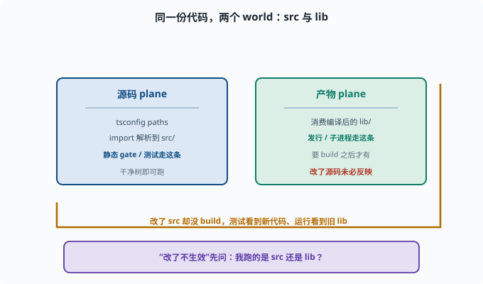

# 环境与仓库：先会"走路"

> 目标：把 deepseek-harness 的环境建立起来，会说清仓库结构、常用命令、"源码/产物双平面"。读完这一页，你能自己安装依赖、构建、跑通基础命令。

## 动手 = 理解的加速器

前面七八章的"概念"只有落到真实仓库里才算能力。这一章我们就在 `deepseek-harness` 上动手。第一步是把环境搭好、命令跑通。

## 仓库结构与关键路径

先记几个最常用的位置：

```text
packages/      各 workspace 包（core/llm/shell/fs/web/...）
packages/core/ 能力主轴：session、system-prompt、tools、agent、agent-loop
docs/          架构与规范
vendor/        vendored Cordis 源码
scripts/       仓库 gates 与生成器
root package.json  各命令入口
```

每个能力包（llm、shell、fs 等）是一个 workspace，会共同被 `dsh` 组装成一个 agent。

## 安装依赖与构建

```sh
pnpm install
pnpm run build
```

注意事项：

```text
需要 Node ^22.19 || >=24（AGENTS.md 声明）
pnpm 管理 workspace
build 产出 lib/（含 tsc 编译的类型与 tsdown 打包的运行时）
```

构建完，`pnpm dsh ...` 就能从源码启动。

## 源码 plane vs 产物 plane：双平面

这是 deepseek-harness 的一个工程关键：

```text
源码 plane：tsconfig paths 把 workspace import 解析到 src/
产物 plane：消费编译后的 lib/（如 config 子进程、某些 gate）
```

区分它很重要：

```text
测试/静态 gate 走 src（干净树）
发行/子进程可能走 lib（要构建产物）
改了源码后，测试和"跑 dsh"看到的东西可能不同
```

所以"我改了代码却没生效"，常常是"跑的是产物、改的是源码"。



上图把两个 plane 放在一起对照：左边"源码 plane"里 `tsconfig paths` 把 workspace 的 import 解析到 `src/`，静态 gate 与单元测试都走这条"干净树"；右边"产物 plane"消费编译后的 `lib/`，发行与部分子进程走这条。那张黄色的回环线正是最常见的踩坑点——你改了 `src` 却忘了 `build`，于是测试看到的是新代码，跑 `dsh` 或子进程看到的却是旧 `lib`。所以遇到"改了不生效"，第一步永远是问自己：这次跑的是 `src` 还是 `lib`。

## 常用命令一瞥

```sh
pnpm run build       # tsc + tsdown 构建
pnpm run test        # vitest 单元测试
pnpm run typecheck   # 类型检查
pnpm run lint        # 代码规范
pnpm dsh --profile headless "任务"   # 跑一个任务（需要模型密钥）
```

先跑通 `build`/`typecheck`，确认环境 OK，再继续下一页。

## 验证环境：三个小目标

```text
1. pnpm install 无报错
2. pnpm run build 成功产出 lib/
3. pnpm run typecheck 通过
```

达成这三条，环境就绪，可以开始"拆源码"了。

## 思考题

1. 仓库里 packages/core 主要包含哪些内容？
2. "源码 plane 与产物 plane"的区别是什么？为什么容易混淆？
3. 为什么改了源码后，跑 test 和跑 dsh 可能看到不同行为？
4. 环境就绪的三个小目标是什么？
5. 列出至少 3 个常用命令。

## 参考答案

1. 能力主轴：session、system-prompt、tools、agent、agent-loop。它定义了"模型、工具、记忆、循环"的核心组装。
2. 源码 plane 把 import 解析到 `src/`（静态 gate/测试走它）；产物 plane 消费编译后的 `lib/`（发行、部分子进程）。容易混淆是"改了源码但跑的是产物"时表现不一致。
3. 因为测试/静态 gate 解析到全新 `src`，而运行 `dsh` 或子进程可能消费已构建的 `lib`；源码改了但没 rebuild 时，两者行为不同。
4. `pnpm install` 无报错、`pnpm run build` 产出 lib/、`pnpm run typecheck` 通过。
5. `pnpm run build`、`pnpm run test`、`pnpm run typecheck`、`pnpm run lint`、`pnpm dsh --profile headless "任务"`。

## 下一步

- 想读懂 dsh 如何被拉起 → [10-02 读懂启动流程](10-02-boot-flow.md)。
- 想深入会话日志结构 → [10-03 拆解会话日志](10-03-session-internals.md)。
- 想复习仓库的 AGENTS 规范 → [AGENTS](../../AGENTS.md)。

[返回本章目录](README.md)
