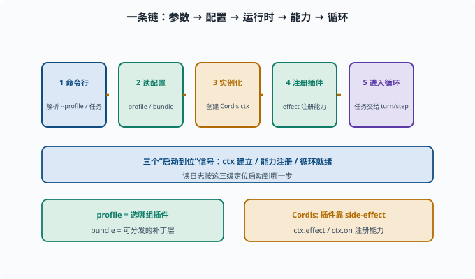

# 读懂启动流程：dsh 如何被拉起

> 目标：理解 profile、bundle、入口如何把 dsh 跑起来。读完这一页，你能说清"命令行 → 读配置 → 装插件 → 进入循环"的启动链。

## 一条启动链

`dsh` 从命令行到真正干活，大致走这几步：

```text
1. 命令行入口：解析参数（--profile、任务文本）
2. 读 profile/bundle：确定要加载哪些插件与配置
3. 实例化运行时：创建 Cordis 上下文（ctx）
4. 注册插件：按配置加载各能力（llm/工具/循环/权限）
5. 进入 agent 循环：把任务交给 turn/step 驱动
```



上图把这五步画成一条水平流水线：左端是命令行解析 `--profile` 与任务文本，依次经过"读 profile/bundle 确定插件"、"实例化 Cordis ctx"、"用 `ctx.effect`/`ctx.on` 注册能力"，右端才真正进入 agent 循环。下方的三个信号——`ctx 建立`、`能力注册`、`循环就绪`——就是你读日志时用来判断"启动到哪一步"的锚点。搞清楚这条链，之后遇到"工具没注册 / 配置没生效"这类启动期问题，就能快速定位是哪个环节断了。

## profile 与 bundle 在启动里的角色

```text
profile：一份"选哪组插件 + 怎么配"的配置（如 headless/交互 preset）
bundle：可分发的一组插件+责任，作为 profile 的补丁层
```

`pnpm dsh --profile headless "任务"` 里的 `headless` 是一个内置 profile 模板（`dsh-base` + `dsh-headless` 两个 bundle 补丁层叠成）：

```text
headless：无交互、跑单任务、打印结果后退出
其他 profile：web（带 Web 界面）、tui，或你自建的
```

## 入口在哪里找

从命令行开始 `rg` 定位（rg 即 ripgrep，一个速度极快的代码搜索工具，用法类似 grep 但默认递归、默认忽略 .gitignore）：

```sh
rg -n "dsh" apps/cli/src packages/boot packages/examples | head -20
```

通常：

```text
apps/cli/src/bin.ts：dsh 命令的真正入口（解析 --profile 等启动参数）
packages/boot：共享 app-bin 胶水（profile 装配逻辑）
examples/headless-agent/cordis.yml：一份可直接读的完整 profile
```

读入口时关注：它如何构造 ctx、如何读 profile、如何把任务塞进 agent loop。

## 注册插件的"effects"风格

在 Cordis 里，插件通过"副作用"加载：

```text
ctx.effect(() => { ... 注册工具/服务/监听；返回清理函数 })
ctx.on("...", handler) 挂事件
```

启动时，框架调用插件的初始化，把这些"注册动作"执行一遍，运行时系统就有了一套完整的能力。

## 从启动到"能干活"的三个信号

正确的启动通常伴随：

```text
ctx 建立（配置生效）
能力注册（模型/工具可用）
循环就绪（能接收任务）
```

读日志/调试时，看这三个信号判断"启动到哪一步了"。

## 思考题

1. dsh 从命令行到干活的启动链大概经过哪几步？
2. profile 和 bundle 在启动里各干什么？
3. "headless" profile 大概意味着什么？
4. 插件在 Cordis 里通常怎么"注册"能力？
5. 判断"启动到哪一步"的常用信号有哪些？

## 参考答案

1. 命令行解析参数 → 读 profile/bundle 确定插件与配置 → 实例化 ctx → 注册插件与能力 → 进入 agent 循环处理任务。
2. profile 是"选哪组插件、怎么配"的配置；bundle 是打包的一组插件+责任，作为 profile 的补丁层。
3. 无交互、跑单任务、打印结果后退出的内置 profile（dsh-base + dsh-headless 补丁层叠成），通常用于自动化/批量。
4. 通过 effect/on 副作用：插件初始化时用 `ctx.effect(()=>{...})` 注册工具/服务/监听并返回清理函数，`ctx.on(...)` 挂事件。
5. ctx 建立、能力注册（模型/工具可用）、循环就绪（能接收任务）。

## 下一步

- 想拆解会话日志 → [10-03 拆解会话日志](10-03-session-internals.md)。
- 想拆解 agent 循环 → [10-04 拆解 Agent 循环](10-04-agent-loop.md)。
- 想复习插件组合原理 → [09-03 插件化组合](../09-agent-architecture/09-03-plugin-composition.md)。

[返回本章目录](README.md)
