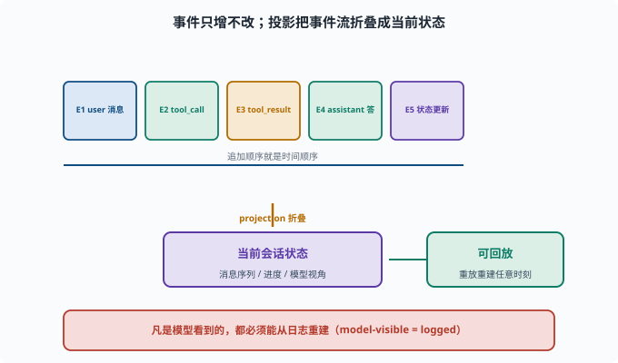

# 拆解会话日志：读懂 append-only 日志

> 目标：在 packages/core/session 里看懂会话日志的结构与事件。读完这一页，你能识别一条会话事件、理解"model-visible ⟺ logged"如何落实到代码。

## 会话日志的价值（回顾）

此前讲过追溯硬规则（[09-05](../09-agent-architecture/09-05-session-log.md)）：**凡是模型看到的都能从日志重建。** 这一页我们把这条规则"拆进代码"。

## session 包在做什么

`packages/core/session` 负责：

```text
持久化会话数据（append-only）
事件模型：SessionEvent
投影（projection）：从事件推断会话状态
标题、遥测等附属能力
```

核心是一个"事件流"：每个动作（消息、工具、模型请求）作为一条事件被追加。

## projection（投影）：从事件到状态

**projection（投影）**指"把只增的事件流折叠成当前状态"的运算：事件本身只记录"发生了什么"，而 agent 每一步需要的是"现在消息序列长什么样"。deepseek-harness 里这个函数叫 `deriveMessages()`——它按顺序折叠事件，产出模型要看到的消息列表；同一份日志可以被反复折叠出任意历史时刻的状态。

## 一条 SessionEvent 长什么样

每条事件都是一个带类型标记的信封（真实字段，见 `packages/core/session/src/types.ts`）：

```text
type：事件的类型（如 turn/start、user/message、tool/result）
seq：会话内单调递增的序号（重放顺序的保证）
time：Unix 毫秒时间戳
data：该类型自己的载荷（消息文本、工具参数、返回值等）
```

真实的事件类型词汇表包括：`turn/start`、`turn/end`、`step/start`、`step/end`、`user/message`、`assistant/chunk`（流式片段）、`assistant/message`、`tool/call`、`tool/result` 等。

读代码时关注：事件如何被"追加"（`session.append`）、如何被读取、如何投影成会话状态。

## "model-visible ⟺ logged" 怎么落地

一条硬规则在代码里体现为：

```text
每次向模型发送新输入前后，都要追加一条对应事件
（如 user/message、assistant/message、tool/result 都有专属事件类型）
这样 deriveMessages 折叠日志，就能重建"模型看到的那条完整消息"
```

工程上"该不该加事件"的判断标准很简单：**如果这条输入会被模型看到，就必须能由日志重建。**

## 用 rg 感受

```sh
rg -n "SessionEvent|append|deriveMessages|message" packages/core/session/src
```

重点看：

```text
事件追加的入口（session.append）
事件如何被序列化/反序列化
deriveMessages 如何把事件流投影成"当前消息序列"（模型视角）
```

## 事件流与"可回放"

因为日志 append-only，可以：

```text
从头到尾重放事件 → 重建任何时刻的会话状态
拉出"某时刻模型视角" → 排查为何那样做（[09-09](../09-agent-architecture/09-09-observability.md)）
```

这就是"可追溯"与"调试"的源码基础。



上图把"事件流"和"投影"两件事拼在一起看：顶部一排 `E1..E5` 是按顺序追加的只增事件，底部那条 `projection 折叠` 的箭头把它们浓缩成"当前会话状态"（消息序列、进度、模型视角）。右端的"可回放"则说明同一份事件流还能被反复重放，重建任意时刻的状态。事件源与投影分离，正是"日志能回答模型当时为什么这么做"的工程根基。

## 思考题

1. session 包主要负责什么？
2. 一条 SessionEvent 通常包含哪些字段？
3. "model-visible ⟺ logged"如何在代码里判断"要不要加事件"？
4. append-only 为什么支持"回放重建状态"？
5. projection 的作用是什么？

## 参考答案

1. 持久化会话数据（append-only）、事件模型 SessionEvent、投影（projection，如 `deriveMessages`）推断会话状态、标题/遥测等。
2. type（事件类型，如 turn/start、user/message、tool/result）、seq（会话内单调序号）、time（Unix 毫秒时间戳）、data（该类型的载荷）等。
3. 判断标准：该输入如果会被模型看到，就必须能从日志重建，因此要先追加对应事件；"看不到的"可以不记，但"看得到的"必须记。
4. 因为事件只增不改、顺序固定，从头重放事件流就能按时间重建任何时刻的会话状态，从而支持追溯与回放。
5. projection（如 `deriveMessages`）把 append-only 的事件流"折叠"成当前的会话状态（如当前消息序列），供 agent 读取与继续。

## 下一步

- 想拆解 agent 循环怎么消费会话 → [10-04 拆解 Agent 循环](10-04-agent-loop.md)。
- 想从零写一个工具 → [10-05 写一个工具](10-05-write-a-tool.md)。
- 想复习追溯硬规则 → [09-05 会话日志与可追溯](../09-agent-architecture/09-05-session-log.md)。

[返回本章目录](README.md)
