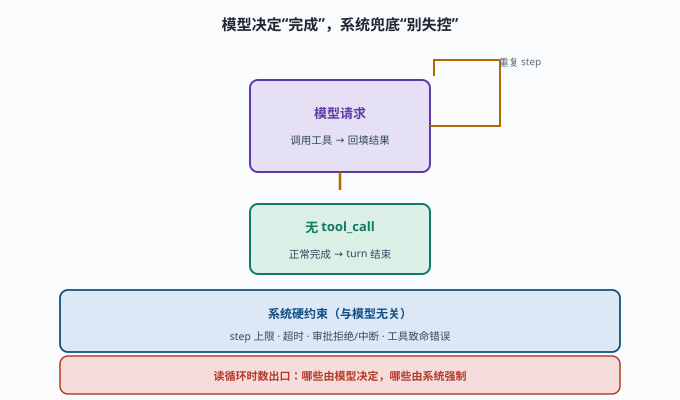

# 拆解 Agent 循环：读 turn/step 驱动

> 目标：在 packages/core/agent-loop 里读懂 turn/step 是如何被驱动的。读完这一页，你能画出"模型请求→执行工具→观察→再请求"在代码里的落点，也知道守卫监听在哪。

## agent-loop 包在做什么

`packages/core/agent-loop` 是"思考–行动–观察"循环的工程化实现（[08-03](../08-agent-foundations/08-03-agent-loop.md)）：

```text
turn（一轮）：处理一个请求到最终答复
step（一步）：一次"模型请求 + 可能的工具执行"
```

它把 ReAct 的概念转成可运行的控制流。

## 循环的"骨架"在代码里的样子

读代码常看到与下面等价的逻辑：

```text
while（未终止）{
  const res = await model.call(messages, tools)   // 思考，可能带 tool_call
  记录事件到 session
  if（无 tool_call）break                          // 完成
  for（每个 tool_call）{
    结果 = await 执行工具(tool_call)               // 行动
    记录 tool 结果事件
    messages.push(tool_result)                    // 观察回填
  }
  检查守卫（步数、超时、审批）
}
```

找这些关键词能快速定位：`turn`、`step`、`tool`、`model`、`break`。

## step 的关键事件

每个 step 通常伴随事件（这也串起会话日志，[10-03](10-03-session-internals.md)）：

```text
模型请求事件（含请求内容）
工具调用事件（含参数）
工具结果事件（含真实返回）
```

这使得"每一步模型看到了什么"都被记下。

## 终止与守卫在哪

循环的"安全阀"通常散落在几处：

```text
无 tool_call → 正常终止
step 上限 → 强制停
超时/审批 → 通过 interaction/guard 挂钩
致命错误 → 停止并上报
```

读循环时数一数：它有几个"出口"？哪些是模型决定、哪些是系统硬约束？



上图把循环的"出口"分成两类看：中间那道向下的绿色路径是**模型决定**——当模型返回不带 `tool_call` 的最终答案，循环就走"正常完成"出口；而围绕它的是一条反复"模型请求 → 执行工具 → 回填结果"的回路。下方那条蓝色带子里列的是**系统硬约束**——`step 上限`、`超时`、`审批拒绝/中断`、`工具致命错误`，这些跟模型想不想停无关，是框架兜底的"刹车"。读循环代码时把出口分两类数，就能立刻看出哪些是自主终止、哪些是强制熔断。

## 用 rg 导航

```sh
rg -n "turn|step|tool_call|model\.call|break" packages/core/agent-loop/src
```

重点理解"控制流"而非"每个细节"：模型请求、工具执行、结果回填、终止判断是四个锚点。

## 循环与"可插桩"

因为每一步都发事件/可挂监听，外部插件能在关键点介入（[09-04](../09-agent-architecture/09-04-event-loop.md)）：

```text
审批插件：工具执行前拦截
日志插件：记录指标
守卫插件：限制步数/超时
```

所以循环不改核心也能增强——这就是能力缝的意义。

## 思考题

1. turn 和 step 在 agent-loop 里各代表什么？
2. 循环通常在哪几个点"发起/消费"会话日志？
3. 循环的正常终止条件是什么？
4. 除了模型自主终止，还有哪些系统硬约束能停止循环？
5. 为什么说 agent-loop 是"可插桩"的？

## 参考答案

1. turn 是处理一个请求到最终答复；step 是 turn 内一次"模型请求+可能的工具执行"。
2. 模型请求前后追加请求事件、工具调用追加调用事件、工具返回追加结果事件，从而让每一步"模型视角"可重建。
3. 模型返回不带 tool_call 的最终答案（即模型认为任务完成）。
4. step 数上限、超时、工具致命错误、审批拒绝/中断等系统层面的硬约束。
5. 因为每一步都发事件、可被插件监听/拦截，外部插件（审批、日志、守卫）能在关键点介入而不改核心循环。

## 下一步

- 想从零写一个工具注册到循环里 → [10-05 写一个工具](10-05-write-a-tool.md)。
- 想复习循环与事件驱动 → [09-04 事件驱动循环](../09-agent-architecture/09-04-event-loop.md)。
- 想了解 step 的守卫 → [08-03 Agent 循环](../08-agent-foundations/08-03-agent-loop.md)。

[返回本章目录](README.md)
