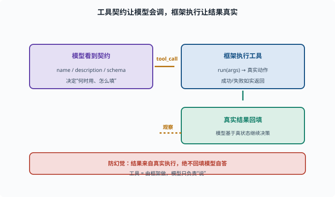

# 写一个工具：注册到 ctx.tools

> 目标：在 deepseek-harness 里从零注册一个工具，让 agent 能调用它。读完这一页，你能说清"工具契约 + 调用处理 + 注册"三部分，写下你的第一个自定义工具。

## 一个工具的三个部分

在 harness 里加一个工具，通常写三样：

```text
1. 契约（名称、描述、参数 schema）——告诉模型"这是什么、怎么用"
2. 处理逻辑——真正执行的动作（读/写/查/算）
3. 注册——把工具挂到 ctx.tools，让循环发现它
```

这和 [08-02](../08-agent-foundations/08-02-tools-and-function-calling.md) 的工具三要素一致。

## 先看现成工具怎么写的

最快的上手方式是照抄现有工具模式：

```sh
rg -n "defineTool|ctx.tools.register" packages/shell/tool-bash/src packages/fs/tool-fs/src packages/todo/tool-todo/src
```

观察它们如何：

```text
定义工具 schema（name/description/parameters）
实现执行函数（输入参数 → 输出结果）
注册进 ctx.tools 并在插件 effect 里完成
```

## 一个最小工具示例（概念）

真实 API 是 `defineTool`（来自 `@deepseek-ai/dsh-tools`），下面是一个最小骨架（省略部分字段，完整形态见 `packages/todo/tool-todo/src/index.ts`）：

```ts
ctx.tools.register(defineTool({
  name: "add_numbers",
  description: "计算两个数字之和。需要做计算时使用。",
  parameters: {
    a: { type: "number", required: true, description: "第一个加数" },
    b: { type: "number", required: true, description: "第二个加数" },
  },
  output: {
    schema: { type: "object", properties: { sum: { type: "number" } } },
    render: (_args, value) => [{ type: "text", text: `${value.sum}` }],
  },
  async execute(args) {
    return { sum: args.a + args.b };   // 真实执行
  },
}));
```

关键：`description` 要让模型知道"什么时候该用它"；`execute` 返回真实结果。`parameters` 的写法不是标准 JSON Schema 的 `{ type: "object", properties: ... }` 外壳，而是"参数名 → 约束"的直接映射，`defineTool` 内部会转成模型要的 JSON Schema。

## 注册进 ctx.tools

`ctx.tools.register()` 返回的本身就是清理函数（Cordis 注册类的惯例），放进插件的 effect 里即可：

```ts
ctx.effect(() => {
  return ctx.tools.register({ ...tool });   // effect 返回它：插件销毁时自动清理
});
```

注册后，agent 的循环就能在恰当时候调用"add_numbers"并收到真实返回。

## 工具返回要"真实"

遵守防幻觉纪律（[06-09](../06-llm-fundamentals/06-09-limits-hallucination.md)、[07-06](../07-llm-engineering/07-06-hallucination.md)）：**工具输出来自真实执行**，成功/失败都如实返回，让模型基于真状态决策而非瞎猜。



上图把"一个工具被用起来"的全过程串了一遍：左端"模型看到契约"（`name / description / schema`）决定了它**要不要调、怎么填**；接着它发出 `tool_call`，右端的"框架执行工具"调用 `execute(args)` 做真实动作，再把成功或失败如实回填给模型。那条虚线的返回箭头标的是"观察"：模型基于工具给的真结果继续决策。正下方那条红线点明纪律——**结果必须来自真实执行**，绝不回填模型自答，否则就是喂幻觉。写工具时只要记住"模型负责说，框架负责做"，分界就清楚了。

## 写完后怎么验证

```text
1. typecheck 通过
2. 写一个单元测试：调用 run，断言输出正确
3. （若可行）跑一个 headless 任务，让模型实际调到它
```

新增工具最好配测试（AGENTS.md 的测试面原则）。

## 思考题

1. 一个工具需要写哪三部分？
2. 为什么 description/schema 写得好很重要？
3. 工具注册通常放在插件的什么阶段？
4. 为什么工具结果必须来自真实执行？
5. 写完后应如何验证？

## 参考答案

1. 契约（名称/描述/参数约束）、处理逻辑（`execute` 函数）、注册（`ctx.tools.register` 让循环发现）。
2. 因为模型靠描述判断"何时用、怎么填参数"（[08-02](../08-agent-foundations/08-02-tools-and-function-calling.md)）；清楚才不会误用、错填。
3. 通常在插件的 effect 阶段：`ctx.effect(()=> ctx.tools.register(defineTool({...})))`，返回的清理函数在插件销毁时移除注册。
4. 因为模型只能"说"不能"做"，工具由框架真实执行、把真结果回填，避免模型"猜结果"导致幻觉与误判（[07-06](../07-llm-engineering/07-06-hallucination.md)）。
5. typecheck 通过、写单测断言 execute 的输出、能的话跑一个 headless 任务让模型实际调用到它。

## 下一步

- 想打包成可复用指令 → [10-06 写一个 skill](10-06-write-a-skill.md)。
- 想接外部工具服务器 → [10-07 接入 MCP 服务器](10-07-mcp.md)。
- 想复习工具调用理论 → [08-02 工具调用](../08-agent-foundations/08-02-tools-and-function-calling.md)。

[返回本章目录](README.md)
