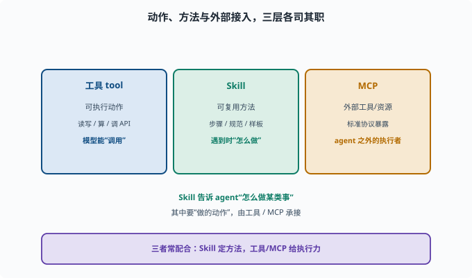

# 写一个 Skill：打包可复用指令

> 目标：理解 Skill 与"一次性工具"的区别，把可复用的工作流/知识打包成 skill。读完这一页，你能说清 skill 的目录结构、SKILL.md 的作用，以及 skill 与工具、MCP 的关系。

## 什么是 Skill

一个 Skill 是**可复用的指令包**：它把"怎么做某类事"的方法（步骤、规范、样板）打包，让 agent 在遇到合适任务时按这套方法操作。

```text
工具（tool）：给 agent 一个"能执行的动作"
Skill：给 agent 一套"遇到这类任务该怎么做的指示/方法"
```

比如说"写文档、做 code review、归档笔记"都可以做成 skill：里面写清楚流程、规范、示例。

## Skill 的最小结构

一个 skill 通常就是目录加一个说明文件：

```text
my-skill/
  SKILL.md      # 核心说明：何时用、怎么做
  （可选）配套脚本/模板/参考
```

`SKILL.md` 是最关键的：

```text
frontmatter（文件开头 --- 包住的元数据块）：name、description 等
描述（description）：什么时候该用这个 skill
步骤：具体怎么做（流程、命令、检查项）
规范：风格、边界、注意事项
示例：参考样例
```

> **frontmatter（前置元数据）**：Markdown 文件最顶部用两行 `---` 包住的一小段结构化信息（如 `name:`、`description:`），工具靠它"不读全文就知道这个文件是什么"。你在很多静态博客/文档系统里都会见到同样的约定。

agent 通过读取 description 判断要不要加载某个 skill——所以 description 的写法直接决定 skill 会不会被用对场合。

参考本仓库已有的 skill 目录（`.agents/skills/`，如 `dsh-doc-standards`），看看它们的写法。deepseek-harness 里 skill 的运行时由 `packages/skill` 提供：`ctx.skills` 注册表 + 各来源提供者（本仓库的本地文件实现会扫描目录、解析 `SKILL.md`）。

## Skill 和"工具/MCP"怎么区分

```text
工具：可直接执行动作（读写、算、调 API）
Skill：给"怎么处理一类任务"的方法与指示
MCP：一种标准方式，把"一批外部工具/资源"暴露给 agent
```

三者常配合：skill 指示"怎么做"，里面提到的动作由工具/MCP 承接。



上图用三块不同颜色的区域把三者摊开：左端"工具 tool"是可执行的动作，模型能直接"调用"；中间"Skill"是可复用的方法（步骤 / 规范 / 样板），它回答的是"遇到这类任务该**怎么做**"；右端"MCP"是把**一批**外部工具 / 资源标准地暴露给 agent 的接入方式。底下的收束句是它们的协作关系：`Skill 定方法，工具 / MCP 给执行力`。也就是说，写 Skill 时不必把每个动作都自己实现一遍，声明"这里该用哪个工具/MCP"，动作就由那层承接。

## 写一个好的 SKILL.md

几个要点：

```text
标题清楚说明"做什么"
description 明确触发时机（何时用这个 skill）
步骤可执行、有顺序、有检查点
写清输出/验收标准
给出边界与坑（什么不该做）
引用必要的工具/规范
```

想想你学过的文档规范（[dsh-doc-standards](../../.agents/skills/dsh-doc-standards/SKILL.md) 就是本仓库一个真实的 SKILL.md）就能体会"好指示"和"车轱辘话"的区别。

## 验证一个 skill

```text
描述是否让 agent"知道何时触发"？
步骤是否能照着走通？
有人照着做，结果是否符合预期？
有没有遗漏的边界/错误处理？
```

## 思考题

1. 工具和 Skill 有什么区别？
2. 一个最小 skill 的目录结构是什么？
3. SKILL.md 里至少该写哪些内容？
4. Skill 与 MCP 的关系是什么？
5. 怎么判断一个 skill 写得好不好？

## 参考答案

1. 工具给 agent 一个可执行的动作（做什么）；Skill 给一套"遇到这类任务该怎么做"的指示/方法（怎么做），两者常配合。
2. 一个目录 + SKILL.md（必要时配脚本/模板）；核心是 frontmatter 与 description 描述何时用、正文写怎么做。
3. 标题、触发描述、可执行的步骤、输出/验收标准、边界与坑、必要工具/规范与示例。
4. Skill 是"怎么处理一类任务"的指示；MCP 是"把一批外部工具/资源标准地暴露给 agent"。skill 里要用的动作，可由工具/MCP 承接。
5. 描述是否触发准确的时机、步骤能否照着走通、结果是否符合预期、是否覆盖边界与错误处理。

## 下一步

- 想接外部工具 → [10-07 接入 MCP 服务器](10-07-mcp.md)。
- 想把 skill 和工具组合成 profile → [10-08 搭自定义 profile](10-08-custom-profile.md)。
- 想参考仓库里现成 skill → 扫描 `.agents/skills/`。

[返回本章目录](README.md)
