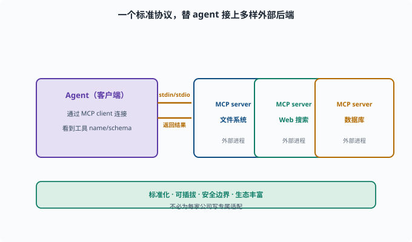

# 接入 MCP 服务器：把外部工具接进来

> 目标：理解 MCP（Model Context Protocol）如何标准化地把外部工具/资源暴露给 agent。读完这一页，你能说清"为什么不逐个 hack API，而是用 MCP 一次性接入"，也知道大致的接入步骤。

## 什么是 MCP

**MCP（Model Context Protocol）**是一个开放协议：**标准化地把"外部工具、资源、提示"暴露给 AI agent**。可以类比数据库的 ODBC/JDBC（统一的"驱动接口"标准，让任何程序能接任何数据库）——不针对某家厂商，一套接口接多样后端。

```text
服务器（MCP server）：暴露工具/资源的进程（文件系统、web 搜索、数据库...）
客户端（MCP client）：agent 这边的接入端
```

agent 通过 MCP 客户端连接服务器，就能"看到并用上"其暴露的工具。



上图把"一个客户端、多个服务器"的基本拓扑画出来：左边的 Agent（客户端）通过 MCP client 与多个外部 `MCP server`（文件系统、Web 搜索、数据库）相连。向右的箭头表示通过 stdio/标准方式发起连接、暴露工具；向左的箭头表示外部进程把真实结果返回。对 agent 来说，这些外部工具"看起来就像普通工具"——它只关心 `name / description / schema`，真正执行则发生在那个隔离的外部进程里。这张图同时点出 MCP 的设计意图：一套协议替 agent 接上多样后端，协议两侧的角色（client / server）正是能力缝思想的一种具体化。

## 为什么用 MCP 而非逐个接入

```text
标准化：一套协议接所有符合的服务器，不必为每家写适配
可插拔：换工具/供应商只改配置
安全边界：工具是外部进程，可在受控环境运行
生态：大量现成 MCP server 开箱即用
```

这正好契合 [09-02](../09-agent-architecture/09-02-capability-seam.md) 的能力缝思想——MCP 是一种"外部能力接入"的标准缝。

## 一次接入的大致步骤

```text
1. 找一个 MCP server（如文件、搜索、数据库 server）
2. 配置连接（命令/参数、或远程 endpoint）
3. 启动 server，agent 的 MCP 客户端建立连接
4. 服务器暴露的工具进入"可用工具"集合
5. agent 可调用这些工具，结果回填（像普通工具）
```

deepseek-harness 里真有这一层：`packages/mcp/mcp-client`（`@deepseek-ai/dsh-mcp-client`）。在 `cordis.yml` 里加一个插件行就是一个 MCP server 连接（`transport: stdio`——stdio 即"标准输入/输出"，让 MCP server 作为本地子进程跑、通过管道通信；或 `transport: streamable-http` 连远程端点），它注册的工具以 `mcp__<服务器名>__<工具名>` 的形式进入 `ctx.tools`，对模型来说与本地工具无异。

源码里这条插件行的配置面（`src/index.ts`）就是两种传输的判别联合：`transport: 'stdio'` 时带 `command`/`args`/`env`（spawn 一个子进程），`transport: 'streamable-http'` 时带 `url`。连接管理在 `connection.ts`：它为每个 server 维护"传输代际"——重连就是关掉旧 transport、建新的一代，两秒宽限期内让旧进程体面退出。这个细节提醒你：MCP 的"可插拔"不只是启动时连一次，还包括运行中 server 崩溃/重启的监督（supervision，持续看护并在异常时重建连接）。

## MCP 与"普通工具"的关系

对 agent 而言，一个 MCP server 暴露的工具，生命周期就像普通工具：

```text
模型看到工具的 name/description/schema
模型发出 tool_call
代理把它路由到 MCP server 执行
server 返回真实结果，回填上下文
```

只是"执行者"变成了外部进程/服务器。所以要遵守同样的真实结果与权限纪律（[09-06](../09-agent-architecture/09-06-scope-permission.md)）。

## 一个接入的最小检查清单

```text
server 是否能启动、工具是否被列出
工具 schema 是否清晰（模型会不会用）
权限：这个 server 能接触什么（沙箱/隔离）
错误：server 挂了/超时如何处理
成本：外部调用要不要计费/限流
```

## 思考题

1. MCP 是什么？解决什么问题？
2. 为什么"MCP server + client"比逐个接入有优势？
3. MCP 暴露的工具对 agent 来说像什么？
4. 接入一个 MCP server 的大致步骤是什么？
5. 接入时要检查哪些安全/可靠性点？

## 参考答案

1. MCP 是一个开放协议，标准化地把外部工具/资源/提示暴露给 agent；客户端连接服务器，看到并调用其工具，避免为每家写专属适配。
2. 标准化（一套协议接所有符合服务器）、可插拔（换配置即可）、安全边界（外部进程受控运行）、生态丰富（开箱即用）。
3. 对 agent 而言就像普通工具：看到 name/description/schema，发出 tool_call，代理路由到 server 执行、返回真实结果回填；只是执行者在外部进程。
4. 找 server → 配置连接 → 启动并建立客户端连接 → 工具进入可用集合 → agent 调用并回填结果。
5. server 能否启动/列表、schema 是否清晰、能接触什么资源（隔离）、超时/错误处理、成本/限流（外部调用）。

## 下一步

- 想把工具/MCP/skill 组装成自己的 agent → [10-08 搭自定义 profile](10-08-custom-profile.md)。
- 想复习能力缝与外部接入 → [09-02 能力缝](../09-agent-architecture/09-02-capability-seam.md)。
- 想守安全边界 → [11 安全与治理](../11-safety-governance/README.md)。

[返回本章目录](README.md)
