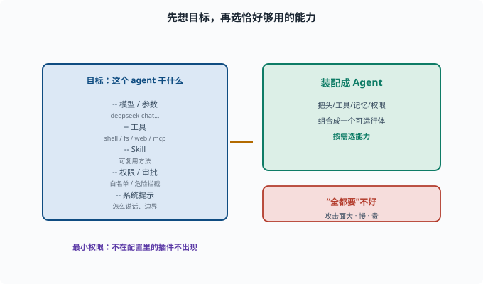

# 搭自定义 profile：配出你的 Agent

> 目标：把"读了的概念"变成"你自己的配置"。读完这一页，你能组装一个自定义 profile：选中工具、配好模型与权限、加 skill/MCP，组成你要的 agent。

## Profile = 你的 agent 的"配方"

在 deepseek-harness 里，**profile（/preset）**决定：加载哪些插件、每个插件怎么配、有没有补丁。它就是把 [09-03](../09-agent-architecture/09-03-plugin-composition.md) 的插件化组合落到你自己的场景。

一个 profile 回答：

```text
用哪个模型、什么参数
开哪些工具（文件/shell/web/mcp）
加哪些 skill
权限与审批怎么设
系统提示是什么
```

## 先看现有 profile 怎么写

```sh
rg -n "profile|headless|preset" apps/cli/src packages/bundle | head -20
```

对照现有（如 headless）理解：它声明了哪些插件、什么配置。然后你可以"照着加"。

## 搭 profile 的思考顺序

```text
1. 目标：这个 agent 要干什么（写代码？查网页？处理文档？）
2. 工具：哪些能力够用且够小（最小权限，[11-01 权限与最小化](../11-safety-governance/11-01-permissions.md)）
3. 模型：哪个供应商/模型
4. 记忆/会话：存哪、多久
5. 权限与审批：哪些要白名单、哪些要审批
6. 系统提示与 skill：怎么说话、有没有可复用方法
```

先想"目标"再选"工具"，避免"全都要"导致又慢又危险。



上图把"配方"的思考顺序画成一个左实右虚的结构：左边那块是一份 profile 要回答的清单——用什么模型、开哪些工具、加哪些 Skill、权限 / 审批怎么设、系统提示是什么；箭头把这份清单"装配成"右边那个可运行的 Agent。右下的红色小条是反向提醒：**"全都要"不好**，能力越多上下文越贵、决策越慢、攻击面越大。所以配 profile 的核心动作是"按目标只选恰好够用的能力"，并让"不在配置里的插件根本不出现"。

## 一个自定义 profile 的示意

真实的 profile 是一个 `cordis.yml` 插件清单（每行 = 一个插件条目）。下面以仓库 `examples/headless-agent/cordis.yml` 的真实形态简化而来（有删减，字段以该文件为准）：

```yaml
# 模型提供者：声明用哪个模型、什么推理强度
- id: llm-deepseek
  name: '@deepseek-ai/dsh-llm-deepseek'
  config:
    thinking: enabled
    reasoningEffort: max

# shell 能力：bash 工具及其执行器
- id: bash
  name: '@deepseek-ai/dsh-bash-local'
  config:
    timeoutMs: 60000

# web 搜索：不需要就不写这一行
# - id: web ...

# MCP 外部工具：一行一个服务器
- id: mcp-my-fs
  name: '@deepseek-ai/dsh-mcp-client'
  config:
    serverName: my-fs
    transport: stdio
    command: npx
    args: ['-y', '@modelcontextprotocol/server-filesystem', '/data']
```

它展示了同样的思路：**按需选能力**——不在清单里的插件根本不会被加载，"关掉"一个能力就是删掉（或 `disabled: true`）那一行。权限与审批不在 profile 顶层单列，而是由 sandbox/interaction 等插件行各自配置（[11-01](../11-safety-governance/11-01-permissions.md)）。

## 配完怎么验证

```text
配置能解析（不会启动失败）
`pnpm dsh --profile demo-agent "任务"` 能跑
工具确实被注册（能被模型调用）
权限生效（危险操作会拦截/审批）
结果符合预期
```

小步验证，别一次配一堆再调试。

## 思考题

1. profile 回答哪些问题？
2. 搭 profile 的思考顺序为什么"先目标后工具"？
3. 为什么"全都要"不好？
4. 自定义 profile 通常要声明哪几类内容？
5. 配好后应先验证哪几件事？

## 参考答案

1. 用什么模型、开哪些工具、加哪些 skill、权限/审批怎么设、系统提示是什么。
2. 因为只有先明确"这个 agent 要干什么"，才能选出恰好够用的工具；先选工具再想目标容易"全都要"导致又慢又危险。
3. 冗余工具会扩大攻击面、增加上下文与成本、让模型更难决策；最小集合更稳、更安全（[09-06](../09-agent-architecture/09-06-scope-permission.md)）。
4. 模型/供应商、启用的插件（工具/skill/mcp）、权限与审批、系统提示/记忆与会话配置。
5. 配置可解析不失败、能跑任务、工具被注册可调用、权限生效（危险操作拦截/审批）、结果符合预期。

## 下一步

- 想打包成独立扩展 → [10-09 写一个插件 bundle](10-09-plugin-bundle.md)。
- 想守权限边界 → [11-01 权限与最小化](../11-safety-governance/11-01-permissions.md)。
- 想复习插件组合 → [09-03 插件化组合](../09-agent-architecture/09-03-plugin-composition.md)。

[返回本章目录](README.md)
