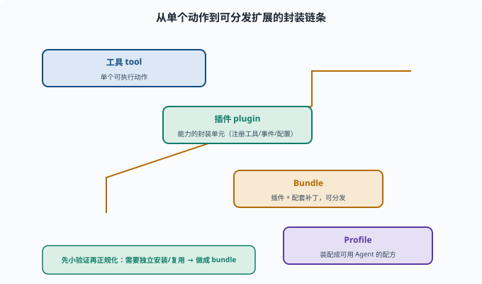

# 写一个插件 Bundle：实现一处可分发扩展

> 目标：把你的能力打包成可复用的插件 bundle，作为独立扩展分发。读完这一页，你能说清"工具/能力 → 插件 → bundle → profile"的层级，也知道写自己 bundle 的最小骨架。

## 从"工具"到"插件"到"bundle"

这几层的关系：

```text
工具（tool）：单个可执行动作
插件（plugin）：一组能力的封装单元（可注册工具、挂事件、提供配置）
bundle：把插件 + 配套（补丁、skill）打包成可分发的最小单位
```

当某个扩展想"独立安装/复用"，就应做成 bundle，让 `profile`/安装器能引用它（[09-03](../09-agent-architecture/09-03-plugin-composition.md)）。



上图用一条阶梯把"封装层级"讲清楚：脚下是**工具 tool**（单个可执行动作），往上包成**插件 plugin**（一个能注册工具、挂事件、带配置的能力单元），再往上打包成**Bundle**（插件 + 配套补丁，可分发的最小单位），最后**Profile** 把若干 bundle 装配成可运行的 Agent 配方。那条蜿蜒的箭头就是从低到高的封装路径。理解这条链之后，"要不要做成 bundle"就有了判断依据：只想在本机快速试，改几行配置即可；要独立安装、被多个 profile 引用，才值得封装成 bundle。

## 一个插件 bundle 的真实结构

以仓库里的 `packages/bundle/headless` 为例（真实文件，非示意）：

```text
packages/bundle/headless/
  package.json        # 声明 dsh.bundle.patch: "./cordis.patch.yml" 与插件依赖
  cordis.patch.yml    # 补丁层：插入/覆盖哪些插件行（entry）
  src/                # 插件实现
```

关键机制：`package.json` 里的 `"dsh": { "bundle": { "patch": "./cordis.patch.yml" } }` 就是 bundle 的"身份证"——profile 加载它时会读这个字段，把补丁层叠到自己的配置上。写之前先读 `packages/bundle/base/cordis.patch.yml`（内置注释很详细）和 `packages/bundle/headless/cordis.patch.yml`。

## 读懂 headless 的补丁层：三层叠加的真实样本

补丁层的语法只有三种动作，headless 的 `cordis.patch.yml` 恰好各用了一次，是最好的教学样本：

```yaml
# 动作一：按 id 定位已有行，覆盖它的 config
- id: system-prompt
  config:
    persona: >-
      You are a coding agent powered by the {{model}} model...

# 动作二：按 id 关掉一个行
- id: hmr
  disabled: true

# 动作三：insert 插入新行（自己或别的插件包）
- insert:
    - id: code-runtime
      name: '@deepseek-ai/dsh-code-runtime-worker-thread'
    - id: headless-runner
      name: '@deepseek-ai/dsh-headless'
      config:
        task: !!js ctx.headlessStartup.task
```

三个动作对应三种扩展场景：改配置（换 persona）、做减法（关掉 Web 热重载）、做加法（插入 code-runtime 与 headless-runner 两个插件行）。注意最后一行的 `!!js ctx.headlessStartup.task`——cordis.yml 允许在 `config` 里用 `!!js` 表达式（两个感叹号，单个 `!js` 是 YAML 语法错误），它在加载时求值，从 `headless-startup` 插件注入的服务里取出命令行传入的任务文本。

## 补丁如何叠成最终配置

加载器（`packages/boot/app-boot/src/profile.ts`）的合成规则是**从空表开始逐层应用**：

```text
最终插件行列表 = 空表
  ← 依次应用每个 bundle 的 cordis.patch.yml（按 dsh.profile.bundles 顺序）
  ← 再应用 profile 自己的 cordis.patch.yml（你的个人补丁）
  ← 最后应用启动器层（--patch 文件与命令行旗标）
```

同 id 的行"后写胜出"，且**整段 config 替换而非合并**。这条规则解释了 base bundle 注释里的一句话：随模式变化的配置行不放 base，而是由每个模式 bundle 完整重述——否则一次覆盖就会把其他字段悄悄抹掉。这也正是 [09-03](../09-agent-architecture/09-03-plugin-composition.md) "配置驱动组合"的落地机制。

## 插件实现长什么样

`src/index.ts` 就是普通插件（与 [10-05](10-05-write-a-tool.md) 同一套写法）：导出 `name`、`inject`（依赖的服务）、`Config`（zod 风格 schema 校验过的配置）和一个应用函数。headless 的 runner 声明 `inject: ['agentDefaultModel', 'agents', 'sessions']`——它要等这三个服务就绪才能建 Agent、驱动任务、刷 Session、打印结果、退出。bundle 没有任何"特殊插件 API"：**bundle 只是"插件 + 声明补丁"的打包约定**。

## 写 bundle 的步骤

```text
1. 明确扩展点：提供哪些工具/能力（复用能力缝）
2. 写插件：实现注册逻辑（effect 里注册工具等）
3. 写 cordis.patch.yml 并在 package.json 声明 dsh.bundle.patch
4. 打包 & 配置引用：让 profile 能加载它
5. 测试：能被加载、工具可调用、权限正常
```

## 与"私有配置"的区别

```text
只在你的 profile 里加几行：快速试（但不可复用）
做成 bundle：封装好、可分发、可复用（但更重）
```

原则：先小验证，再决定要不要"正规化"成可分发 bundle。

## 验证清单

```text
package.json 声明 dsh.bundle.patch、依赖声明清楚
插件能被加载（不外抛）
提供的工具/能力可用
权限/安全符合预期
能被其他 profile 引用而不破坏
```

## 思考题

1. 工具、插件、bundle 的层级关系是什么？
2. 一个 bundle 最小要包含什么？
3. 为什么有时"做成 bundle"比"改配置文件"更好？
4. 写一个 bundle 的大致步骤是什么？
5. 验证 bundle 应检查哪些点？

## 参考答案

1. 工具是单个动作；插件是能力的封装单元（注册工具/事件/配置）；bundle 把插件+配套补丁打包成可分发的最小单位。
2. package.json（声明 dsh.bundle.patch 指向补丁文件）+ cordis.patch.yml（补丁层）+ 插件实现。
3. 因为 bundle 封装好、可分发、可复用、依赖清楚，适合"要独立安装/被多个 profile 引用"的扩展；而改配置只适合快速试。
4. 明确扩展点 → 写插件实现注册 → 写 cordis.patch.yml 并声明 dsh.bundle.patch → 打包并让 profile 引用 → 测试加载/可用/权限。
5. 声明清楚、依赖清楚、插件可加载不报错、提供的工具可用、权限符合预期、能被其他 profile 引用而不破坏。

## 下一步

- 想做端到端综合任务 → [10-10 端到端任务](10-10-end-to-end.md)。
- 想守扩展的安全边界 → [11 安全与治理](../11-safety-governance/README.md)。
- 想复习插件组合语法 → [09-03 插件化组合](../09-agent-architecture/09-03-plugin-composition.md)。

[返回本章目录](README.md)
