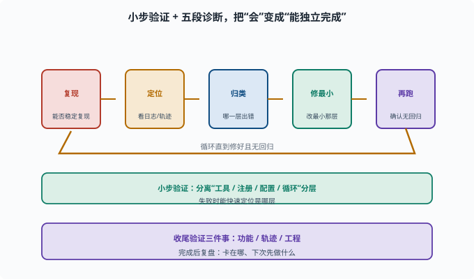

# 端到端任务：把前面所有能力串成一个真实任务

> 目标：完成一个"需要读代码、造工具、配 profile、跑任务、复盘轨迹"的综合任务。读完这一页，你能独立规划并从零跑完一个 agent 任务，附带结果验证。

## 把"会"变成"能独立完成"

前面几页分别练了环境、启动、会话、循环、工具、skill、MCP、profile、bundle。这一页把它们**串成一个完整任务**，考验你是否真的"会"。

一个很好的综合任务，是"在仓库里加一个小工具/打印小能力，并让 agent 用起来"。

## 任务设计（示例）：加一个自定义工具

目标：给 harness 加一个 "repo_stats" 工具（统计当前仓库文件数/行数），并跑一个任务让 agent 调用它。

子任务拆解：

```text
1. 读懂现有工具怎么写（读 packages/... 那类工具）
2. 写工具逻辑（统计文件/行数）
3. 注册到 ctx.tools
4. 配一个 profile/让它能被调用
5. 建一个任务让 agent 用上它
6. 观察轨迹，验证工具真被调用、结果正确
```

### 参考实现骨架

按 [10-05](10-05-write-a-tool.md) 的三件套（契约 + 逻辑 + 注册），这个工具大致长这样：

```ts
ctx.effect(() => ctx.tools.register(defineTool({
  name: "repo_stats",
  description: "统计指定目录下的文件数与总行数。需要了解仓库规模时使用。",
  parameters: {
    dir: { type: "string", required: true, description: "要统计的目录路径" },
  },
  output: {
    schema: {
      type: "object",
      properties: {
        files: { type: "number" },
        lines: { type: "number" },
      },
    },
    render: (_args, value) => [
      { type: "text", text: `${value.files} files, ${value.lines} lines` },
    ],
  },
  async execute(args, exec) {
    let files = 0
    let lines = 0
    // 用 fs 能力或 exec.sandbox 提供的文件访问遍历统计
    return { files, lines }
  },
})))
```

写完先 `pnpm run typecheck` 过类型，再补一个单测（喂临时目录、断言计数），最后才接到 profile 里跑真任务。

### 第 6 步怎么做：看轨迹

验证"工具真被调用"不靠猜：打开 [10-03](10-03-session-internals.md) 教的会话日志，`rg '"type":"tool/call"' <session-log>` 找到 `repo_stats` 的调用事件，再对照紧随的 `tool/result`——参数、返回值、耗时全在日志里。这一步同时复训了"model-visible ⟺ logged"：模型看到的工具结果，一定能从日志重建。

## 执行节奏：别一把梭

```text
小步验证：
  先写工具；typecheck + 单测
  再注册；跑通一个最小任务
  再验证轨迹与结果
```

一次只前进一小步，出了错能快速定位是哪一层（工具逻辑 / 注册 / 配置 / 循环）。

## 过程中反复用到的"诊断循环"

```text
复现：能不能稳定复现问题
定位：看会话日志/轨迹，哪一步开始不对
归类：是工具错、配置错、还是循环/权限错
修最小：改最小那层
再跑：确认修复且无回归
```

这正是 [08-06](../08-agent-foundations/08-06-reflection.md)、[08-08](../08-agent-foundations/08-08-agent-evaluation.md) 教的方法论。



上图把"诊断循环"画成一条首尾相接的环形流水线：`复现 → 定位（看日志/轨迹）→ 归类（哪一层出错）→ 修最小 → 再跑（确认无回归）`，然后回环重复直到真正修好。环绕它的那句话是"小步验证：分离工具 / 注册 / 配置 / 循环分层"——这正是"一把梭"做不到的：一次只前进一步，失败时才能快速判断是哪一层坏了。底部的紫色收束句提醒你收尾时验证三件事（功能、轨迹、工程），并留出复盘。

## 验证三件事

```text
1. 功能：任务真的完成了吗（文件/行数对不对）
2. 轨迹：工具确被调用、参数对、结果真实
3. 工程：typecheck/单测通过、无权限越界
```

## 复盘：完成之后问自己

```text
我在哪一步卡了最久？为什么？
哪一步是"概念清楚"但"落地卡壳"？
下次做类似任务，我会先做什么？
```

复盘是把"完成一件事"升级成"学会一类事"的关键。

## 思考题

1. 一个端到端任务通常由哪些子任务组成？
2. 为什么执行要"小步验证"而不是"一把梭"？
3. 任务完成后要验证哪三类结果？
4. 诊断循环的四步是什么？
5. 复盘的价值是什么？

## 参考答案

1. 读懂相关代码、实现功能（如写工具）、注册/配置、跑通一个最小任务、验证轨迹与结果、复盘；往往还包含必要的测试。
2. 因为"一把梭"失败时难以定位是哪层出了问题；小步验证能在每层快速反馈，让"工具逻辑/注册/配置/循环"分开排查。
3. 功能（任务真完成了、结果正确）、轨迹（工具被调用、参数对、结果真实）、工程（typecheck/单测通过、无权限越界）。
4. 复现 → 定位（看日志/轨迹哪一步不对）→ 归类（哪一层）→ 修最小 → 再跑确认无回归。
5. 把"完成一件事"升级为"学会一类事"：看清卡点、总结方法，下次做相似任务更快更稳。

## 下一步

- 想让结果可评估、可回归 → [08-08 Agent 评估](../08-agent-foundations/08-08-agent-evaluation.md)。
- 想在交付前守好底线 → [11 安全与治理](../11-safety-governance/README.md)。
- 想回看整个学习路线 → [00 学习路线](../00-curriculum/README.md)。

[返回本章目录](README.md)
