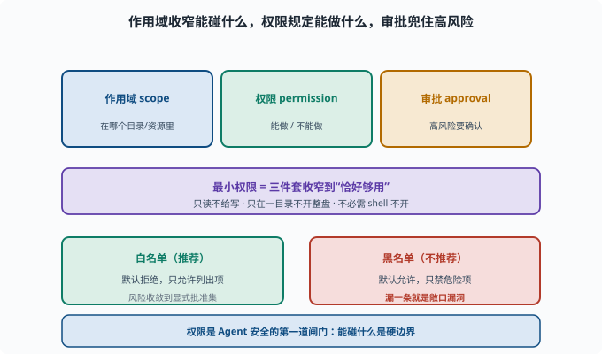

# 权限与最小化：给 Agent 恰好够用的权限

> 目标：把"最小权限"从原则变成可执行的安全设计。读完这一页，你能说清作用域、白名单、审批的落地，也知道为什么"权限是 Agent 安全的第一道闸门"。

## 为什么权限是第一道闸门

Agent 拥有能读写文件、执行命令、访问网络的"手"（[08](../08-agent-foundations/README.md)）。一旦权限失控，一次幻觉或注入就可能导致真实破坏。**权限就是"Agent 能碰什么"的硬边界**，也是第一道、最前的一道防线。

## 三个核心手段

```text
作用域（scope）：在哪个上下文/目录/资源里
权限（permission）：能做/不能做的规则
审批（approval）：高风险操作要确认
```

三者的关系不是并列堆叠，而是一条"逐层收窄"的链：作用域先把 Agent 关进一小块上下文，权限再决定它在这块里能做什么，审批则为其中不可逆或高风险的少数操作加一道人工/策略确认。下图把这条链和"最小权限"的收窄目标画在了一起。



看到这张图的重点是"默认最小"：不是从"全部放开"往回删，而是从"什么都不开"往上加，只把任务必需的能力放进白名单。这样即便某一环被绕过，露出面的也只是那一个小小的批准集，而不是整个系统。

## 最小权限：宁可少给

**最小权限（least privilege）**：只给完成任务所需的最小能力。

```text
只读场景 → 不给写/删
只在某目录 → 不放开整盘
不必须的 shell → 不给
```

好处：

```text
缩小攻击面：不暴露的能力无法被滥用
降低误伤：Agent 再笨也不至于删错大片
可审计：需要的能力更少 → 审计清单更短
```

## 白名单 vs 黑名单

```text
白名单：默认拒绝，只允许列出项（推荐）
黑名单：默认允许，只禁用危险项（不推荐，漏一条就危险）
```

安全上强烈倾向**默认拒绝 + 白名单**。

为什么黑名单注定追不全？因为"危险操作"的集合是开放的：`rm -rf` 可以写成 `rm -r -f`，可以 base64 编码后解码执行，可以通过 `find -delete` 间接实现，可以用脚本语言一行触发。攻击者只需找到一个你没列的形式，防御者却要列出所有形式——**不对称性永远偏向攻击方**。白名单把这个不对称反转过来：没列出的全都拒绝，攻击者要找的不再是"绕过一条规则"，而是"让白名单里的安全工具组合出危险行为"，难度高得多。

## 审批：危险操作要"人/策略点头"

对不可逆或高风险操作加审批：

```text
删除/覆盖文件 → 审批
写工作区之外 → 审批
执行未白名单的命令 → 审批
```

在 deepseek-harness 里，`interaction`/`permission` 能力负责这个"请求批准"流程（[09-06](../09-agent-architecture/09-06-scope-permission.md)）。

## 一个权限决策清单

```text
这个工具是否真需要？  → 不需要则不开
最小范围是什么？      → 目录/网络/能力给到最小
是否需要审批？       → 危险才批
白名单够用吗？       → 尽量白名单
失败时能回滚吗？     → 不可逆要更严
```

## 思考题

1. 为什么说权限是 Agent 安全的第一道闸门？
2. 作用域、权限、审批各管什么？
3. 最小权限的核心是什么？举一个例子。
4. 为什么推荐"默认拒绝 + 白名单"？
5. 判断"要不要审批"的标准是什么？

## 参考答案

1. 因为它硬性决定 Agent"能碰什么"，是防止幻觉/注入造成真实破坏的最前防线；权限失控，后面再多手段也难补救。
2. 作用域决定"能看到哪些工具/资源"，权限决定"能做什么"，审批决定"高风险操作要不要确认"。
3. 只给完成任务所需的最小能力。例：只读任务不给写/删，只在固定目录跑、不开整盘权限。
4. 因为"默认拒绝 + 白名单"意味着未列出的都禁止，把风险收敛到显式批准集；黑名单默认放开，漏一条就是敞口漏洞。
5. 操作是否不可逆/高风险/超出最小必要：删除覆盖、写工作区外、未白名单命令等要审批；可逆且必要且在白名单内的可自动。

## 下一步

- 想把 Agent 关进"笼子" → [11-02 沙箱与隔离](11-02-sandbox.md)。
- 想理解恶意输入如何劫持 → [11-03 提示注入](11-03-prompt-injection.md)。
- 想复习作用域/权限的架构 → [09-06 作用域与权限](../09-agent-architecture/09-06-scope-permission.md)。

[返回本章目录](README.md)
