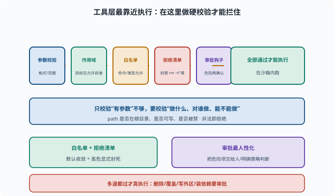

# 工具安全：危险操作的护栏

> 目标：理解"工具层护栏"如何在最贴近执行的地方兜底。读完这一页，你能说清参数校验、作用域、白名单、拒绝清单、超时与审批如何在工具里拦截危险。

## 为什么要在工具层兜底

提示层能"劝说"模型，但模型会犯错/被注入（[11-03](11-03-prompt-injection.md)）。**工具层是最靠近"执行"的地方**——在这里做硬校验，能拦住很多"模型已经决定要做"的危险操作。

```text
模型说"删文件" → 工具层检查"是否允许/是否审批"
模型说"执行命令" → 工具层检查"白名单/职责"
```

## 工具层的几道护栏

```text
参数校验：来的参数是不是合法格式、是否在允许范围
作用域检查：目标是否在允许的目录/资源内
白名单/黑名单：命令/工具类型是否被允许
拒绝清单：明确禁止高危操作（如强制删除、换权限）
超时/配额：长任务、大资源消耗限死
审批钩子：危险动作在执行前触发交互/权限请求
```

这几道护栏在真实执行前按顺序逐关通过，任何一个不过就拒绝。下面这张图把它们和"全部通过才执行"画成了同一道管线。



理解这张图的关键是"多道都过才真执行"：参数校验、作用域、白名单、拒绝清单、审批钩子任何一环放行都不算数，直到最后在沙箱内落地。这也解释了为什么"只校验参数是字符串"远远不够——它放过了后面四道该管的危险。

## 参数校验为什么重要

如果模型填了 `path: "/etc/passwd"`，工具层应在执行前发现"越界"并拒绝：

```text
不能只校验"是个字符串"
→ 还要校验"是否在允许根目录内、是否可写、是否被禁"
```

好的工具校验"做什么、对谁做、能不能做"，而不是"有没有参数"。

## 白名单/拒绝清单

```text
白名单：默认拒绝，只允许枚举的安全命令/操作
拒绝清单：明确禁止 `rm -rf`、`chmod 777`、格式化等
```

对命令型工具，白名单 + 拒绝清单配合最稳；对文件类，作用域 + 可写校验是关键。

## 危险操作审批

即便是白名单内、"合法"的破坏性操作，也常要审批：

```text
删除/覆盖文件、工作区外写入、安装依赖、启动长期服务
→ interaction/permission 触发"请求批准"
→ 策略/用户决定放行或拒绝
```

审批是最人性化的一道闸：它把"可能危险的事"交给人/明确策略判断。

## 一个防护逻辑示例

```text
工具：delete_file(path)
1. 参数校验：path 是 string
2. 作用域：path 必须在工作区内
3. 拒绝清单：若目标是"整个目录/根" → 拒绝
4. 审批：删除文件 → 请求批准
5. 执行：在沙箱内执行，返回真实结果
```

多道都过才真执行。

## 思考题

1. 为什么要在工具层兜底（而不只靠提示）？
2. 工具层的护栏通常有哪些？
3. 为什么"只校验参数是非空字符串"不够？
4. 白名单和拒绝清单如何配合？
5. 哪些操作通常要触发审批？

## 参考答案

1. 因为模型会犯错/被注入，提示层只是"劝说"；工具层最靠近执行，做硬校验能拦住"模型已决定做"的危险操作。
2. 参数校验、作用域检查、白名单/黑名单、拒绝清单、超时/配额、审批钩子。
3. 因为还要校验"动作的对象是否越界、是否危险"（path 是否在允许目录、是否可写、是否被禁），格式合法不等于行为合法。
4. 白名单默认拒绝、只允许枚举的安全项；拒绝清单再明确禁止高危操作（如 `rm -rf`）；两者配合让"默认收敛 + 高危显式封死"。
5. 删除/覆盖文件、写工作区外、安装依赖、启动长期服务等不可逆/高风险操作，通常触发 interaction/权限"请求批准"。

## 下一步

- 想关注数据泄露 → [11-05 数据隐私](11-05-privacy.md)。
- 想主动找工具漏洞 → [11-06 红队与对抗](11-06-redteam.md)。
- 想复习审批/作用域 → [09-06 作用域与权限](../09-agent-architecture/09-06-scope-permission.md)。

[返回本章目录](README.md)
