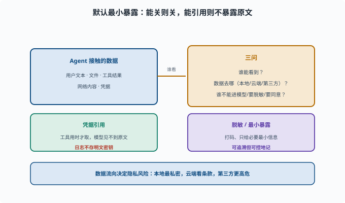

# 数据隐私：谁能看到什么数据

> 目标：理解 Agent 场景里的隐私问题：凭据、脱敏、合规、数据流向。读完这一页，你能判断"哪些数据不该进模型/该脱敏/该审批"，也知道可追溯与实际数据流的关系。

## 隐私不只是"加密"

Agent 会接触大量数据：用户文本、文件、工具结果、网络内容、凭据。隐私的核心问题是：

```text
谁能看到这些数据？
数据去了哪里（本地/云端/第三方模型/日志）？
哪些不能进模型？哪些要脱敏？哪些要用户同意？
```

隐私问题的本质是"数据流向 + 暴露面"：数据从 Agent 手里流向谁、谁在途中看到了原文。下面这张图把"谁看数据的三问"放在中央，两端分别对应凭据引用和脱敏/最小暴露这两种处理方式。



直观地说，越靠右的数据就越要少给：模型不该看到的原文用**凭据引用**（见下节）挡住，日志里不该出现的内容在落盘前先脱敏。两条路都服务于同一个原则——默认最小暴露。

## 凭据与密钥：最重要的隐私

凭据（credentials：API key、token、密码等"能证明身份、因此能造成破坏"的机密字符串）绝不能随随便便进模型上下文或日志：

```text
不要塞进 system prompt/文件内容让模型读到
用"凭据引用"机制，工具在需要时才安全取用，不让模型窥见原文
日志里不能出现明文密钥
```

**凭据引用（credential reference）**：配置和日志里只放一个"代号"（如 `$DEEPSEEK_API_KEY`），真实值留在环境变量或专门的凭据文件里；工具执行时由框架在最后一刻解析并注入到子进程，全程不经过模型上下文。

deepseek-harness 的 `credentials` 能力（`packages/credentials`）就是"引用而不暴露原文"的模式。

## 数据脱敏

**脱敏（sanitize/mask）**：在数据进入模型或日志之前，把敏感片段替换成打码形式（如 `138****5678`）。进模型/日志前，敏感信息先处理：

```text
把身份证/电话/邮箱/密钥打码
只给模型"必要的最小信息"而不是整段敏感原文
工具结果返回前过滤掉不该暴露的字段
```

核心原则：**默认最小暴露**——只给完成任务所需的最少数据。

## 数据流向：本地 vs 云端

不同部署的数据流不同：

```text
本地：模型在本地跑，数据不出本机（最私密）
云端 API：文本会发给模型服务商 → 要看服务商的数据条款
第三方工具/MCP：数据会流向外部服务
```

在选型时，"数据去哪"决定隐私风险等级。敏感任务应优先本地方案或明确合规的供应商。

## 合规与同意

涉及用户数据时要考虑：

```text
处理隐私数据要不要用户同意/告知？
日志存多久、能不能按需删除？
是否符合所在地区法规（如个人信息保护）？
```

合规不是可选项，是交付真实系统的一部分。

## 隐私与"可追溯"的张力

可追溯（[09-05](../09-agent-architecture/09-05-session-log.md)）要求"模型看到的都记日志"，但日志又会存敏感数据。所以：

```text
不是"所有都记原文"
而是"允许记、但要可控"：敏感字段可脱敏/可标记、日志可保留策略/可清理
```

这里需要平衡：既要能回放审计，又不能把密钥永久明文存档。

## 一个隐私小检查清单

```text
这里会不会把密钥/敏感原文暴露给模型？
日志里有没有明文凭据？
这个数据要不要脱敏？
它发到哪个服务商/外部？
是否需要用户同意/合规评估？
```

## 思考题

1. 隐私的核心问题有哪些？
2. 凭据为什么不能进模型/日志？deepseek-harness 怎么处理？
3. "默认最小暴露"是什么意思？
4. 本地 vs 云端 API，数据流的隐私差异是什么？
5. 可追溯（全记日志）与隐私如何平衡？

## 参考答案

1. 谁能看到数据、数据去哪（本地/云端/第三方/日志）、哪些不能进模型、哪些要脱敏或审批、合规与同意。
2. 因为明文密钥一旦进上下文就可能被模型泄漏（通过响应对话或日志）。harness 用"凭据引用"机制：工具需要时安全取用，不让模型窥见原文，日志也不存明文。
3. 只给完成任务所需的最少数据：进模型前过滤敏感字段、脱敏必要信息，而不是整段敏感原文随随便便交给模型。
4. 本地模型数据不出本机最私密；云端 API 文本会发给服务商需看数据条款；第三方工具/MCP 数据流向外部服务，风险等级更高。
5. 不是"所有都存原文"，而是可控地记：敏感字段可脱敏/标记、日志设保留策略、可清理，既满足"可回放审计"又不把密钥永久明文存档。

## 下一步

- 想主动测试私有数据是否泄露 → [11-06 红队与对抗](11-06-redteam.md)。
- 想了解事故后的可追溯 → [11-07 可追溯与审计](11-07-audit.md)。
- 想复习可追溯硬规则 → [09-05 会话日志与可追溯](../09-agent-architecture/09-05-session-log.md)。

[返回本章目录](README.md)
