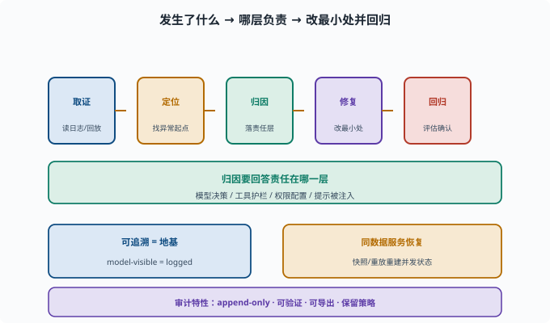

# 可追溯与审计：出事了能否复盘

> 目标：理解事故后的"复盘能力"由什么支撑。读完这一页，你能说清可追溯（会话日志）、责任链、审计记录和恢复如何共同让你"出事了能复盘"。

## 出事后的第一问题：发生了什么

Agent 一旦出错、越权或泄露，第一个问题就是：

```text
到底发生了什么？
是哪一步开始的？
谁（哪个能力/权限）让它做到的？
能否复现？
```

没有这些，无法定位、无法修复、无法担责。**可追溯与审计**就是支撑"复盘"的能力。

## 可追溯 = 会话日志（地基）

前面反复强调的 "model-visible ⟺ logged"（[09-05](../09-agent-architecture/09-05-session-log.md)）就是地基：

```text
模型看到的一切、工具执行的一切，都记进 append-only 会话日志
事故后：读日志 → 回放 → 定位"从哪一步开始不对"
```

没有日志，"复盘"无从谈起。

## 责任链：谁让这件事发生的

审计要能回答"责任在哪一层"：

```text
是模型的决策错？→ 看它的 tool_call/思考
是工具的护栏漏？→ 看工具校验/权限
是权限配太宽？→ 看 profile/permission
是提示被注入？→ 看输入内容
```

光"知道炸了"不够，还要能**定位责任层**，才能精准修复。

复盘有一条固定的路径：先从日志**取证**（forensics：像事故现场勘查一样，从留存的记录里收集"到底发生了什么"的证据），再沿轨迹定位异常起点，然后把责任落到模型/工具/权限/注入某一层，最后改最小处并用评估确认没有回归。下面这张图把这四步和"归因要回答责任在哪一层"放在一起。



图中底部还点出两个支撑：可追溯（model-visible = logged）是整个复盘的地基，同一份日志也能用于崩溃后的状态恢复续跑。没有左边的"地基"，这四步里的任何一步都无从谈起。

## 审计记录：不可抵赖性

**不可抵赖性（non-repudiation）**：事后无法否认"某动作确实发生过、确实是这个主体做的"——因为记录完整且改不了。审计日志就要有这些特性：

```text
append-only：历史不可篡改（[09-05](../09-agent-architecture/09-05-session-log.md)）
可验证：谁/什么动作/什么时间
可导出：合规需要时可提供记录
保留策略：能按需保留/清理
```

这是"出事了能不能说清楚、能不能担责"的支撑。

## 恢复与复盘联动

可追溯还能支撑 [09-10](../09-agent-architecture/09-10-state-recovery.md) 的恢复：

```text
事故后：用日志快照/重放重建事发状态
复盘：看崩溃前模型视角
修复：从问题点重放，验证修复是否有效
```

"可追溯"同时服务"事后复盘"和"恢复续跑"。

## 复盘四步

```text
1. 取证：读日志/回放，确认发生了什么
2. 定位：从轨迹找哪一步开始异常
3. 归因：落到模型/工具/权限/注入哪一层
4. 修复 + 回归：改最小处，再用评估确认修复且无回归（[11-08](11-08-eval-driven.md)）
```

## 思考题

1. 出事后的第一问题是什么？由什么支撑？
2. "责任链"要能回答什么？
3. 审计日志应具备哪些特性？
4. 可追溯如何同时服务"复盘"和"恢复"？
5. 复盘四步是什么？

## 参考答案

1. 发生了什么、哪一步开始的、谁让它做到的、能否复现。这些由可追溯（append-only 会话日志）支撑，因为 model-visible ⟺ logged。
2. 责任在哪一层：模型决策、工具护栏、权限配置，还是提示被注入，从而精准修复。
3. append-only（不可篡改）、可验证（谁/什么/何时）、可导出（合规需要）、保留策略（按需保留/清理）。
4. 日志/快照既能"出事回放复盘"，也能"崩溃后重建状态续跑"；同一个可追溯数据同时服务事后取证与状态恢复。
5. 取证（读日志/回放确认发生什么）→ 定位（找异常起点）→ 归因（落到哪层）→ 修复+回归（改最小处并用评估确认无回归）。

## 下一步

- 想让安全评估成为工程门禁 → [11-08 评估驱动改进](11-08-eval-driven.md)。
- 想复习可追溯硬规则 → [09-05 会话日志与可追溯](../09-agent-architecture/09-05-session-log.md)。
- 想复习恢复机制 → [09-10 状态与恢复](../09-agent-architecture/09-10-state-recovery.md)。

[返回本章目录](README.md)
