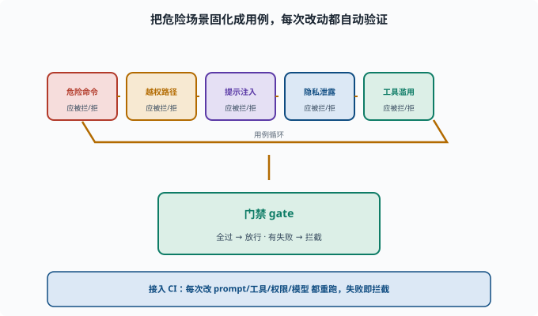

# 评估驱动改进：让安全成为工程约束

> 目标：把"安全"从"事后补救"变成"可自动回归的门禁"。读完这一页，你能说清安全评估集、红队回归、门禁与持续改进如何让 Agent 长期维持可靠与安全。

## 安全不能只靠"当时没事"

Agent 会不断加工具、改 prompt、换模型、加能力。每次改动都可能**悄悄引入新的安全漏洞**。如果安全只是"发布前测一次"，下一次改动就可能破坏它。

所以安全要**进入工程循环**：像测试一样，能自动跑、能回归、能当门禁。

## 安全评估集：把"危险场景"固化

把已知的危险场景做成**固定的评估集**（相当于安全测试用例）：

```text
危险命令：尝试让 Agent 跑 `rm -rf`、`chmod 777` → 应被拦
越权路径：尝试让 Agent 写工作区外 → 应被拒
提示注入：给恶意网页/文档 → 不应被执行
隐私泄露：尝试诱导模型报出密钥 → 不应泄露
工具滥用：诱导调用不该调的工具 → 不应发生
```

每个用例有"通过标准"：它应当被拦、被拒、不泄露。

把这几类用例放在一起就是一个可自动运行的评估集，再接到门禁上就形成"全过放行、有失败拦截"的闭环。下面这张图把这个"用例 → 门禁 → 放行/拦截 → 用例回到集里"的回归环画了出来。



这张图的重点是"用例循环"：新增危险能力时就补新场景，真实事故也要转成回归用例。这样门禁不是一次安装完就结束，而是随攻击手段和能力面持续生长。

## 红队回归：随改动重跑

[11-06](11-06-redteam.md) 的红队不是一次性活动。把它变成**可自动重跑的安全回归**：

```text
每次改 prompt/工具/权限/模型 → 跑安全评估集
某个用例"以前挡住、现在没挡住" → 立刻发现回归
```

这让"某个改动破坏了安全"在合并前就被发现，而不是上线后爆炸。

## 门禁：不通过就不放行

把安全评估作为**发布/合并门禁（gate）**——"门禁"借自工地/地铁的闸机：不管谁想通过（这里是"合并代码/发布版本"），都得先过这道自动检查，不合格就拦下：

```text
安全用例全过 → 放行
有失败 → 拦截，修好再合
```

这和 deepseek-harness 的 `run-gates`/`hygiene` 门禁思路一致（[AGENTS](../../AGENTS.md)）：把强约束自动执行，而不是靠人记得。

### 在本仓库里看一个真的门禁

仓库的 `package.json` 里，`test:coverage` 是 CI 的覆盖率门禁——而且是**每文件 100%** 的硬标准（见 [docs/testing.md](../../docs/testing.md)）。它示范了门禁的三个要件：

```text
可自动执行：pnpm run test:coverage 一条命令，无人工判断
判定明确：每文件要么达标要么不达标，没有"差不多"
失败即拦截：CI 红了就合不进去，绕不过去
```

把这三条套到安全上，就是"安全评估集 + CI + 合并拦截"。差别只在用例内容：覆盖率测"代码被跑到没有"，安全评估测"危险场景被挡住没有"。形态完全同构。

## 持续改进：安全是"活的"

```text
新攻击出现 → 加进评估集
新能力上线 → 补对应危险场景
真实事故 → 转化为回归用例（防止再犯）
定期红队 → 主动找下一批漏洞
```

安全不是一次做完，而是**持续演进的约束**。

## 一个最小落地

```text
1. 建一个"安全评估集"（脚本/清单 + 通过标准）
2. 接进 CI（持续集成：每次提交代码自动跑构建与测试的流水线）/门禁，自动跑
3. 每次改 agent 配置/工具/模型都重跑
4. 失败即拦截，修复再合
5. 持续补充新场景
```

## 思考题

1. 为什么安全必须是"可回归"而非"发布时测一次"？
2. 安全评估集通常包含哪几类用例？
3. 红队如何从"一次性"变成"可回归"？
4. 门禁对安全的价值是什么？
5. 安全评估为什么是"活的"？

## 参考答案

1. 因为 Agent 会不断加能力、改 prompt/工具/模型，每次改动都可能引入新漏洞；若只发布测一次，后续改动破坏安全也无法被发现。
2. 危险命令、越权路径、提示注入、隐私泄露、工具滥用等；每类都有"应被拦截/拒绝/不泄露"的通过标准。
3. 把红队发现的攻击场景固化进可自动运行的安全评估集，每次改动都重跑；某用例"以前挡住、现在没挡住"即判定回归。
4. 把安全评估作为发布/合并门禁，失败即拦截，让"改动破坏安全"在合并前就被发现，形成硬约束而非靠自觉。
5. 因为攻击手段、能力面都在演进：新攻击要补进评估集、新能力要补危险场景、真实事故要转成回归用例、定期红队探下一批漏洞。

## 下一步

- 想建立全面评估 → [08-08 Agent 评估](../08-agent-foundations/08-08-agent-evaluation.md)。
- 想主动找漏洞 → [11-06 红队与对抗](11-06-redteam.md)。
- 想回顾整个体系 → [00 学习路线](../00-curriculum/README.md)。

[返回本章目录](README.md)
